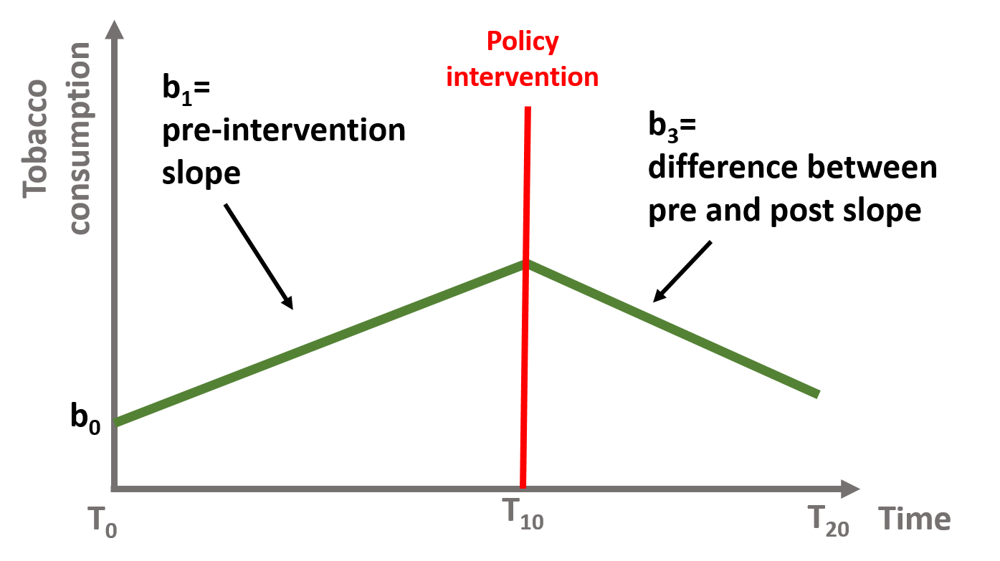

```{r setup, include=FALSE}
knitr::opts_chunk$set(echo = TRUE, message=F, warning=F, fig.width = 10)
```

**Packages**

Here are the packages we will use in this lecture. If you don't remember how to install them, you can have a look at the code. 

* **stargazer** for nice tables

```{r, eval=F}
install.packages( stargazer )
library( "stargazer" )
```

**What you should know after this lecture**

* What is the scope of an interrupted time series?
* What is the right design to apply an interrupted time series? 
* How should you organize your data before using an interrupted time series?
* What are the key coefficients of an interrupted time series? How do you interpret them? 
* What are the main threats to validity that you need to pay attention to?
* What is autocorrelation? 
* Applying a time series model to data in R

```{r, echo=TRUE, results="hide", eval=F}
install.packages( "stargazer" )  # formatting regression output
install.packages( "scales" )     # variable transforms, formatting tables
install.packages( "Wats" )       # Wrap-Around Time Series Plots
```


```{r, echo=T, results="hide"}
library( "scales" )
library( "stargazer" )
library( "Wats" )
library( "dplyr" )
library( "pander" )
```

# The key concept

Interrupted time series can be used when: 

1. we have data about a certain outcome over time (longitudinal data) AND 
2. we want to understand how and if the outcome has changed after an intervention (e.g., a new policy program) was implemented.

Note that your data need to include observations **before and after** the intervention had occured.

Examples include:

**Data** | **Research question**                                                                      | 
-------- | -----------------------------|
Yearly data on marijuana consumption in a state       |Does marijuana consumption increase after the state passes a law the legalize marijuana use?     |
Monthly employment data on local businesses in a city |Does a raise in the minimum wage affect local levels of employment?                              |
Number of books read monthly by students in a school  |Does the opening of a new library within the school affect the number of books read by students? |

<br>

In our first example, let's assume we have data on the total consumption of tobacco in a US state from a point in time (t0) to ten years later (t10). Our observations are represented in the graph \@ref(fig:f1) below. The line suggests an upward trend, with state residents consuming more tobacco over time. 

```{r f1, fig.cap="Yearly consumption of tobacco from t0 to t10", out.width='60%', echo=F }

```

Now let's imagine that the policymakers decide to introduce a new tax on tobacco at the end of year t10 to reduce its consumption. *What are the possible outcomes of this intervention?*

We can represent some possible outcomes in figures \@ref(fig:f2) - \@ref(fig:f5). 

In figure \@ref(fig:f2), the tax has no effect on tobacco consumption, which continues to increase at the same trend as before. 

```{r f2, fig.cap="No policy effect", out.width='60%', echo=F }
knitr::include_graphics( "FIGURE/TimeSeries/Picture2.1.png" )
```

In figure \@ref(fig:f3), the tax reduces tobacco consumption right after the policy intervention but the upward trend continues over time. There is an **immediate policy effect** but no sustained effect.

```{r f3, fig.cap="Immediate policy effect", out.width='60%', echo=F }
knitr::include_graphics( "FIGURE/TimeSeries/Picture2.2.png" )
```

In figure \@ref(fig:f4), the tax does not reduce tobacco consumption immediately, but it shifts the trend downward in the long term. There is no immediate policy effect but we observe a **sustained effect** of the policy.

```{r f4, fig.cap="Sustained policy effect", out.width='60%', echo=F }
knitr::include_graphics( "FIGURE/TimeSeries/Picture2.3.png" )
```

Finally, we can also imagine that the tax decreases tobacco consumption immediately after AND shifts the trend downward. Figure \@ref(fig:f5) shows **both an immediate and a sustained policy effect**. 

```{r f5, fig.cap="Immediate + sustained policy effect", out.width='60%', echo=F }
knitr::include_graphics( "FIGURE/TimeSeries/Picture2.4.png" )
```

Interrupted time series enable us to investigate each effect, thereby understanding if the policy intervention:

* has no effect (\@ref(fig:f2)); OR  
* has only an immediate effect (\@ref(fig:f3)); OR
* has only a sustained, long term effect (\@ref(fig:f4)); OR
* has both an immediate and a sustained effect (\@ref(fig:f5)). 

## The statistical model

In mathematical terms, it means that the time series equation includes four key coefficients:

\begin{equation} 
\text{Y} = \text{b}_0 + \text{b}_1T + \text{b}_2D + \text{b}_3P + \text{e}
  (\#eq:timeseries)
\end{equation} 

Where:
<br>
<br>
$\text{Y}$ is the outcome variable;
<br>
<br>
$\text{T}$ is a continuous variable which indicates the time (e.g., days, months, years...) passed from the start of the observational period; 
<br>
<br>
$\text{D}$ is a dummy variable indicating observation collected before (=0) or after (=1) the policy intervention; 
<br>
<br>
$\text{P}$ is a continuous variable indicating time passed since the intervention has occured (before intervention has occured P is equal to 0). 

Our dataset will look like this:

```{r fdataset, fig.cap="A time series dataset", out.width='60%', echo=F }
knitr::include_graphics( "FIGURE/TimeSeries/Picture5.png" )
```

We can graphically illustrated each coefficient and gradually build equation \@ref(eq:timeseries). 

In figure \@ref(fig:f6), $\text{b}_0$ is the baseline level of the outcome (the intercept or constant) and $\text{b}_1$ is the **slope of the line before the intervention** (green line). 

\begin{equation} 
\text{Y} = \text{b}_0 + \text{b}_1T + \text{e}
  (\#eq:baseline)
\end{equation}

```{r f6, fig.cap="Coefficients b0 and b1, if b2 = 0 and b3 = 0", out.width='60%', echo=F }

```

In figure \@ref(fig:f7), $\text{b}_2$ is the **immediate effect** that occurs after the intervention. It represents how the outcome level has changed from the last observation before the intervention to the first one after. In this case the slope of the line has not changed, and the lines after and before the intervention are parallel. Their slope is equal to $\text{b}_1$.

\begin{equation} 
\text{Y} = \text{b}_0 + \text{b}_1T + \text{b}_2D + \text{e}
  (\#eq:immediateEffect)
\end{equation}

```{r f7, fig.cap="Coefficient b0, b1, and b2, if b3 = 0", out.width='60%', echo=F }

```

In figure \@ref(fig:f8), the slope has changed after the intervention. $\text{b}_3$ is the **difference between the slope of the line before and the slope of the line after the intervention**. It represents the **sustained effect** of the policy intervention. Note that $\text{b}_2$ = 0,  meaning that there has been no immediate effect of the policy.

\begin{equation} 
\text{Y} = \text{b}_0 + \text{b}_1T + \text{b}_3P + \text{e}
  (\#eq:sustainedEffect)
\end{equation}

```{r f8, fig.cap="Coefficient b0, b1, and b3, with b2 = 0", out.width='60%', echo=F }

```

Finally, in figure \@ref(fig:f9), we have **both an immediate and sustained effect** and $\text{b}_2$ and $\text{b}_3$ are both different from zero.

\begin{equation} 
\text{Y} = \text{b}_0 + \text{b}_1T + \text{b}_2D + \text{b}_3P + \text{e}
  (\#eq:timeseries)
\end{equation}

```{r f9, fig.cap="Coefficient b0, b1, b2, and b3", out.width='60%', echo=F }
knitr::include_graphics( "FIGURE/TimeSeries/Picture3.4.png" )
```

## The counterfactual

In time series, it is important to understand the counterfactual. The counterfactual refers to *what it would have occured to Y, had the policy intervention not happened*.

Let's take a case where our policy intervention had both an immediate and a sustained effect, as shown in figure \@ref(fig:f10). The green line is represented by the equation \@ref(eq:timeseries), where $\beta{b}_2$ and $\beta{b}_3$ are both different from 0. 

\begin{equation} 
\text{Y} = \text{b}_0 + \text{b}_1T + \text{b}_2D + \text{b}_3P + \text{e}
  (\#eq:timeseries)
\end{equation} 

To calculate the counterfactual, we need to assume that the intervention has never occured and there has been no immediate nor sustained effect. In other words, if the policy intervention had not happenend, the green line would have continued as shown by the dotted gray line. Our equation \@ref(eq:timeseries) would become:

\begin{equation} 
\text{Y} = \text{b}_0 + \text{b}_1T + \text{b}_2*0 + \text{b}_3*0 + \text{e}
  (\#eq:counterfactual)
\end{equation} 

Or just:

\begin{equation} 
\text{Y} = \text{b}_0 + \text{b}_1T + \text{e}
  (\#eq:counterfactual2)
\end{equation}

```{r f10, fig.cap="Time series counterfactual ", out.width='60%', echo=F }

```

We can calculate the counterfactual for each point in time. For instance, we look at t = 12. The predicted Y is calculated in the equation \@ref(eq:t12). The predicted Y for t = 12 falls on the green line in figure \@ref(fig:f11). Its counterfactual is calculcated in equation \@ref(eq:t12counterfactual). It is located on the dotted line, perpendicularly above the predicted Y. 

\begin{equation} 
\text{Y} = \text{b}_0 + \text{b}_1*12 + \text{b}_2*D*1 + \text{b}_3*P*2 + \text{e}
  (\#eq:t12)
\end{equation} 

\begin{equation} 
\text{Y} = \text{b}_0 + \text{b}_1*12 + \text{b}_2*D*0 + \text{b}_3*P*0 + \text{e}
  (\#eq:t12counterfactual)
\end{equation} 

```{r f11, fig.cap="Time series counterfactual, T=12 ", out.width='60%', echo=F }
knitr::include_graphics( "FIGURE/TimeSeries/Picture4.1.png" )
```

The counterfactual changes for each point in time. Let's look at t = 18. 

\begin{equation} 
\text{Y} = \text{b}_0 + \text{b}_1*18 + \text{b}_2*D*1 + \text{b}_3*P*8 + \text{e}
  (\#eq:t18)
\end{equation} 

\begin{equation} 
\text{Y} = \text{b}_0 + \text{b}_1*18 + \text{b}_2*D*0 + \text{b}_3*P*0 + \text{e}
  (\#eq:t18counterfactual)
\end{equation} 

```{r f12, fig.cap="Time series counterfactual, T=18 ", out.width='60%', echo=F }

```

We will apply these concepts in the following working example. 

# A time series model

```{r, echo=F}
set.seed(123)
T = rep(1:365)
D = ifelse(T > 200, 1, 0)
P = ifelse(T <= 200, 0, rep(1:200))

err = rnorm(365, 150, 70)

Y = 5.4 + 0.5*T + 20*D + 1.2*P + err

Y <- rescale( Y, to = c(0, 300))

dataTS = as.data.frame(cbind(Y, T, D, P))
```

```{r image, out.width='50%', echo=F, fig.align='center' }
knitr::include_graphics( "FIGURE/TimeSeries/StudentWellbeing.jpg" )
```

We are going to have a look at a simulated dataset describing the wellbeing of a class of students. Students' wellbeing is an increasingly discussed topic in [policy debates](http://oecdeducationtoday.blogspot.com/2018/03/mental-health-students-school.html) and some states are introducing [mental health education classes](https://www.nbcnews.com/better/health/fall-all-new-york-students-will-be-learning-about-mental-ncna911031) (even some [universities](https://www.nytimes.com/2018/01/26/nyregion/at-yale-class-on-happiness-draws-huge-crowd-laurie-santos.html)). 

The dataset contains 365 daily observations of the wellbeing of a class of students. Wellbeing is measured by a index from 0 to 300. At t = 201 students will start attend a mental health education class. We want to understand how (and if) their wellbeing improves.

First, we have a look at how the dataset is structured using the *head* and *tail* function. We can also look at rows 198-204 where the interruption occurs.

```{r}
dataTS$Y <- round(dataTS$Y,1)
d.temp <- rbind( head(dataTS), c("...","...","...","..."),
                 dataTS[ 198:200, ], 
                 c("**START**","**TREATMENT**","---","---"), 
                 dataTS[ 201:204, ],  
                 c("...","...","...","..."),
                 tail(dataTS) )
row.names( d.temp ) <- NULL  
pander( d.temp )
```


```{r}
plot( dataTS$T, dataTS$Y,
      bty="n", pch=19, col="gray",
      ylim = c(0, 300), xlim=c(0,400),
      xlab = "Time (days)", 
      ylab = "Wellbeing Index" )

# Line marking the interruption
abline( v=200, col="firebrick", lty=2 )
text( 200, 300, "Start of Wellbeing Classes", col="firebrick", cex=1.3, pos=4 )

# Add the regression line
ts <- lm( Y ~ T + D + P, data=dataTS )
lines( dataTS$T, ts$fitted.values, col="steelblue", lwd=2 )
```

The dataset contains four variables:

**Column** | **Variable name ** | **Description**                                  | 
-----------|--------------------- | -----------------------------------------------------|
$\text{Y}$ |$\text{Wellbeing}$    | Wellbeing index (from 0 to 300)                       |
$\text{T}$ |$\text{Time}$         | Time (from 1 to 365)                                  |
$\text{D}$ |$\text{Treatment}$    | Observation post (=1) and pre (=0) intervention       |
$\text{P}$ |$\text{Time Since Treatment}$   | Time passed since the intervention                    |

Our model is based on the equation \@ref(eq:timeseries):

\begin{equation} 
\text{Y} = \text{b}_0 + \text{b}_1*Time + \text{b}_2*Treatment + \text{b}_3*Time Since Treatment + \text{e}
  (\#eq:example)
\end{equation} 

We can run the model using the **lm** function in R.

```{r, echo=T, results='asis'}
regTS = lm ( Y ~ T + D + P)  # Our time series model

stargazer( regTS, 
           type = "html", 
           dep.var.labels = ("Wellbeing"),
           column.labels = ("Model results"),
           covariate.labels = c("Time", "Treatment", "Time Since Treatment"),
           omit.stat = "all", 
           digits = 2 )
```

Let's interpret our coefficients:

* The **Time** coefficient indicates the wellbeing trend before the intervention. It's positive and significant, indicating that students' wellbeing increases over time. For each day that passes, the wellbeing increases of 0.19 points on the index.
<br>
<br>
* The **Treatment** coefficient indicates the increase in the students' wellbeing immediately after the intervention. We can see that the immediate effect is positive and significant indicating that attending the first class increased the students' wellbeing of 13.09.
<br>
<br>
* The **Time Since Treatment** coefficient indicates that the trend has changed after the intervention. The sustained effect is positive and significant, indicating that for each day that passes after the intervention, the wellbeing of students increases of 0.54 points on the index. 

## Plotting the results 

A useful exercise is to calculate outcomes at different points in time as we did in section \@ref(the-counterfactual). For instance, we can calculate the outcome right after the intervention, which occured at time = 200. Note that while $\text{Time}$ = 201, $\text{Time Since Treatment}$ is equal to 1 because it is the first day after the intervention.

\begin{equation} 
\text{Y} = \text{b}_0 + \text{b}_1*201 + \text{b}_2*1 + \text{b}_3*1 + \text{e}
  (\#eq:examplet201)
\end{equation} 

We can also represent the point on a graph:

```{r ft1, fig.cap="Wellbeing level at t = 201"}

# We create a small dataset with the new values
data1 <- as.data.frame( cbind( T = 201, D = 1, P = 1 )) 

# We use the function predict to (1) take the coefficients estimated in regTS and (2) calculate the outcome Y based on the values we set in the new datset
y1 <- predict( regTS, data1 ) 

# We plot our initial observations, the column Y in our dataset
plot( Y,
      bty="n",
      col = gray(0.5,0.5), pch=19,
      xlim = c(1, 365), 
      ylim = c(0, 300),
      xlab = "Time (days)", 
      ylab = "Wellbeing Index")

# We add a point showing the level of wellbeing at time = 201)
points(201, y1, col = "dodgerblue4", pch = 19, bg = "dodgerblue4", cex = 2)
text(201, y1, labels = "t = 201", pos = 4, cex = 1)

# Line marking the interruption
abline( v=200, col="red", lty=2 )

```

Now, we can calculate the outcome 30 days after the intervention. $\text{Time}$ will be equal to 230 while $\text{Time Since Treatment}$ will be equal to 30. $\text{Treatment}$ is always equal to 1 since it is a dummy variable indicating pre or post intervention. 

\begin{equation} 
\text{Y} = \text{b}_0 + \text{b}_1*230 + \text{b}_2*1 + \text{b}_3*30 + \text{e}
  (\#eq:examplet230)
\end{equation} 

We can add the new point at t = 230 to the graph:

```{r ft30, fig.cap="Wellbeing level at t = 230"}
data2 <- as.data.frame( cbind( T = 230, D = 1, P = 30 )) # New data

y2 <- predict( regTS, data2 ) # We predict the new outcome

# We plot our initial observations, the column Y in our dataset
plot( Y,
      bty="n",
      col = gray(0.5,0.5), pch=19,
      xlim = c(1, 365), 
      ylim = c(0, 300),
      xlab = "Time (days)", 
      ylab = "Wellbeing Index")

# We add a point showing the level of wellbeing at time = 201
points(201, y1, col = "dodgerblue4", pch = 19, bg = "red", cex = 2)

# We add a new point showing the level of wellbeing at time = 230)
points(230, y2, col = "dodgerblue4", pch = 19, bg = "red", cex = 2)

# Label for our predicted outcome
text(201, y1, labels = "t = 201", pos = 4, cex = 1)

#Label for the counterfactual 
text(230, y2, labels = "t = 230", pos = 4, cex = 1)

# Line marking the interruption
abline( v=200, col="red", lty=2 )

```

## The counterfactual 

Using the same mechanism illustrated in section \@ref(the-counterfactual) and \@ref(plotting-the-results), we can calculate the counterfactual for any point in time. The counterfactual at $\text{Time}$ = 230 is the level of wellbeing at that point in time *if the intervention had not occured*. 

Note the changes in our equation \@ref(eq:examplet230): $\text{Treatment}$ and $\text{Time Since Treatment}$ are both equal to 0.

\begin{equation} 
\text{Y} = \text{b}_0 + \text{b}_1*230 + \text{b}_2*0 + \text{b}_3*0 + \text{e}
  (\#eq:examplet230counterfactual)
\end{equation} 

As before, we plot the results on a graph. Y is our predict value and C is the counterfactual.

```{r ft30c, fig.cap="Counterfactual for t = 230"}
data3 <- as.data.frame(cbind( T= 230, D = 0, P = 0)) # Data if the intervention does not occur

y3 <- predict(regTS, data3) #Counterfactual

# We plot our initial observations, the column Y in our dataset
plot( Y,
      bty="n",
      col = gray(0.5,0.5), pch=19,
      xlim = c(1, 365), 
      ylim = c(0, 300),
      xlab = "Time (days)", 
      ylab = "Wellbeing Index")

# We add a  point showing the level of wellbeing at time = 230
points(230, y2, col = "dodgerblue4", pch = 19, bg = "red", cex = 2)

# We add a point indicating the counterfactual
points(230, y3, col = "darkorange2", pch = 19, cex = 2)

# Label for our predicted outcome
text(230, y2, labels = "Y at t = 230", pos = 4, cex = 1)

#Label for the counterfactual 
text(230, y3, labels = "C at t = 230", pos = 4, cex = 1)

# Line marking the interruption
abline( v=200, col="red", lty=2 )
```

It is important to note the counterfactual *varies for each point in time*. We can clearly see this if we plot a new point at time = 320 and its counterfactual.

```{r ft320, fig.cap="Wellbeing level and counterfactual for t = 320"}
data4 <- as.data.frame(cbind( T = 320, D = 1, P = 80)) 
data5 <- as.data.frame(cbind( T = 320, D = 0, P = 0))

y4 <- predict(regTS, data4)
y5 <- predict(regTS, data5)

# We plot our initial observations, the column Y in our dataset
plot( Y,
      bty="n",
      col = gray(0.5,0.5), pch=19,
      xlim = c(1, 365), 
      ylim = c(0, 300),
      xlab = "Time (days)", 
      ylab = "Wellbeing index")

# Wellbeing at time = 230
points(230, y2, col = "dodgerblue4", pch = 19, bg = "red", cex = 2)

# Counterfactual at time = 230
points(230, y3, col = "darkorange2", pch = 19, cex = 2)

# Wellbeing at time = 320
points(320, y4, col = "dodgerblue4", pch = 19, cex = 2)

# Counterfactual at time = 320
points(320, y5, col = "darkorange2", pch = 19, cex = 2)

# Adding labels
text(320, y4, labels = "Y at t = 320", pos = 4, cex = 1)
text(320, y5, labels = "C at t = 320", pos = 4, cex = 1)
text(230, y2, labels = "Y at at = 230", pos = 4, cex = 1)
text(230, y3, labels = "C at t = 230", pos = 4, cex = 1)

# Line marking the interruption
abline( v=200, col="red", lty=2 )
```

Finally, we can look at the results by plotting all predicted outcomes and their counterfactuals. In figure \@ref(fig:allValues) We can see that there is an increasing in the wellbeing index after the intervention. The dashed line represents the counterfactual.

```{r allValues, fig.cap="Time series and its counterfactual"}
pred1 <- predict(regTS, dataTS) 
# To estimate all predicted values of Y, we just use our dataset

datanew <- as.data.frame(cbind(T = rep(1 : 365), D = rep(0), P = rep(0))) 
# Create a new dataset where Treatment and Time Since Treatment are equal to 0 as the intervention did not occur.

pred2 <- predict(regTS, datanew) 
# Predict the counterfactuals

plot( Y,
      bty="n",
      col = gray(0.5,0.5), pch=19,
      xlim = c(1, 365), 
      ylim = c(0, 400),
      xlab = "Time (days)", 
      ylab = "Wellbeing index")

lines( rep(1:199), pred1[1:199], col="dodgerblue4", lwd = 3 )
lines( rep(201:365), pred1[201:365], col="dodgerblue4", lwd = 3 )
lines( rep(200:365), pred2[200:365], col="darkorange2", lwd = 3, lty = 5 ) 

text(0, 45, labels = "Predicted values", pos = 4, cex = 1, col = "dodgerblue3")
text(300, 95, labels = "Counterfactual", pos = 4, cex = 1, col = "darkorange2")

# Line marking the interruption
abline( v=200, col="darkorange2", lty=2 )
```

## Note: Delayed effects in time series 

Note that the coefficients obtained from equation \@ref(eq:example) *do not* tell us if the difference between each point (the predicted outcomes) and its counterfactual is statistically significant. They only tell you if 

1. there is an immediate change after the intervention and 
2. the slope has changed after the intervention. 

There is no statistical test to look at whether there is a statistically significant difference between a predicted outcome and its counterfactual. This has important implications. It could be that effect of the intervetion *varies over time* as in figure \@ref(fig:mixedeffect). In this case, there is a drop in students' wellbeing right after the intervention. For instance, it could be that the class challenges students to think about their emotions, thereby decreasing their overall sense of wellbeing. 

```{r, echo=F}
set.seed(123)
T = rep(1:365)
D = ifelse(T > 200, 1, 0)
P = ifelse(T <= 200, 0, rep(1:200))
err = rnorm(365, 150, 70)
Y = 5.4 + 0.5*T - 80*D + 1.2*P + err
Y <- rescale( Y, to = c(0, 300))
dataTS2 = as.data.frame(cbind(Y, T, D, P))
```

```{r, echo = T, results = 'asis'}
reg2 = lm(Y ~ T + D + P, data = dataTS2)

stargazer( reg2, 
           type = "html", 
           dep.var.labels = ("Wellbeing"),
           column.labels = ("Model results"),
           covariate.labels = c("Time", "Treatment", "Time Since Treatment"),
           omit.stat = "all", 
           digits = 2 )
```

We represent these results on graph \@ref(fig:mixedeffect). Depending on the point in time we consider the graph, the intervention had a negative effect or a positive one. If we look at results immediately after the intervention had occured (the red dotted line), we might conclude that the effect is negative. But if we consider some delay and look at the intervention at t = 300 (green dotted line), the effect are positive.

Thinking about **when** the effect is likely to occur is important in time series. We discuss other example in section \@ref(time-of-the-intervention-effect).

```{r mixedeffect, fig.cap="The effect of the policy changes over time"}
pred1 <- predict(reg2, dataTS2) 

datanew <- as.data.frame(cbind(T = rep(1 : 365), D = rep(0), P = rep(0))) 

pred2 <- predict(reg2, datanew) 

plot(Y,
    col = "gray",
    xlim = c(1, 365), 
    ylim = c(0, 400),
    xlab = "Time (days)", 
    ylab = "Wellbeing index")

lines( rep(1:199), pred1[1:199], col="dodgerblue4", lwd = 3 )
lines( rep(201:365), pred1[201:365], col="dodgerblue4", lwd = 3 )
lines( rep(200:365), pred2[200:365], col="darkorange2", lwd = 3, lty = 5 ) 

text(0, 45, labels = "Predicted values", pos = 4, cex = 1, col = "dodgerblue3")
text(300, 105, labels = "Counterfactual", pos = 4, cex = 1, col = "darkorange2")

# Line marking the interruption
abline( v=200, col="red", lty=2 )

# Line at t = 300
abline( v=300, col="forestgreen", lty=2 )
```

# Replication of a study 

We are going to replicate a study conducted by [Rodgers, John, and Coleman (2005)](https://www-jstor-org.ezproxy1.lib.asu.edu/stable/pdf/4147334.pdf?refreqid=excelsior%3A41336456a16a95f70eb557b0257c5013) to investigate fertility rates in Oklahoma after the [Oklahoma City bombing in 1995](https://www.britannica.com/event/Oklahoma-City-bombing), which killed 168 persons. 

[Theories](https://www.prb.org/whywedontexpectababyboomafter911/) suggest that birth rates respond to sociocultural situations, including the occurence of major disasters - both natural, such as hurricanes, and man-made, such as 9/11. Individuals feel more prone to have children as a response to major life losses or because they feel closer to traditional values (such as having a family) when unexpected events occur. By contrast, they might be less willing to have children when experiencing events that negatively affect their life style. 

Evidence supporting these theories is [limited](https://www.nytimes.com/2002/06/11/nyregion/baby-boom-nobody-told-stork-little-evidence-seen-yet-post-9-11-surge-births.html) but there have been ongoing investigations, especially as fertility rates [steadily declined in past years](https://ourworldindata.org/fertility-rate).

Data used in the study are available in the [Wats](https://cran.r-project.org/web/packages/Wats/Wats.pdf) package in R and utilized by [Rodgers, Beasley, and Schuelke to discuss representation of interrupted time series](https://www.tandfonline.com/doi/full/10.1080/00273171.2014.946589?scroll=top&needAccess=true).   

## Data

We start by uploading the Wats package and the data.

```{r, eval=F}
library( "Wats" )
```

```{r, echo = T}

# Upload the data from the package
data( CountyMonthBirthRate2014Version )

# We rename the data set to avoid the long name!
data = CountyMonthBirthRate2014Version 

```

These are the variables contained in the dataset. 

**Variable name   ** | **Description    **                                  | 
-------------------- | -----------------------------------------------------|
Fips                 |Fips code                                             |
CountyName           |Name of the county                                    |
Year                 |Year (1990-1999)                                      |
Month                |Month                                                 |
FecundPopulation     |Fecund population                                     | 
BirthCount           |Number of births in the month                         | 
Date                 |Date when the data were collected                     |
DaysInMonth          |Number of days in the month                           |
DaysInYear           |Number of days in the year                            |
StageID              |Indicate the time 9 months after the bombing          |
BirthRateMonthly     |Birth                                                 |

The dataset contains observations from multiple counties, but for this exercise we are going to consider only the county of Oklahoma city. 

```{r, echo = T}

#Subset the data to keep only Oklahoma county data
oklahoma <- subset(data, data$CountyName == "oklahoma") 

```

To get a first sense of the data we can look at this plot that Rodgers and colleagues used to represent birth rate over time in Oklahoma county:

```{r f13, fig.cap="Oklahoma county, Birth rate over time (Source: Rodgers et al., 2005)", echo=F, fig.width=10 }
knitr::include_graphics( "FIGURE/TimeSeries/PictureRodgers.png" )
```

What do you expect to find based on the figure?

## Analysis

When preparing data for time series analysis, we need to create three new variables to apply our time series equation \@ref(eq:timeseries): 

1. a variable indicating the time; 
2. a variable indicating if the observation occured before and after the event; 
3. a variable indicating the time passed since the bombing. 

```{r, echo = T}

# Create a time variable from 1 to last row of the dataset
oklahoma$time <- rep( 1 : nrow( oklahoma )) 

# Create a dummy variable equal to 1 if after 1995 or after May 1995, and equal to 0 otherwise
oklahoma$treatment <- ifelse( oklahoma$Year > 1995 | oklahoma$Year == 1995 & oklahoma$Month >= 5, 1, 0)

# Create a dummy variable that is equal to 0 before time = 64 (when the event occured) and 1 otherwise.

# If we look at the frequency of the treatment variable, we see that 64 rows has received no treatment and 56 rows did receive the treatment. 
table(oklahoma$treatment)

# The new variable will have 64 zeros and then will count time from 1 to 56
oklahoma$timeSince <- c(rep(0, 64), rep(1:56))

```

We can now calculate the coefficients as we did before:

```{r, echo=T, results='asis'}

reg_OK <- lm( BirthRateMonthly ~ 
              time + 
              treatment + 
              timeSince, 
              data = oklahoma)

stargazer( reg_OK, 
           type = "html", 
           dep.var.labels = ("Monthly Birth Rate"),
           column.labels = "",
           covariate.labels = c("Time", "Treatment", "Time Since Treatment"),
           omit.stat = "all", 
           digits = 3 )
```

Can you interpret results from the table? In particular:

1. What was the trend of the birth rate before the event?
2. What was the change in the birth rate immediatedly after the event?
3. What is the trend of the birth rate after the event?

We can see that: 

* Each month, the birth rate decreased of 0.005. The decrease, although small, is statistically significant from zero. 
<br>
* The event has no immediate effect on the birth rate as the Treatment coefficient is not significantly different from zero.
<br>
* The difference between the slope of the line before and after the intervention is positive and statistically significant, suggesting a sustained effect of the event. We can calculate the new slope: (-0.005) + 0.0014 = 0.009. After the intervention the birht rate positively increases of 0.009 each month.     

We can look at our observed and predicted birth rate on a plot:

```{r fRodgers, fig.cap = "Observed and predicted birth rates in Oklahoma county"}
# Predict Birth rate
pred_OK <- predict( reg_OK, oklahoma )

plot( oklahoma$BirthRateMonthly,
      col = "gray",
      xlim = c( 1, nrow (oklahoma) ), 
      ylim = c( (min ( oklahoma$BirthRateMonthly ) - 0.5), (max (oklahoma$BirthRateMonthly) + 0.5)),
      xlab = "Time (days)", 
      ylab = "Birth rate" )

lines( pred_OK, col="dodgerblue4", lwd = 3 )

# Line marking the interruption
abline( v=64, col="red", lty=2 )

```

## Delayed effect

When conducting an interrupted time series analysis is important to think about possible threats to the validity of the study. In this case, Rodgers and colleagues noted that it would be difficult to observe an increase in the birth rate right after the event for the simple reason that a pregnancy lasts 9 months! 

We can run our analysis again and see whether we can find an immediate affect 9 months after the bombing. We do it by changing our Treatment and Time Since Treatment variables to indicate a different point in time.

```{r, echo = T}
oklahoma$treatment2 <- ifelse(oklahoma$Year > 1996 | oklahoma$Year == 1996 & oklahoma$Month >= 2, 1, 0)
# Our new treatment variable is equal to 1 if the bombing has occured and 9 months have passed.It is equal to zero otherwise.

oklahoma$timeSince2 <- ifelse(oklahoma$time <= 73, 0, rep(1 : 73))
# Our Time Since Treatment variable starts 9 months after the bombing, instead than at the time of the bombing.
```

```{r, echo=T, results='asis'}

reg_OK2 = lm(BirthRateMonthly ~ 
             time + 
             treatment2 + 
             timeSince2,
             data = oklahoma)

stargazer( reg_OK2, 
           type = "html", 
           dep.var.labels = ("Monthly Birth Rate"),
           column.labels = "",
           covariate.labels = c("Time", "Treatment - 9 months delay", "Time Since Treatment - 9 months delay"),
           omit.stat = "all", 
           digits = 2 )
```

Again, we don't find a significant immediate effect. Given the further evidence, we can rule out that an immediate an effect has occured as result of the event. 

# Additional notes

In this section we are going to discuss some additional issues that you might need to consider with interrupted time series.

## Autocorrelation

Autocorrelation is a major issue when working with time series. Autocorrelation occurs when observation at one point in time depends from observations at another point in time. For example: 

* it is possible that your level of wellbeing depends on how you have been feeling in the past days;
* the number of hours you study today might depend on how many hours have you studies a week ago;
* the diffusion of diseases over time depends on whether there has been other cases in the past weeks;
* and so on. Autocorrelation is a common phenomenon. 

When we use OLS, we assume that error terms associated with each observation are **not** correlated. But, this assumption does not hold in the presence of autocorrelation because error terms are correlated across observations. If you don't correct for autocorrelation, you might underestimate the standard errors, meaning that you are overestimating the statistical significance. 

You can assess autocorrelation by looking at the residual pattern. If residuals are randomly dispersed, then there is no autocorrelation. 
```{r fres, fig.cap="Residuals of a time series"}

regTS_OK <- lm(BirthRateMonthly ~ time, data = oklahoma)
# Calculate a simple regression where birth rate depends only on time 

plot(resid( regTS_OK ))
# Plot the residuals
```

Some times, it can be difficult to detect small correlation patterns using the residual plot as in figure \@ref(fig:fres). As alternative, we can test autocorrelation of residuals using the Durbin-Watson test in the package **lmtest**.

```{r, results="hide"}
#install.packages("lmtest", repos="https://cran.cnr.berkeley.edu")
#library("lmtest")
```

```{r}
#dwtest(oklahoma$BirthRateMonthly ~ oklahoma$time)
```

The test is positive as the p-value is smaller than 0.05. We can conclude that autocorrelation is an issue.

The function **acf** is another easy way to plot your residuals and assess autocorrelation. We can have a look at it.

```{r facf, fig.cap="Autocorrelation plt"}
regTS_OK <- lm(BirthRateMonthly ~ time, data = oklahoma)
# We run again a simple regression where the outcome depends solely on time

acf(resid( regTS_OK ))
# We use the acf function to plot the residuals
```

In figure \@ref(fig:facf), the x axis represents the time while the y axis is the level of autocorrelation. If a line goes outside the blue horizontal line, the autocorrelation is significant at that point in time (p-value <= 0.05). 

In our figure, it looks like our error terms are correlated at T = 1, T = 11, and T = 12. We can retrieve from the acf function the level of correlation. 

```{r, results = 'hold'}

# Correlation at time 1 (note that 0 is time 1, so time 1 is actually our second observation )
acf(resid( regTS_OK ))$acf[2]   

# Correlation at time 12 
acf(resid( regTS_OK) )$acf[12]

# Correlation at time 13 
acf(resid( regTS_OK ))$acf[13]

```

We can use the value of the correlation that we just retrieve to correct our standard errors.

Another alternative is to an [ARIMA model](https://datascienceplus.com/time-series-analysis-using-arima-model-in-r/) which allows to adjust for autocorrelation and other time series characteristics such seasonality. In this course, we do not address ARIMA models.

## Time of the intervention effect

Time series can get complicated as there might be late effects (as we saw in our Section \@ref(replication-of-a-study)) that can be misleading. A classical example are traning programs. Let's imagine a state that introduces a new training program at T = 8 and we want to evaluate the immediate and sustained effect. Our data are represented in figure \@ref(fig:ftraining). 

Look at the lines. If we consider the time of the intervention, we would conclude that the program has a negative effect on income! But this is because individuals drop out from the labour market or stop working as they need to attend the training. Income, in fact, increases over time when individuals re-enter the labour market. 

```{r ftraining, fig.cap="Figure 13. Training program intervention ", out.width='60%', echo=F }

```

Thinking about **when** the effect is likely to occur is importan in time series. As we mentioned in section \@ref(the-counterfactual), we cannot test if the slope difference is significant at different point in time. 

If we suspect a late effect, we can look at immediate and sustained effects some months after the intervention. In the training example, we would observe an immediate, positive effect if we look at t = 18. Moreover, the "Time since Treatment" coefficient would have indicated a larger, positive effect. 

```{r, fig.cap="Figure 14. Training program intervention", out.width='60%', echo=F }
knitr::include_graphics( "FIGURE/TimeSeries/Picture8.1.png" )
```

## Regression to the mean

It is also difficult to know for how long the effect of a policy will be sustained. In several cases researchers note a *regression to the mean* phenomenon, whereas the outcome slowly returns to its initial value. 

For instance, let's think of our first example about wellbeing. It is possible that the school program has a positive effect in the short term, as students draw benefits from the new class. But in the long term, it is likely that students will get used to the wellbeing program and their wellbeing goes back to its initial values. This is shown in figure \@ref(fig:regTOmean). 

There are also factors that are outside the policy makers' control and might affect the sustained effect of the intervention. For instance, family and other environmental factors might push back wellbeing to its initial value. 

```{r regTOmean, fig.cap="Regression to the mean", out.width='60%', echo=F }
knitr::include_graphics( "FIGURE/TimeSeries/Picture9.png" )
```

## Validity threats: control groups and multiple time series

Finally, time series are also subject to threats to internal validity, such as:

* Another event occurred at the same time of the intervention and cause the immediate and sustained effect that we observe;
* Selection processes, as only some individuals are affected by the policy intervention. 

To address these issues, you can:

* Use as a control a group that is not subject to the intervention (e.g., students who do not attend the well being class)

This design makes sure that the observed effect is the result of the policy intervention. The data will have two observations per each point in time and will include a dummy variable to differentiate the treatment (=1) and the control (=0). The model has a similar structure but (1) we will include a dummy variable that indicates the treatment and the control group and (2) we will interact the group dummy variable with all 3 time serie coefficients to see if there is a statistically significant difference across the 2 groups. 

You can see this in the following equation, where $\text{G}$ is a dummy indicating treatment and control group. 

\begin{equation} 
\text{Y} = \text{b}_0 + \text{b}_1*T + \text{b}_2*D + \text{b}_3*P + \text{b}_4*G + \text{b}_5*G*T + \text{b}_6*G*D + \text{b}_7*G*P
  (\#eq:2timeseries)
\end{equation} 

To interpret the coefficients you need to remember that the reference group is the treatment group (=1). The Group dummy (b4) indicates the difference between the treatment and the control group. b5 represents the slope difference between the intervention and control group in the pre-intervention period. b6 represents the difference between the control and intervention group associated with the intervention. b7 represents the difference between the sustained effect of the control and intervention group after the intervention.

```{r f16, fig.cap="Time series with control group", out.width='60%', echo=F }
knitr::include_graphics( "FIGURE/TimeSeries/Picture10.1.png" )
```

* Analyze multiple time series where the effect has occured at multiple points in time. 

We can also take two (or more) groups where the intervention has occured at different point in time and see whether the effect of the intervention is significant for both of them. 

```{r f17, fig.cap="Time series with intervention at different points in time", out.width='60%', echo=F }
knitr::include_graphics( "FIGURE/TimeSeries/Picture10.2.png" )
```

