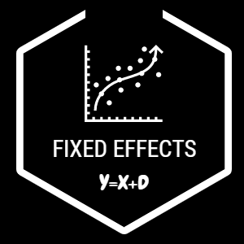
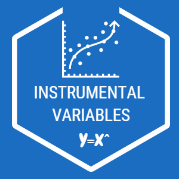

<h1> FOUNDATIONS OF PROGRAM EVALUATION III REGRESSION TOOLS FOR CAUSAL ANALYSIS </h1>

<table style="width:100%">
  <tr>
    <th>  </th>
    <th><h2> Fixed Effect Models </h2></th> 
  </tr>
  <tr>
    <th>  </th>
    <th><h2> Instrumental Variables </h2></th> 
  </tr>
</table>

* Instrumental Variables
* Matching
* Regression Discontinuity
* Difference-in-Difference
* Time Series
* Logistic Regression
* Duration Analysis
