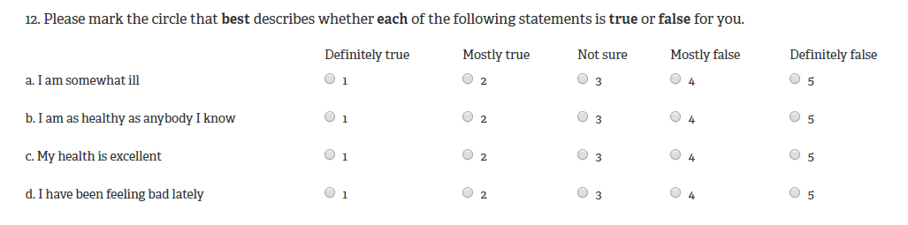

---
title: "Instrumental Variables Lab"
output:
  html_document:
    theme: readable
    df_print: paged
    highlight: tango
    toc: yes
    toc_float: no
    css: 'css/lab-instructions.css'
    includes:
      after_body: 'footer.html'
--- 


```{r setup, include=FALSE}
knitr::opts_chunk$set(echo = TRUE, message=F, warning=F, fig.width = 10)
```

```{r, echo=F}
library( stargazer )
library( pander )
library( dplyr )
```

# Lab Overview

This labs is loosely based on the paper written by Angela R. Fertig and David A. Reingold (2007) entitled ["Public housing, health, and health behaviors: Is there connection?".](https://onlinelibrary.wiley.com/doi/epdf/10.1002/pam.20288)

For this lab you need to upload the RegDisc_lab data available in the class R package. 

There are **6 sets of questions** to be answered. You can get up to 100 points + bonus questions. Points are indicated next to each question. 

Remember to:

* Format your table using stargazer 
* Submit the r markdown file with all your codes. 
* Bold your answers.

```{r, echo = F, results="hide"}
URL <- "DATA/IV_lab.csv"
data <- read.csv( URL, stringsAsFactors=F )
head( data ) %>% pander()
```


```{r, eval = F, results="hide"}
URL <- "https://raw.githubusercontent.com/DS4PS/pe4ps-textbook/master/labs/DATA/IV_lab.csv"
data <- read.csv( URL, stringsAsFactors=F )
head( data ) %>% pander()
```

## The policy problem

> **Research question**: 
> Does access to public housing improve health outcomes for low-income households? 

This lab analyzes some data to understand the relationship between receiving public housing assistance and health status.

We define health status as 4-item scale measuring individuals' self-reported health. The scale is shown in figure \@ref(fig:healthoutcomes) and was designed by RAND corporation for a medical study. Items are coded so that a value of 5 indicates better health status. We sum each item to obtain a scale from 1 to 20.

The literature suggests several reasons for why public housing might positively affect health status. Among others, public houses are beholden to health codes and reduce exposure to lead, dust, mold, and toxins that could impact health outcomes. It might also be that public houses provide easier access to health clinics willing to serve the poor so as households in public houses might be more likely to look for assistance. 

On the other hand, public housing might be located in segregated neighborhoods, which are often associated with gang violence and drug problems, which might negatively affect health outcomes.

We advance the following **hypothesis**:

> Households who received public housing assistance since longer will report better health outcomes.

## An instrumental variable approach

Estimating the impact of public housing assistance on health status can be problematic because of omitted variable bias. Fertig and Reingold describe it: "families who  pursue  housing  subsidies  may  be  more  or  less  attentive towards their  health  compared  to  families  who  do  not  pursue  subsidies.  If this is true, then their health behaviors and outcomes would be different regardless of whether they lived in public housing or not". 

We can see this in figure \@ref(fig:figure1). "Healthy lifestyle" is an individual's commitment to diet, exercise and utilization of healthcare services. It is an omitted variable, which is correlated with both the outcome and the policy variable. Individuals who are more concerned about maintaining an healthy lifestyle might be more likely to look for public house assistance. But concerns about one's healthy lifestyle might also lead to a better health statust. Healthy lifestyle is an omitted variable. Therefore we would need to use an instrumental variable to correctly estimate the relationship between public housing and health status. 

*Note: healthy lifestyle is an omitted variable in this exercise because it was not measured when data were collected. Omitted variables occur because some concepts are too complex to measure (remember the ability variable in the lecture) or because researchers did not collect data on some aspects (like in this case).*


<br>
<hr>
<br>

```{r healthoutcomes, fig.cap="Health status scale", out.width='100%', echo=F }

```

\newpage

<br>
<hr>
<br>


```{r figure1, fig.cap="Covariance structure of an instrumental variable model", out.width='80%', echo=F }

```


## The Data

Data were collected across multiple cities in the US. The study population includes only households eligible for public houses - i.e., househols whose income is below 80 percent of their city's median family income. 

A brief description of each variable is provided here below.


Variable names        | Description 
----------------------|----------------------------------------------------------------------------------------------------
HealthStatus          | Health status on a scale from 1 = poor to 5 = excellent
PublicHousing         | Number of years spent in a public house
Supply                | Number of available public houses in the city every 100 eligible households
ParentsHealthStatus   | Health status of parents
WaitingTime           | Average waiting time before obtaining public housing assistance in the city (in months)
Stamp                 | Dollar amount of food stamps (TANF) consumed each month
Age                   | Age
Race                  | Race, 1 = White, 2 = Black, 3 = Hispanic, 4 = Other
Education             | Education, 1 = High School, 2 = Diploma, 3 = Bachelor, 4 = Master
MaritalStatus         | 1 = Single, 2 = Married, 3 = Widow, 4 = Divorced 


# Lab Questions

## Q1 

**First, lets look at some descriptive statistics.**

* **Q1a:** Produce a summary statistics table using stargazer. (5 points)
* **Q1b:** What are the mean and standard deviation of the dependent variable? (2.5 points)
* **Q1c:** What are the mean and standard deviation of the policy variable? (2.5 points)

## Q2 

Let's examine the estimated impact of the policy variable in a model that does not account for omitted variable bias.

Run a naive model that predict the effect of public housing assistance on health status. Include race, education, age, and marital status as control variables. We are not accounting for our omitted variable, healthy lifestyle, in this initial model. 

* **Q2a:** Report the results in a regression table with stargazer. (5 points)
* **Q2b:** What is the estimated effect of public housing in this model? Is that statistically significant? How much does an additional month of public housing assistance decrease or increase health status? (5 points)


## Q3 

**Now we examine our data and identify four possible instrumental variables:**

* Supply of public housing measured as the number of housing available every 100 households
* Health status of parents
* Waiting time for a public housing
* Dollar amount of food stamps (TANF) consumed each month

* **Q3a:** What three key characteristics should these variables have to be valid instruments? Briefly list and describe them. (15 points)

## Q4 

**Look at the correlation matrix provided below. To help you, the matrix contains the omitted variable (note that in reality you won't have this information!).** 

* **Q4a:** Which criteria among the ones described in question Q3a can you test by looking at the correlation matrix? (5 points)
* **Q4b:** For each of the three variables, describe which criteria of a valid instrument they meet and which criteria they do not meet based on the matrix. (15 points)  
* **Q4c:** As a result, which variable(s) is(are) a valid instrument? (5 points)

## Q5

**Once you selected the valid instrumental variable(s), you need to decide which one is the best choice (in a real study, we might want to include both of them; but, for simplicity, let's limit our selection to one instrumental variable).**

* **Q5a:** Run a first-stage model using each of the instrumental variables that you selected as valid in question Q4c. Provide result tables using stargazer. (10 points)
* **Q5b:** Given the results of the first stage, which variable would you pick as instrumental variable? (5 points)
* **Q5c:** Why? (5 points)

## Q6

**Now run the second stage of the IV model using the instrumental variable that you selected in Q5.** 

* **Q6a:** Provide result tables using stargazer. (5 points)
* **Q6b:** Is the effect of public housing on health status positive or negative after you utilize an instrumental variable? Is it statistically significant? (5 points)
* **Q6c:** How much does the health status of a individual increase or decrease for each additional months spent in a public house? (5 points)
* **Q6d:** Compare results with the naive model. Were we under- or over-estimating the effect of public housing on health status? (5 points)

## BONUS QUESTION 1

**Imagine that you are explaining your results to a journalist. You want to provide a concrete example of the effect of public housing assistance. (5 points) **

* **BQ2a:** From the summary statistics table, retrieve the amount of time spent in a public house for an average individual and an individual in the top 25 percent (use the third quantile). 
* **BQ2b:** If for each 1-point increase of the health status index, the government saves 1200 $ in medical bill, what is the average amount of savings when we move from an average individual to an individual in the top-25 percent? Consider the individual to be white, with a diploma, 35 years old and single.  

## BONUS QUESTION 2

**Will the omitted variable be correlated with the residual of stage 1? Will it be correlated with the predicted values of X1? (5 points) **

* **BQ2a:** Draw a plot representing the correlation between the omitted variable (the variable is called HealthBehavior in your dataset) and the predicted value of the first stage.
* **BQ2b:** Draw a plot representing the correlation between the omitted variable (the variable is called HealthBehavior in your dataset) and the residuals of the first stage.

\newpage

<br>
<hr>
<br>

```{r matrixstructure, fig.cap="Correlation matrix structure", echo=F, fig.height=10}

dat <- 
  data %>%
  select( HealthStatus, PublicHousing, Supply, WaitingTime, 
          Stamp, ParentsHealthStatus, HealthBehavior)

panel.cor <- function(x, y, digits=2, prefix="", cex.cor)
{
    usr <- par("usr"); on.exit(par(usr))
    par(usr = c(0, 1, 0, 1))
    r <- abs(cor(x, y))
    txt <- format(c(r, 0.123456789), digits=digits)[1]
    txt <- paste(prefix, txt, sep="")
    if(missing(cex.cor)) cex <- 0.8/strwidth(txt)
    
    test <- cor.test(x,y)
    # borrowed from printCoefmat
    Signif <- symnum(test$p.value, corr = FALSE, na = FALSE,
                  cutpoints = c(0, 0.001, 0.01, 0.05, 0.1, 1),
                  symbols = c("***", "**", "*", ".", " "))
    
    text(0.5, 0.5, txt, cex = 1.5 )
    text(.7, .8, Signif, cex=cex, col=2)
}

panel.smooth <- function (x, y, col = par("col"), bg = NA, pch = par("pch"), 
	cex = 1, col.smooth = "red", span = 2/3, iter = 3, ...) 
{	points(x, y, pch = 19, col = gray(0.7,0.3), bg = bg, cex = cex)
	ok <- is.finite(x) & is.finite(y)

	if (any(ok)) 
		lines(stats::lowess(x[ok], y[ok], f = span, iter = iter), 
			col = col.smooth, lwd=2, ...)
}

pairs( dat, upper.panel=panel.cor, lower.panel=panel.smooth )


```


```{css, echo=F}
p {
color: black;
margin: 0 0 20px 0;
}

td {
    padding: 3px 10px 3px 10px;
}

p.caption {
    text-align: center;
    font-style: italic;
}

table
{ 
    margin-left: auto;
    margin-right: auto;
    margin-top:80px;
    margin-bottom:100px;
}

h1, h2{
  margin-top:100px;
  margin-bottom:20px;
}

H5{
    text-align: center;
    color: gray;
    font-size:0.8em;
}

img {
    max-width: 90%;
    display: block;
    margin-right: auto;
    margin-left: auto;
    margin-top:30px;
    margin-bottom:20px;
}

pre {
  overflow-x: auto;
}

pre code {
   display: block; 
   padding: 0.5em;
   margin-bottom:20px;
}

code {
  font-size: 92%;
  border: 10px solid #F8F8F8;
  margin-bottom: 2px;
}

code[class] {
  background-color: #F8F8F8;
}


caption {
  font-style: bold;
}

```


