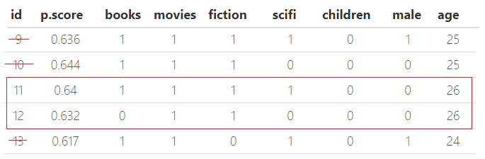
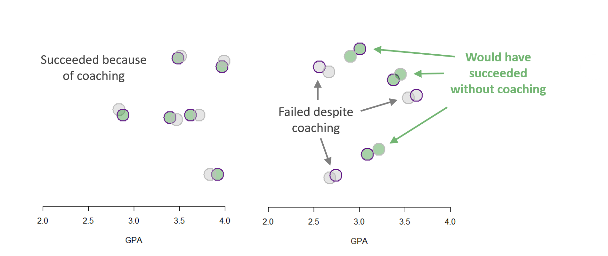
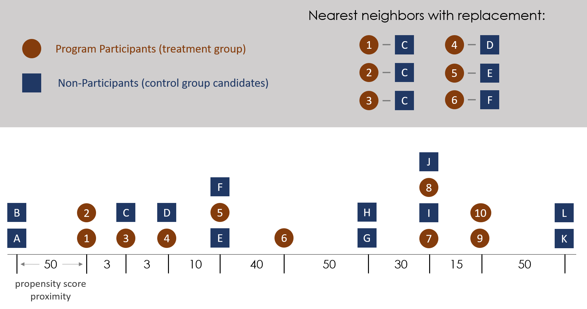
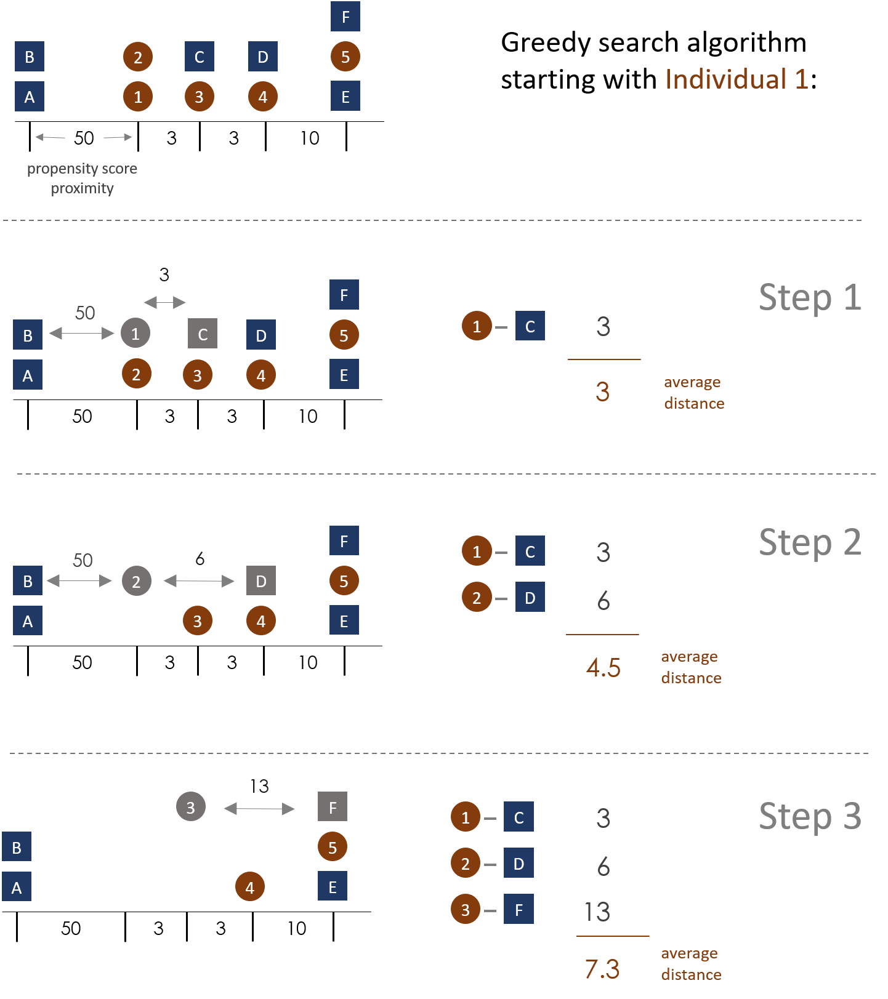
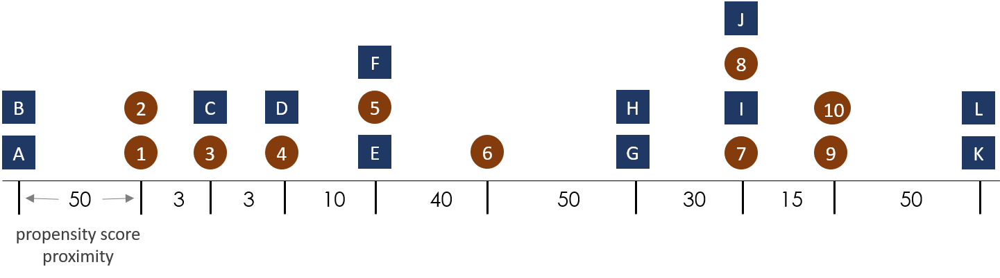

---
title: "LAB: Matching"
output:
  html_document:
    theme: readable
    df_print: paged
    highlight: tango
    toc: yes
    toc_float: no
    css: 'css/lab-instructions.css'
    includes:
      after_body: 'footer.html'
--- 

```{r setup, include=FALSE}
knitr::opts_chunk$set(echo = TRUE, message=F, warning=F, fig.width = 10)
```


# Policy Context 

Matching is an extremely valuable tool in the program evaluation toolkit because it can be used alone or in combination with other models to account for selection problems when programs are voluntary and mitigate bias. 

Field experiments and RCTs are the gold standard for social science research because randomization ensures that the treatment and control groups are for all practical purposes identical. If randomization is successful then the two groups should be "balanced" on all measured and unmeasured characteristics, meaning observable traits like gender, wealth, IQ, health, speed, and experience should be equally distribute across both groups. Similarly, unobservable traits like motivation, happiness, and grit should also be equally distributed. Any comparison of means of any of these traits between the two groups should result in null effects, i.e. indistinguishable levels or proportions of each trait. 

One of the nicest features of experiments is that balancing the groups greatly simplifies the analysis. If all of the covariates are balanced then program effects can be estimated using a simple comparison of means of the treatment and control group in the post-treatment period. Importantly, if randomization is done correctly the latent or observed level of the dependent variable should be identical prior to the treatment, meaning the estimator **T2-C2** will capture the treatment effects and not secular trends. 

This point is important because there are many research questions where pre-treatment measures do not exist. If you are studying the effect of a specific type of counseling that is supposed to help violent first-time offenders develop better conflict resolution skills so they do not recidivate, then returning to prison is the outcome of interest. How do you measure recidivism if the prisoners prior to the program if prisoners have not yet been released from jail? 

Many of the quasi-experimental methods use time trends to measure and remove the gains that occur independent of the treatment (secular trends), they require measures from at least two points in time. **In contexts where pre-treatment metrics are meaningless the only remaining estimator is the post-test only estimate of program impact.** This estimator is only unbiased if the treatment and control group are identical prior to the treatement. 

In many other circumstances it is *possible* to measure pre-treatment outcomes, but evaluators are only engaged once funding for the program has been secured or the pilot phase is complete, so it is too late to get pre-treatment measures. In these cases the evaluators have to find ways to build a robust post-treatment comparison. 

Matching is a tool that allows us to manually construct groups so that they will approximate the types of groups created through randomization. Instead of using a brute force process like randomization, matching curates a study sample by carefully selecting subjects that create balanced groups. The test for success in the matching process is exactly the same as the test for "happy" randomization in experiments - comparing all of the measured pre-treatment characteristics of study participants to ensure that the groups would have been the same prior to the start of the program. 

The main difference is that randomization will ensure observed **and unobserved** characteristics of study participants are balanced. Since matching uses specialized algorithms to identify subsets of the data that are balanced, it can **only match on observed traits** with no way to test whether important omitted variables or hard-to observe differences in motivation have been mitigated. As a result, matching works best when there is a rich set of covariates describing study participants. In these circumstances it has been shown that in many contexts estimates of treatment effects using groups constructed through matching generate the same results as randomized control studies: 

*Stuart, E. A. (2010). Matching methods for causal inference: A review and a look forward. Statistical science: a review journal of the Institute of Mathematical Statistics, 25(1), 1.*

*Fortson, K., Verbitsky-Savitz, N., Kopa, E., & Gleason, P. (2012). Using an experimental evaluation of charter schools to test whether nonexperimental comparison group methods can replicate experimental impact estimates. Washington, DC: US Department of Education, Institute of Education Sciences, National Center for Education Evaluation and Regional Assistance.*

*Ferraro, P. J., & Miranda, J. J. (2014). The performance of non-experimental designs in the evaluation of environmental programs: A design-replication study using a large-scale randomized experiment as a benchmark. Journal of Economic Behavior & Organization, 107, 344-365.*

And in circumstances where it does not completely replicate effects obtained from experiments it at the very least reduces the size of bias: 

*Glazerman, S., Levy, D. M., & Myers, D. (2003). Nonexperimental versus experimental estimates of earnings impacts. The Annals of the American Academy of Political and Social Science, 589(1), 63-93.*


# Matching Models 

This lab is distinct from the replication studies you have done on previous labs because matching is not a model used to estimate and interpret program effects. Rather, matching is a process used to construct a valid counterfactual prior to analyzing the data. Once the data is matched any variety of regression tools can be used to conduct the analysis. It is an imput into the study design process more than a way of estimating the results.

For this reason, the lab is designed to break open the black box of matching models to show you some important features of the algorithms so that you understand what is happening behind the curtain. Like many aspects of modeling, there is an art to the science of matching. It is not a single technique, but a family of techniques that are designed to use a large observational sample that is known to contain selection bias because participants had the choice to opt-in or opt-out of the program under review. As a result, those that chose to participate are different from those that chose not to participate in ways that have a meaningful effect on the outcome of interest. Simply comparing the post-intervention outcomes of the "treated" to those of program non-participants will certainly result in very biased and very misleading inferences. 

**The comparison group is not a valid counterfactual in that it does not present a measure of what the treatment group would have looked like if they had not participated in the program.**

We overcome this problem by restricting the analysis to a subset of the data after we have identified "twins" that are *identical* on all measured pre-treatment characteristics except that one participated in the program and one did not. 


> *Does starring in Game of Thrones make you rich and happy? One of these twins received the treatment, while the other now regrets listening to dad and being "pragmatic and realistic" about his career.*

More precisely, matching does not ensure that each program participant has an *identical twin*, rather it is an efficient way to ensure that the groups are *statistically identical*, i.e. that group traits are not significantly different. Just like randomization can fail when chance produces dissimilar groups, matching fails when algorithms cannot identify balanced subgroups within the data resulting in observed differences in group means on measured traits. 

This can occur for several reasons. Just like an individual would need a large crowd if they wanted to find their doppelganger, matching typically requires a large pool of candidate twins for each individual in the treatment group. Or alternatively, if the types of people that participate in the program are **completely different** from the rest of the people in the sample then it might be mathematically impossible to create balanced groups. 


## Matching Process

Many of the estimation techniques that we use in this program were derived from mathematical theory and represent elegant ways to model data. For example, we might fail to appreciate that the compact formula **b1=cov(x,y)/var(x)** generates the precise regression slope that maximizes model fit and minimizes the residual. A similarly parsimonious formula gives us the standard error of the slope, which allows us to test the primary hypothesis of interest that the program generates meaningful impact and does not produce harm. 

Comparatively, matching is a very mechanical process that requires brute force manipulation of the data to identify statistical doppelgangers. Although they were first developed by statistics methodologists, the current applications draw as much from computer science tools for optimization as they do from statistical theory. 

Early advances in the methodology came from the field of education using a specific approach to matching using propensity scores:

*Rosenbaum, P. R., & Rubin, D. B. (1985). Constructing a control group using multivariate matched sampling methods that incorporate the propensity score. The American Statistician, 39(1), 33-38.*

A more recent wave of work shows that the method is sound, but some of the common approaches to propensity score matching are problematic because of the way they search for "twins" in the data. They have developed better algorithms that improve upon early theory but rely more on computational tools that can more efficiently explore data to create robust group membership. 

*King, G., & Nielsen, R. (2019). Why propensity scores should not be used for matching. Political Analysis, 27(4), 435-454.*

The key problem in matching is balance. The process or algorithm that is used to construct your groups determines which cases are kept in the sample, which determines the overall *quality* of the counterfactual (quality meaning high internal validity in this context). Different algorithms will give you vastly different groups, as you will see. 

As a result, understanding the mechanics of the process will help you tailor the matching procedure to your specific context. 

Unsurprisingly, many of the best tools have been built in R. This lab demonstrates some key features of the **MatchIt** package. 


# Packages

The **MatchIt** package was developed by Gary King and colleagues, and contains an entire library of routines for matching. Recall that matching is a family of approaches to constructing a balanced treatment and control group from observational data, not a specific model used to estimate program impact. 

*Ho, D. E., Imai, K., King, G., & Stuart, E. A. (2011). MatchIt: nonparametric preprocessing for parametric causal inference. Journal of Statistical Software, http://gking. harvard. edu/matchit.*

They also provide a nice [**package vignette**](articles/matchit.pdf) with some exaples. 

```{r}
# install.packages( "MatchIt" )
# install.packages( "rgenoud" )

library( dplyr )
library( pander )
library( stargazer )
library( MatchIt )
library( rgenoud )
```


# Data

Data for this lab comes from an informal survey of MPA students in a program evaluation class in 2012 to generate a simple example of matching scores in action. Students were asked if they have read any of the Harry Potter series, which is a stand-in for the treatment in the study. 

Since reading Harry Potter is a voluntary activity we worry about selection problems - people that read the books are different than those that do not (Harry Potter fans are randomly distributed across the population). Which leads us to ask, could we predict the behavior with some simple demographics. The survey consisted of the following questions precedded by their variable name in the dataset: 

1. **books**: "Have you read some or all of the books from the Harry Potter series (yes/no)?"
2. **movies**: "Have you seen any of the Harry Potter movies (yes/no)?"                       
3. **fiction**: "Do you read fiction often for fun (yes/no)?"                                  
4. **scifi**: "Do enjoy science fiction or fantasy genres (yes/no)?"                         
5. **children**: "Do you have children over eight years in age (yes/no)?"                       
6. **male**: "What is your sex (male/female)?"                                                   
7. **age**: "What is your age (numeric)?"                                                   
8. **race** "What is your race (white, black, asian, other)?"

Dummy variables have been created for the **white**, **black**, and **asian** categories. 


```{r}
URL <- "https://raw.githubusercontent.com/DS4PS/pe4ps-textbook/master/labs/DATA/harry-potter.csv"
dat <- read.csv( URL, stringsAsFactors=F )
head( dat ) %>% pander()
```

We have 51 respondents, and 37 percent (19/51) reported that they had read at least one book in the Harry Potter series. 

As you can see, the "treatment" and "control" groups of readers are unbalanced. 

```{r}
dat %>% 
  group_by( books ) %>% 
  summarize( mean.age = mean(age),
             prop.male = mean(male),
             prop.fiction = mean(fiction),
             prop.scifi = mean(scifi),
             prop.movies = mean(movies),
             prop.children = mean(children),
             prop.white = mean( race == "white" ),
             prop.black = mean( race == "black" ), 
             prop.asian = mean( race == "asian" ) ) %>% 
  pander( digits=2 )
    
```


The goal is to create a balanced group with no measured differences between the fan club and non-readers. 

Note that about 2/5 of the full sample read Harry Potter and about 2/5 of white respondents reported the same. However, only 1 of the 5 Asian respondents had NOT read Harry Potter, and only 1 of the 17 Black respondents HAD read Harry Potter. As a result, you will see that race ends up shaping our final matched sample the most. To achieve balanced groups the algorithms will basically drop Black and Asian people from the sample. Thus our understanding of the societal impact of the Harry Potter series will have high internal validity but low generalizability to races other than White. 

Although it is a frivolous example, it actually does a good job of demonstrating how racial bias can work its way into algorithms with absolutely no desire or intent to do so. 


# Lab Instructions 

This lab will use the Harry Potter survey data and a toy optimization dataset to demonstrate some features of algorithms that are designed to "search" for optimal solutions in data. In this case, the optimal solution will be a set of group members in the treatment and control groups that generate no group differences. 

* Part 1 demonstrates the nearest neighbor approach to matching. 
* Part 2 introduces the challenges with greedy search algorithms. 
* Part 3 shows how these concepts can be leveraged to improve group construction using the MatchIt package. 

## Propensity Scores

A propensity score in evaluation is simply a measure of the probabilty or likelihood that a specific person particpate (or has participated) in the program. 

We can estimate the propensity score empirically using program participation as our dependent variable in a linear probability model or a logit. 

```{r, results="asis"}
ps.model <- lm( books ~ movies + fiction + scifi + 
             children + male + age + factor(race), 
             data=dat )

stargazer( ps.model, digits=2, type="html",
           omit.stat = c("f","ser") )
```

We care less about interpretting results and more about getting the predicted propensity for program participation from the model. Note that the data has been sorted by propensity scores so that twins can be identified.  

```{r}
dat$p.score <- ps.model$fitted.values %>% round(3)

col.order <- c( "id", "p.score", "books", "movies", "fiction", 
                   "scifi", "children", "male", "age", "race",
                "white","black","asian")

dat <- dat[ col.order ]

head( dat, 15 ) %>% pander()
```


## Part 1 - Neighest Neighbors

We have estimated each individual's propensity score based upon whether or not they participated in the program (read Harry Potter). 

For Part 1 open your dataset in the viewer or Excel. You can use the clipboard to paste the data into Excel: 

```{r}
write.table( dat, "clipboard", row.names=F, sep='\t' )
```

### Q1 

Using a *simplified* nearest neighbor heuristic, identify all of the "twins" in your dataset, i.e. the near identical cases that serve as a strong counterfactual. 

TO achieve this, apply the following heuristic: 

1. For each individual in the treated group (**books**) check whether a control group neighbor exists by looking one line up and one line down for a neighbor that has not read the books. If there is no good comparison ignore the case. 
2. If the individual has an untreated neighbor, add both IDs to your study set. 
3. After a match occurs do not consider the matched pair for future matches (matching WITHOUT replacement). 

For example, individual 10 here does not have a candidate neighbor in the control group. Case 12 is closer to 11 than to 13, so they become a match.

This is called a **nearest neighbor** approach because each observation in the treatment group is compared to its close neighbors to identify potential matches. The real algorithm would use a distance threshold, not the one row up and one row down rule, but the basic process is instructive. 

Note how well the propensity score does at identifying twins in this case. They are exactly the same except for one likes science fiction and one does not. 



**Print your matched sample as your solution to Q1.**

```{r}
# add ids of all matched 'twins' 
ids <- c(11,12)  
dat[ ids, ] %>% pander()
```


## Q2 

Now check the balance on your original dataset and on your new matched dataset. You can use the following function to compare all means at once. 

```{r}

compare_means <- function( df )
{
  
  options( scipen=8 )
  
  vars <- c("movies", "fiction", "scifi", "children", 
            "male", "age", "white", "black", "asian")
  
  results <- NULL
  loop.count <- 1
  
  for( i in vars )
  {
    x <- i
    ttest <- t.test( get(x) ~ books, data=df )
    
    control    <- as.numeric( ttest$estimate[1] ) %>% round(2)
    treatment  <- as.numeric( ttest$estimate[2] ) %>% round(2)
    diff       <- ( treatment - control ) %>% round(2)
    p.value    <- ttest$p.value %>% round(5)
    ci.lower   <- ttest$conf.int[1] %>% round(2)
    ci.upper   <- ttest$conf.int[2] %>% round(2) 
    
    new.row <- cbind( variable=i, treatment, control, diff, p.value, ci.lower, ci.upper ) 
    results <- rbind( results, new.row )
  
  }
  
  t <- table( df$books )
  results <- rbind( results, c("n",as.numeric( t[2] ), as.numeric( t[1] ), "","","","" ) )
  return( as.data.frame( results ) )

}

compare_means( df=dat ) %>% pander()

```


**Q2a**

Print the balance table (comparison of means) for your original dataset and your matched sample. 

```{r, eval=F}
compare_means( df=dat         ) %>% pander()
compare_means( df=dat.matched ) %>% pander()
```


**Q2b**

Did balance improve? Explain your reasoning. 


### Q3

Explain how a match like this might occur? 


```{r}
these <- c("id", "p.score", "books", "movies", "fiction", "scifi", "children", 
           "male", "age", "race")
dd <- dat[ 26:27, these ]
rownames( dd ) <- NULL
dd %>% pander()
```


## Part 2 - Greedy Search 

The computer program needs rules to determine which cases are matched pairs and which cases are dropped from the original sample. In Part 1 you used a simple heuristic of sorting the dataset by propensity scores then comparing each case to the row above and row below, keeping the pair if one was in the treatment group and the other was in the control. 

The lecture introduced a slightly-different heuristic, which was to simply keep all cases there a treated observation (paid for admissions coaching) overlapped with a non-treated observation. Those cases were kept, and the rest of the data was thrown out. This is an exaple where the study includes two continous numeric covariates only, so its easy to represent matches on the two dimensional grid by finding overlapping dots. In the example above the propensity scores represent the likelihood of participating in a program, so people with high likelihood of participation are only matched with other people that are highly likely to participate in the program but did not for some reason. 

 

Matching programs will use slightly more complex heuristics for determining matches. Note though, that they are still heuristics because they are apply simple sets of rules to generate reasonable results. A small matched sample is retained and the rest of the data is discarded. 

The **optimal** solution to the matching problems is to return the IDs of people in the dataset that generate the highest degree of balance in the dataset on measured covariates. It turns out to be a very hard mathematical problem because there is no closed-form solution to identify the best set of twins (closed form solution = a formula that can be proven to produce the highest score). And it also turns out to be a hard problem computationally because even with small datasets it would take thousands of years to explore all possible combinations of pairs in the dataset to find the best combinations. 

As a result, many algorithms use something called **greedy search**, which means simply identifying the best solutions for each individual observation, and iterating through all of the observations in the treatment group searching for the best twin for each case. It is called a **greedy** algorithm because it only considers each observation in isolation, and does not consider how each individual match might make the global score worse (i.e. weaken the balance of the matched dataset). The term **impatient** might be a better description of how the algorithm operates. 

For Part 2 of the lab you will work with a small dataset of 22 observations and create your own greedy matches following a couple of simple rules. Orange circles repreent program participants, and blue squares represent the candidates for our control group. 

The horizontal axis represents where observation fall along some propensity measure, but instead of reporting the score itself the numbers report the distance between clusters of observations on the propensity measure. True propensity scores range from 0 to 1, but this hypothetical case uses larger numbers to make addition easier. 

The basic goal of a greedy algorithm is to find the closest match for each observation in the treatment group. In this chart the example allows for matching with replacement, so one untreated case can be used as the control group reference for multiple treated case. It is more common to use matching without replacement. 





**Instructions:**

You will be given four different start points, and your job is to create the matched dataset by hand using a greedy search heuristic and matching WITHOUT replacement. Once you have added observations to a pair, remove them from the data. 

For example, the diagram below shows a case where the search start with observation #1 in the dataset. After #1 is matched then the nearest neighbor for #2 is found. 

In this example the algorithm is following some ordering of the dataset, like first ID to last ID. 

The fitness score or objective function that we are seeking to minimize is the average distance between all paired observations in the matched set. Smaller distances between pairs means they are more similar on measured traits. A smaller average score translates to better model balance. 

The goal of this exercise is to show how small changes to a greedy search heuristic can results in very different results. 





### Q1 

Using the diagram below create four different sets of matched pairs and report their average distance scores. 

**Q1a:** Start with observation #1 in the treatment group, and go in order until you finish with observation #10. For each observation use a nearest neighbor rule to create the match and remove matched pairs from the list.

Create a spreadsheet with your matched pairs listed as "1-C", "2-D", etc. Record the distance measure for each matched pair, and tabulate the average distance between all matched pairs at the end. If two observations are stacked vertially in the diagram and they are matched the distance between them is zero.

**Q1b:** Repeat the same operations, but now start with individual #10 and work backwards through the list until you have results for all 10 cases in the treatment group. 

**Q1c:** Now instead of starting with an arbitrary participant and following the order of IDs, go in order from those cases that have the smallest distance to their neighbors to those that have the largest. For example, you could start with **3-C**, **4-D**, and **7-I** since they all have distance scores of 0. Once all of the zero distance cases are gone, start with the next case that has the shortest distance to a non-matched neighbor. Repeat for all observations. 

**Q1d:** We are forcing you to match every observation in the treatment group, even if their nearest neighbor is located far away. What happens if you only need to retain 60% of your sample for analysis. How does that change your fitness statistic?




**Report your results to Q1a to Q1d as a table with each matched pair, the distance between observations in the matched pair (like the example above), and the globalaverage distance measure across all 10 cases.**

How sensitive are greedy search arguments to small changes like which data point you start with? 


### Bonus 

Continue using the greedy search rule (find the nearest neighbor), but you are free to choose the order of observations that you match as long as you match all 10 program participants and do not use replacement. Can you beat the lowest score from Q1a to Q1c? 


## Part 3 - MatchIt Package 

Now that you have some intuition about the algorithms underneath the hood try out the **MatchIt** package. 

In practice it can be hard to predict which options work well with specific datasets. Each data set has its own unique internal structure and dimensionality that is suitable for one heuristic and not another. You will use the concept of balance to guide your choices. 

The syntax is close to regression syntax, so fairly simple. The default search method a greedy nearest neighbor approach: 

```{r}
# nearest neighbor is the default method

m.out <- matchit( books ~ movies + fiction + scifi + children + 
                  male + age + white + black + asian, data=dat,
                  method = "nearest" )

# view match statistics 
m.out
```

### Q1: 

If you are happy with the new sample balance you can create a subset of your data using the **match.data()** function. With this default method we ended up dropping 13 observations from the control group. Did it improve the balance in our data? How can you tell? 

```{r}
# create a new dataset from the matches
d.matched <- match.data( m.out )
compare_means( df=d.matched  ) %>% pander()
```


### Q2

In the printout above of sample statistics it reports that 13 cases in the control group were unmatched at the end. The **discard=** argument allows he program to drop observations prior to matching. This is helpful when some cases fall outside of the region of common support. 

How does relaxing this contraint change the final sample size? 

Does it generate more or less balance than the defaul method reported in Q1? Is this consistent with Q1d in Part 2? 


```{r, eval=F}
m.out <- matchit( books ~ movies + fiction + scifi + children + 
                  male + age + white + black + asian, data=dat,
                  discard="both" )

m.out 
d.matched <- match.data( m.out )
# compare_means( df=d.matched ) %>% pander()
```

You might need to remove the movies variable from your table of contrasts if everyone saw the films in the matched sample. A column of ones has no variance, so the t-test will report an error. Just comment out movies in the variable list. 

```{r, eval=F}
compare_means <- function( df )
{
  
  options( scipen=8 )
  
  vars <- c("fiction", "scifi", "children",   # "movies", 
            "male", "age", "white", "black", "asian")
  
  results <- NULL
  loop.count <- 1
  
  for( i in vars )
  {
    x <- i
    ttest <- t.test( get(x) ~ books, data=df )
    
    control    <- as.numeric( ttest$estimate[1] ) %>% round(2)
    treatment  <- as.numeric( ttest$estimate[2] ) %>% round(2)
    diff       <- ( treatment - control ) %>% round(2)
    ci.lower   <- ttest$conf.int[1] %>% round(2)
    ci.upper   <- ttest$conf.int[2] %>% round(2) 
    p.value    <- ttest$p.value %>% round(5)
    
    new.row <- cbind( variable=i, treatment, control, diff, ci.lower, ci.upper, p.value ) 
    results <- rbind( results, new.row )
  
  }
  
  t <- table( df$books )
  results <- rbind( results, c("n",as.numeric( t[2] ), as.numeric( t[1] ), "","","","" ) )
  return( as.data.frame( results ) )

}

compare_means( df=d.matched ) %>% pander()
```


### Q3

Q1 and Q2 both use greedy search routines. Some of the other search methods borrow from optimization to do a more thorough search for sets of pairs that lowers the average distance in the matched set. Compare the sample created by this type of search to the samples generated from Q1 and Q1. 

* Is the sample size larger or smaller than each?   
* Is the balance better or worse than each?  

_Please use the chunk argument **results="hide"** when running the genetic search method so you don't include a dozen pages of genetic search iteration output._ 

```{r, message=FALSE, results="hide", eval=F}
m.out <- matchit( books ~ movies + fiction + scifi + children + 
                  male + age + white + black + asian, data=dat,
                  method="genetic" )
```


```{r, eval=F}
m.out 
d.matched <- match.data( m.out )
compare_means( df=d.matched ) %>% pander()
```


