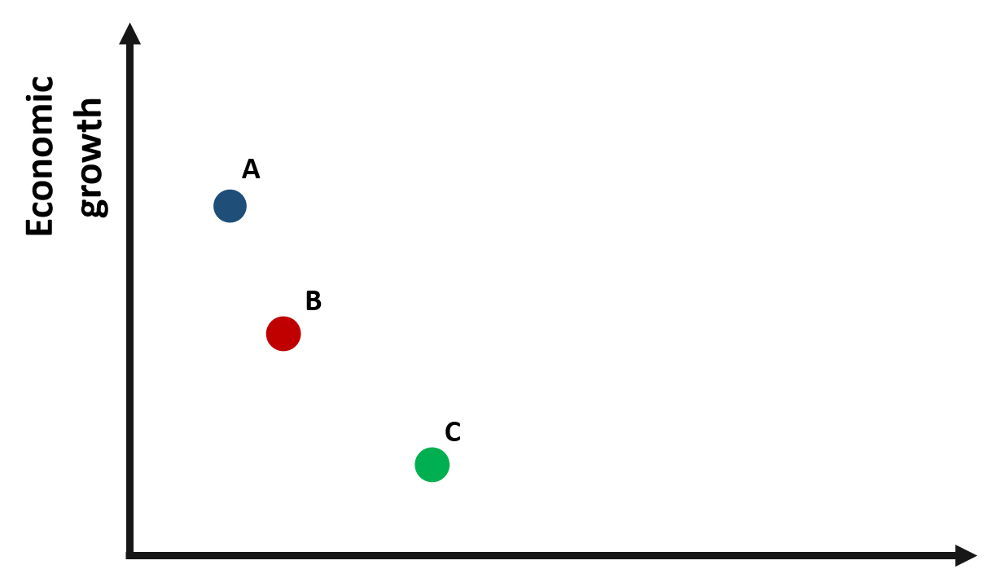
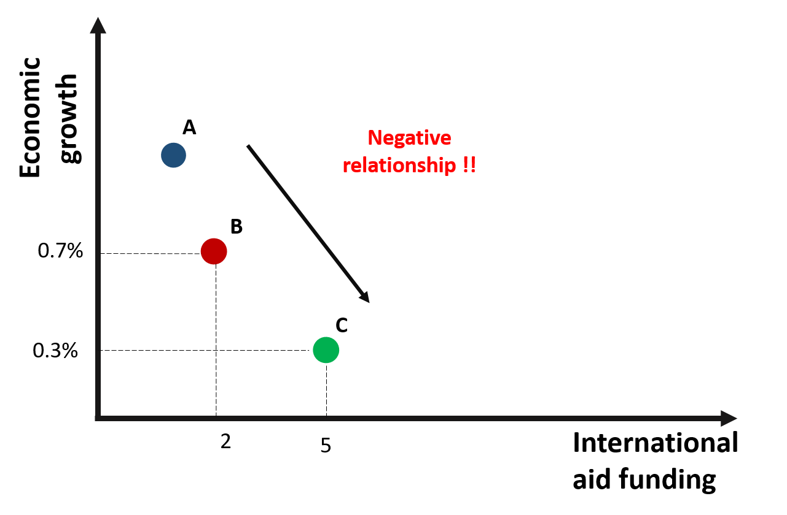
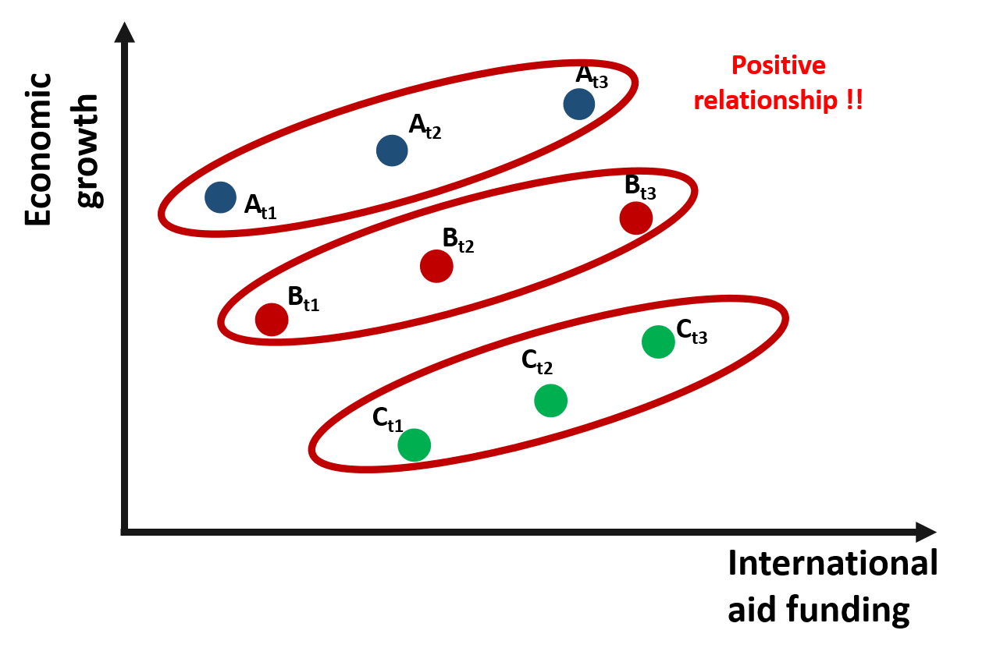

```{r setup, include=FALSE}
knitr::opts_chunk$set(echo = TRUE, message=F, warning=F, fig.width = 10)
```

**Packages**

Here are the packages we will use in this lecture. If you don't remember how to install them, you can have a look at the code. 

* **plm** for fixed effect model
* **car** and **gplots** for graphs
* **stargazer** for nice tables


```{r, echo=TRUE, eval=F, results="hide" }
install.packages( "plm" )
install.packages( "stargazer" )
install.packages( "scales" )
install.packages( "car" )
install.packages( "gplots" )
install.packages( "fastDummies" )
```

```{r, echo=FALSE, results="hide"}
library( "plm" )
library( "scales" )
library( "stargazer" )
library( "car" )
library( "gplots" )
library( "fastDummies" )
library( "pander" )
library( "dplyr" )
```


**What you will learn**

* What is the difference between an OLS, fixed, and random effect model?
* How do you interpret the effect of X on Y in a fixed effect model? 
* Which data structure do you need to run a fixed effect model? 
* How to run a fixed effect model in R


# The key concept

We will start with a very simple example to illustrate the idea of within and between variation, which is the key to understanding the fixed effect model.

Let's imagine to have data about three different countries. We want to understand the relationship between international aid funding received by the country (policy variable) and economic growth (outcome variable).

```{r f1, fig.cap="Relationship between economic growth and international aid", out.width='60%', echo=F }

```

Based on the graph, we would expect a negative relationship between x and y: countries receiving greater international aid report a lower growth. For instance, country C receives more funding than country B but its growth it's less than half of country B.

```{r f2, fig.cap="A negative relationship between growth and international aid?", out.width='60%', echo=F }

```

Are we supposed to conclude that international aid has a negative effect on growth?

A way to confirm this result is to collect data about each country over an extended period of time. In this way, we move from **cross-sectional** data to **panel** data, where each variable in the datset is observed along a given time period.

The small "t" next to each observation indicates the time at which data were collected. 

The graph \@ref(fig:f3) represents observations from three countries across three time periods.

```{r f3, fig.cap="Relationship between growth and international aid: panel data", out.width='60%', echo=F }
knitr::include_graphics( "FIGURE/FixEffs/Picture3.png" )
```

If we consider the relationship between international aid and growth **within** each time period and **across** the 3 countries, the relationship is once again negative. 

```{r f4, fig.cap="Relationship between growth and international aid: **Across** countries variation", out.width='60%', echo=F }

```

However, if we change the way we look at the data and consider the relationship between international aid and growth **within** one single country and **across** time, we would observe a positive relationship.

```{r f5, fig.cap="Relationship between growth and international aid: **Within** countries variation", out.width='60%', echo=F }

```

Why does the relationship change so much?

One possible explanation is that country C is poorer and, because of that, it receives more funding than the other countries. However, when we compare country C against other countries, its growth is still limited. As results, **across** countries variation is negative. The trend is positive only if we compare growth over time **within** each country. As country C receives more funding, its economic growth improves.

This statistical phenomenon is known as the **Simpson's Paradox**, where trends are different depeding on whether data are observed by groups or at the aggregate level (you can read more about the Simpson's paradox [here](https://towardsdatascience.com/simpsons-paradox-how-to-prove-two-opposite-arguments-using-one-dataset-1c9c917f5ff9) and [here](https://towardsdatascience.com/simpsons-paradox-and-interpreting-data-6a0443516765)). 

As we will see in the remain of the lecture, **fixed effect** wil enable us to consider differences across groups so that we can estimated the within effect of the policy intervention.

**Mundlak (1965) presented one of the first examples of solvig "management bias" in estimations using fixed effects.**


```{r, echo=F}

# this one works well:
e <- c(-0.217265337508781, 0.0996074731855418, 0.0800275276849036, 
-0.178488399013339, -0.496420526595239, -1.7168471976976, -0.405092050237224, 
-0.115710342436631, -0.371092702457788, 0.822415948208485, 0.85135450577188, 
0.171227422217835, 0.123875567283242, 1.40368293360846, 1.2581671356454, 
0.62810338038335, -0.887705537863198, 0.757750779879804, 1.08763122728127, 
0.575576369638848, 0.28709316244214, -0.375428732568683, 0.663417542179713, 
1.04134503360736, -0.16471947215554, 2.4753832533224, -1.11870402193226, 
0.32517135445685, -1.07233215548999, -0.0896477846333077)

id <- rep( 1:3, each=10 )
org.id <- factor(id)


# MODEL 1 - OLS

x1  <- 9 + 1:10 + 0*id
y1  <- 25 + x1 + 0*id + e


x <- x1
y <- y1
m1 <- lm( y ~ x )


# MODEL 2 - Random Effect

x2  <- 9 + 1:10 + 0*id
y2  <- 5 + x2 + 10*id + e


x <- x2
y <- y2
m2.ols <- lm( y ~ x )
m2.re <- lm( y ~ x + org.id )


# MODEL 3

x3  <- 1:10 + 5*id
y3  <- 5 + x3 + 10*id + e

x <- x3
y <- y3
m3.ols <- lm( y ~ x )
m3.fe <- lm( y ~ x + org.id )


# SYNTHETIC DATA 

# MODEL 1 - OLS

x1  <- 9 + 1:10 + 0*id
y1  <- 25 + x1 + 0*id + e

x <- x1
y <- y1
m1.ols <- lm( y ~ x )


# MODEL 3

x3  <- 1:10 + 5*id
y3  <- 5 + x3 + 10*id + e

x3.mean <- ave( x3, org.id )
x3.centered <- x3 - x3.mean

y3.mean <- ave( y3, org.id )
y3.centered <- y3 - y3.mean

x <- x3
y <- y3
m3.ols <- lm( y ~ x )
m3.fe <- lm( y ~ x + org.id )

x <- x3.centered
y <- y3.centered
m3.centered <- lm( y ~ x )
```


```{r, fig.heigh=6, fig.width=12, echo=F}
par( mfrow=c(1,3) )

plot( x1, y1, pch=19, col=org.id, cex=2, 
      ylim=c(20,60), xlim=c(0,30),
      bty="n", axes=F,
      xlab="Fertilizer", ylab="Tons of Corn Per Acre", 
      line=1.5, cex.lab=1.5 ) 
axis( side = 1, labels = FALSE )
axis( side = 2, labels = FALSE )
title( main="Scenario 1: \nAll Farms Equal", line=1, cex.main=2 )


plot( x2, y2, pch=19, col=org.id, cex=2, 
      ylim=c(20,60), xlim=c(1,30),
      bty="n", axes=F,
      xlab="Fertilizer", ylab="Tons of Corn Per Acre", 
      line=1.5, cex.lab=1.5 ) 
axis( side = 1, labels = FALSE )
axis( side = 2, labels = FALSE )
title( main="Scenario 2: \nLand Quality Varies", line=1, cex.main=2 )


plot( x3, y3, pch=19, col=org.id, cex=2, 
      ylim=c(20,60), xlim=c(1,30),
      bty="n", axes=F,
      xlab="Fertilizer", ylab="Tons of Corn Per Acre", 
      line=1.5, cex.lab=1.5 ) 
axis( side = 1, labels = FALSE )
axis( side = 2, labels = FALSE )
title( main="Scenario 3: \nLand Management Varies", line=1, cex.main=2 )
```


## Types of Bias

```{r, echo=F}
# SIMPSON'S PARADOX


# MODEL 1 - OLS

x1  <- 9 + 1:10 + 0*id
y1  <- 25 + x1 + 0*id + e


x <- x1
y <- y1
m1 <- lm( y ~ x )


# MODEL 2 - Random Effect

x2  <- 9 + 1:10 + 0*id
y2  <- 5 + x2 + 10*id + e


x <- x2
y <- y2
m2.ols <- lm( y ~ x )
m2.re <- lm( y ~ x + org.id )


# FE CASE 1

x11  <- 1:10 + 5*id
y11  <- 5 + x11 + 10*id + e

x <- x11
y <- y11
m11.ols <- lm( y ~ x )
m11.fe <- lm( y ~ x + org.id )


# FE CASE 2

x12  <- 1:10 + 5*id
y12  <- 10 + 15*id + e

x <- x12
y <- y12
m12.ols <- lm( y ~ x )
m12.fe  <- lm( y ~ x + org.id )


# FE CASE 3

x13  <- 1:10 + 5*id
y13  <- 60 + x13 - 18*id + e

x <- x13
y <- y13
m13.ols <- lm( y ~ x )
m13.fe  <- lm( y ~ x + org.id )


## GRAPHICS

par( mfrow=c(1,3) )


plot( x11, y11, pch=19, col=org.id, cex=2, 
      ylim=c(20,60), xlim=c(0,30),
      bty="n", axes=F,
      xlab="Hours of Private Tutoring", ylab="Math Scores", 
      line=1.5, cex.lab=1.5 ) 
axis( side = 1, labels = FALSE )
axis( side = 2, labels = FALSE )
title( main="Matthew Effect", line=1, cex.main=2 )


plot( x12, y12, pch=19, col=org.id, cex=2, 
      ylim=c(20,60), xlim=c(1,30),
      bty="n", axes=F,
      xlab="Hours of Private Tutoring", ylab="Math Scores", 
      line=1.5, cex.lab=1.5 ) 
axis( side = 1, labels = FALSE )
axis( side = 2, labels = FALSE )
title( main="Artificial Program Impact", line=1, cex.main=2 )


plot( x13, y13, pch=19, col=org.id, cex=2, 
      ylim=c(20,60), xlim=c(1,30),
      bty="n", axes=F,
      xlab="Hours of Private Tutoring", ylab="Math Scores",  
      line=1.5, cex.lab=1.5 ) 
axis( side = 1, labels = FALSE )
axis( side = 2, labels = FALSE )
title( main="Simpson's Paradox", line=1, cex.main=2 )
```


```{r, echo=F, fig.width=10, fig.height=18}
###

par( mfrow=c(3,1), mar=c(5.1, 4.1, 4.1, 15) )

plot( x11, y11, pch=19, col=gray(0.5,0.5), cex=3, 
      ylim=c(20,70), xlim=c(1,25),
      bty="n", axes=F,
      xlab="Program Impact Over-Stated", ylab="", 
      line=1.5, cex.lab=1.5, col.lab="gray50", cex.lab=1.5 ) 
axis( side = 1, labels = FALSE )
axis( side = 2, labels = FALSE )
title( main="Matthew Effect", line=1, cex.main=2 )
abline( m11.ols, lwd=2 )
for(i in 1:3){ abline( lm(y11[id==i]~x11[id==i]), lty=3, lwd=3, col="darkgray" ) } 

mtext( " Pooled Model", side=4, outer=F, at=m11.ols$fitted.values[30]+5, cex=1.5, las=2 )
b <- m11.fe$coefficients
mtext( "  FE Slope", side=4, outer=F, at=b[1]+25*b[2]+2, cex=1, las=2 )
mtext( "  FE Slope", side=4, outer=F, at=b[1]+25*b[2]+b[3]+2, cex=1, las=2 )
mtext( "  FE Slope", side=4, outer=F, at=b[1]+25*b[2]+b[4]+2, cex=1, las=2 )


plot( x12, y12, pch=19, col=gray(0.5,0.5), cex=3, 
      ylim=c(20,70), xlim=c(1,25),
      bty="n", axes=F,
      xlab="Program Impact Over-Stated", ylab="", 
      line=1.5, cex.lab=1.5, col.lab="gray50", cex.lab=1.5 ) 
axis( side = 1, labels = FALSE )
axis( side = 2, labels = FALSE )
title( main="Artificial Program Impact", line=1, cex.main=2 )
abline( m12.ols, lwd=2 )
for(i in 1:3){ abline( lm(y12[id==i]~x12[id==i]), lty=3, lwd=3, col="darkgray" ) } 

mtext( " Pooled Model", side=4, outer=F, at=m12.ols$fitted.values[30]+5, cex=1.5, las=2 )
b <- m12.fe$coefficients
mtext( "  FE Slope", side=4, outer=F, at=b[1]+25*b[2]+2, cex=1, las=2 )
mtext( "  FE Slope", side=4, outer=F, at=b[1]+25*b[2]+b[3]+2, cex=1, las=2 )
mtext( "  FE Slope", side=4, outer=F, at=b[1]+25*b[2]+b[4]+2, cex=1, las=2 )


plot( x13, y13, pch=19, col=gray(0.5,0.5), cex=3, 
      ylim=c(20,70), xlim=c(1,25),
      bty="n", axes=F,
      xlab="Impact has Wrong Sign", ylab="", 
      line=1.5, cex.lab=1.5, col.lab="gray50", cex.lab=1.5 ) 
axis( side = 1, labels = FALSE )
axis( side = 2, labels = FALSE )
title( main="Simpson's Paradox", line=1, cex.main=2 )
abline( m13.ols, lwd=2 )
for(i in 1:3){ abline( lm(y13[id==i]~x13[id==i]), lty=3, lwd=3, col="darkgray" ) } 

mtext( " Pooled Model", side=4, outer=F, at=m13.ols$fitted.values[30]-3, cex=1.5, las=2 )
b <- m13.fe$coefficients
mtext( "  FE Slope", side=4, outer=F, at=b[1]+25*b[2]+2, cex=1, las=2 )
mtext( "  FE Slope", side=4, outer=F, at=b[1]+25*b[2]+b[3]+2, cex=1, las=2 )
mtext( "  FE Slope", side=4, outer=F, at=b[1]+25*b[2]+b[4]+2, cex=1, las=2 )
```


## OLS, demeaning, and fixed effects.

```{r, echo = F}
y = c(4.4, 6.8, 9.2, 0.54, 1.9, 3.26, -6.92, -5.495, -4.07)

x = c(2, 4, 6, 2.3, 4, 5.7, 3, 4.5, 6)

g = c("a", "a", "a", "b", "b", "b", "c", "c", "c")

t = c(1,2,3,1,2,3,1,2,3)

data = as.data.frame(cbind(x,y,t))
data = as.data.frame(cbind(data, g))
```

We will continue our example and look at some numbers to better understand differences between OLS and fixed effects.

Let's take a look at a simulated dataset that replicates the example illustrated in figure \@ref(fig:f3). We plot the observations on a graph. We have three countries (A, B, C) and we observe the relationship between international aid and economic growth at three points in time. 

```{r f6, fig.cap = "Simulated dataset: Economic growth and international aid"}

palette( c( "steelblue", "darkred", "darkgreen"  ) )

plot( x, y, bty="n", pch=19, cex=3,
      ylim = c(-8,10), xlim = c(0,8), 
      col = as.factor(data$g), 
      ylab = "Economic growth (%)", 
      xlab = "International aid ($M)")

text(data$x[1], data$y[1]+1, "A t1")
text(data$x[2], data$y[2]+1, "A t2")
text(data$x[3], data$y[3]+1, "A t3")

text(data$x[4], data$y[4]+1, "B t1")
text(data$x[5], data$y[5]+1, "B t2")
text(data$x[6], data$y[6]+1, "B t3")

text(data$x[7], data$y[7]+1, "C t1")
text(data$x[8], data$y[8]+1, "C t2")
text(data$x[9], data$y[9]+1, "C t3")
```

### OLS model

First, we estimate the relationship between x and y considering only one year of data (cross-sectional dataset as in figure \@ref(fig:f2)). We can use an **OLS model**. 

The OLS results show that the coefficient of International Aid is significantly and negatively correlated with Economic Growth. It suggests that for each additional milion received in international aid funding, economic growth decreases by 11%. 

```{r f7, fig.cap = "Simulated dataset: Year = 1"}

palette( c( "steelblue", "darkred", "darkgreen"  ) )

plot( x[data$t ==1], y[data$t==1], pch=19, cex=3, bty="n",
      ylim = c(-8,10), xlim = c(1,4), 
      col = as.factor(data$g), lwd = 5, 
      ylab = "Economic growth (%)", 
      xlab = "International aid ($M)")

abline(y[data$t == 1] ~ x[data$t == 1], col = "red")
text(data$x[1], data$y[1]+1, "A t1")
text(data$x[4], data$y[4]+1, "B t1")
text(data$x[7], data$y[7]+1, "C t1")

```

```{r, echo=T, results='asis', fig.cap="OLS, Cross-sectional data, Year = 1"}

OLS <- lm ( y[data$t == 1] ~ x[data$t == 1] )

stargazer( OLS, 
           type = "html", 
           dep.var.labels = ("Economic growth (T1)"),
           column.labels = c("Cross-Sectional OLS"),
           covariate.labels = c("Intercept", "International aid - Year 1"),
           omit.stat = "all", 
           digits = 2, intercept.bottom = FALSE )

```

### Pooled OLS model

Since we have data across multiple years, we can also use a **pooled OLS** regression, where we use all observations across years to predict Economic Growth (as in figure \@ref(fig:f3)). 

We compare results across a cross-sectional OLS and a pooled OLS model. The pooled OLS regression indicates that international aid has no effect on economic growth; the beta coefficient is not significantly different from zero.

Results are substantially different between the cross-sectional and the pooled OLS model. 

```{r f8, fig.cap = "Simulated dataset: All observations"}

palette( c( "steelblue", "darkred", "darkgreen"  ) )

plot(x, y, pch=19, cex=3, bty="n",
     col = factor(data$g), 
     ylim = c(-8,10), xlim = c(0,8), 
     ylab = "Economic growth (%)", 
     xlab = "International aid ($M)")

text(data$x[1], data$y[1]+1, "A t1")
text(data$x[2], data$y[2]+1, "A t2")
text(data$x[3], data$y[3]+1, "A t3")

text(data$x[4], data$y[4]+1, "B t1")
text(data$x[5], data$y[5]+1, "B t2")
text(data$x[6], data$y[6]+1, "B t3")

text(data$x[7], data$y[7]+2, "C t1")
text(data$x[8], data$y[8]+2, "C t2")
text(data$x[9], data$y[9]+2, "C t3")

```

```{r, echo=T, results='asis', fig.cap="Pooled OLS regression"}

Pooled_OLS = lm ( y ~ x )

stargazer( OLS, Pooled_OLS, 
           type = "html", 
           dep.var.labels = ("Economic growth"),
           column.labels = c("Cross-Sectional OLS", "Pooled OLS"),
           covariate.labels = c("Intercept", "International aid - Year 1", "International aid"),
           omit.stat = "all", 
           digits = 2, intercept.bottom = FALSE )
```

### De-meaned OLS model

```{r, echo=F}

# this one works well:
e <- c(-0.217265337508781, 0.0996074731855418, 0.0800275276849036, 
-0.178488399013339, -0.496420526595239, -1.7168471976976, -0.405092050237224, 
-0.115710342436631, -0.371092702457788, 0.822415948208485, 0.85135450577188, 
0.171227422217835, 0.123875567283242, 1.40368293360846, 1.2581671356454, 
0.62810338038335, -0.887705537863198, 0.757750779879804, 1.08763122728127, 
0.575576369638848, 0.28709316244214, -0.375428732568683, 0.663417542179713, 
1.04134503360736, -0.16471947215554, 2.4753832533224, -1.11870402193226, 
0.32517135445685, -1.07233215548999, -0.0896477846333077)

id <- rep( 1:3, each=10 )
org.id <- factor(id)


# MODEL 1 - OLS

x1  <- 9 + 1:10 + 0*id
y1  <- 25 + x1 + 0*id + e


x <- x1
y <- y1
m1 <- lm( y ~ x )


# MODEL 2 - Random Effect

x2  <- 9 + 1:10 + 0*id
y2  <- 5 + x2 + 10*id + e


x <- x2
y <- y2
m2.ols <- lm( y ~ x )
m2.re <- lm( y ~ x + org.id )


# MODEL 3

x3  <- 1:10 + 5*id
y3  <- 5 + x3 + 10*id + e

x <- x3
y <- y3
m3.ols <- lm( y ~ x )
m3.fe <- lm( y ~ x + org.id )


# SYNTHETIC DATA 

# MODEL 1 - OLS

x1  <- 9 + 1:10 + 0*id
y1  <- 25 + x1 + 0*id + e

x <- x1
y <- y1
m1.ols <- lm( y ~ x )


# MODEL 3

x3  <- 1:10 + 5*id
y3  <- 5 + x3 + 10*id + e

x3.mean <- ave( x3, org.id )
x3.centered <- x3 - x3.mean

y3.mean <- ave( y3, org.id )
y3.centered <- y3 - y3.mean

x <- x3
y <- y3
m3.ols <- lm( y ~ x )
m3.fe <- lm( y ~ x + org.id )

x <- x3.centered
y <- y3.centered
m3.centered <- lm( y ~ x )
```


```{r, fig.height=6, fig.width=12, echo=F}
par( mfrow=c(1,2), mar=c(5.1, 4.1, 4.1, 12) )

plot( x1, y1, pch=19, col=gray(0.5,0.5), cex=3, 
      ylim=c(20,70), xlim=c(0,25),
      bty="n", axes=F,
      xlab="UNBIASED + EFFICIENT", ylab="", 
      line=1.5, cex.lab=1.5, col.lab="gray20", cex.lab=1.5 )  
axis( side = 1, labels = FALSE )
axis( side = 2, labels = FALSE )
title( main="Data with No Groups", line=1, cex.main=2 )
abline( m1, lwd=2 )
b <- m1$coefficients
mtext( "  Pooled OLS Model", side=4, outer=F, at=b[1]+25*b[2]+3, cex=1.5, las=2 )


plot( x3, y3, pch=19, col=gray(0.5,0.5), cex=3, 
      ylim=c(20,70), xlim=c(1,25),
      bty="n", axes=F,
      xlab="BIASED + INEFFICIENT", ylab="", 
      line=1.5, cex.lab=1.5, col.lab="gray20", cex.lab=1.5 ) 
axis( side = 1, labels = FALSE )
axis( side = 2, labels = FALSE )
title( main="Data With Groups", line=1, cex.main=2 )
abline( m3.ols, lwd=2 )
for(i in 1:3){ abline( lm(y3[id==i]~x3[id==i]), lty=3, lwd=3, col="darkgray" ) } 

mtext( " Pooled OLS Model", side=4, outer=F, at=m3.ols$fitted.values[30]+5, cex=1.5, las=2 )
b <- m3.fe$coefficients
mtext( "  FE Slope", side=4, outer=F, at=b[1]+25*b[2]+2, cex=1, las=2 )
mtext( "  FE Slope", side=4, outer=F, at=b[1]+25*b[2]+b[3]+2, cex=1, las=2 )
mtext( "  FE Slope", side=4, outer=F, at=b[1]+25*b[2]+b[4]+2, cex=1, las=2 )
```

*De-meaning the data by groups transforms it into something that looks like regular regression data.*

```{r, fig.height=6, fig.width=12, echo=F}
par( mfrow=c(1,2) )

plot( x1, y1, pch=19, col=gray(0.5,0.5), cex=3, 
      ylim=c(34,46), xlim=c(mean(x1)-5,mean(x1)+5),
      bty="n", axes=F,
      xlab="", ylab="", 
      cex.lab=1.5 ) 
axis( side = 1, cex.axis=2, at=c(10.5,12.5,14.5,16.5,18.5), labels=c(10,12,14,16,18) )
axis( side = 2, cex.axis=2 )
title( main="No Groups in Data)", line=1, cex.main=2 )
abline( h=40, lty=3, col="gray", lwd=3 )
abline( v=mean(x), lty=3, col="gray", lwd=3 )
text( 17, 39, expression( paste( "( ", bar( x ), " , ", bar( y ), " )" ) ), 
      cex=2, col="black" )


plot( x3, y3, 
      pch=19, col=gray(0.5,0.5), cex=3,
      ylim=c(20,60), xlim=c(1,30),
      bty="n", axes=F,
      xlab="", ylab="", 
      cex.lab=1.5 ) 
axis( side = 1, cex.axis=2 )
axis( side = 2, cex.axis=2 )
title( main="Data With Groups", line=1, cex.main=2 )
for( i in 1:3 )
{ 
   segments( x0=min(x3[id==i])-1, x1=max(x3[id==i])+1, 
             y0=mean(y3[id==i]), 
             lty=3, col="gray", lwd=3 )

   segments( x0=mean(x3[id==i]),
             y0=min(y3[id==i])-1, y1=max(y3[id==i])+1,
             lty=3, col="gray", lwd=3 )

   text( mean(x3[id==i])-3, mean(y3[id==i])+3, 
         expression( paste( "( ", bar( x )[j], " , ", bar( y )[j], " )" ) ), 
         cex=1.5, col="black" )
}


```


```{r, fig.height=6, fig.width=12, echo=F}
par( mfrow=c(1,2) )

plot( x1, y1, pch=19, col=gray(0.5,0.5), cex=3, 
      ylim=c(34,46), xlim=c(mean(x1)-5,mean(x1)+5),
      bty="n", axes=F,
      xlab="", ylab="", 
      cex.lab=1.5 ) 
axis( side = 1, cex.axis=2, at=c(10.5,12.5,14.5,16.5,18.5), labels=c(10,12,14,16,18) )
axis( side = 2, cex.axis=2 )
title( main="No Groups in Data", line=1, cex.main=2 )
abline( h=40, lty=3, col="gray", lwd=3 )
abline( v=mean(x), lty=3, col="gray", lwd=3 )
text( 17, 39, expression( paste( "( ", bar( x ), " , ", bar( y ), " )" ) ), 
      cex=2, col="black" )


plot( x3.centered, y3.centered, 
      pch=19, col=gray(0.5,0.5), cex=3, 
      ylim=c(-6,6), 
      bty="n", axes=F,
      xlab="", ylab="", 
      cex.lab=1.5 ) 
axis( side = 1, cex.axis=2 )
axis( side = 2, cex.axis=2 )
title( main="Group Data After \nMean Centering", line=1, cex.main=2 )
abline( h=0, lty=3, col="gray", lwd=3 )
abline( v=0, lty=3, col="gray", lwd=3 )
text( -2.3, 1.5, expression( paste( "( ", x[ij] - bar( x )[j], " , ", y[ij] - bar( y )[j], " )" ) ), 
      cex=2, col="black" )
```

As we discussed before, OLS can be problematic with panel data because it takes into account **across-country** variation. The effect of international aid on growth is negative because the overall trend across countries is negative. Countries which receive more funding (like Country C) report a lower economic growth. To observe the true effect of international aid, we need to remove the across-country variation. We can do it by demeaning the data. 

De-meaning requires you to substract the mean from each variable. In this case, we are interested in demeaning by group, so that the values of x and y are centered around each group mean. You can observe the process in table \@ref(fig:f5). 

>By demeaning the data, we remove across-country variation: the mean of each country across years is now equal to 0.

The mean value of Economic Growth in group A is 4. We substract 4 from each value of Economic Growth within group A (2, 4, 6) and obtain -2, 0, and 2. We repeat the same process for each group, and for both Economic Growth (x) and International Aid (note: you need to demean all the variables in your model, including control variables).

```{r f9, fig.cap="Relationship between growth and international aid: Within countries variation", out.width='60%', echo=F }

```

```{r, echo = F}
y <- c(4.4, 6.8, 9.2, 0.54, 1.9, 3.26, -6.92, -5.495, -4.07)

x <- c(2, 4, 6, 2.3, 4, 5.7, 3, 4.5, 6)

g <- c("a", "a", "a", "b", "b", "b", "c", "c", "c")

t <- c(1,2,3,1,2,3,1,2,3)

data <- data.frame( x,y,t,g )
```


```{r, echo=T, results='asis', fig.cap="Pooled OLS regression"}
# library( dplyr )

data <- 
  data %>%
  group_by( g ) %>%
  mutate( mean.x=mean(x), x.demeaned = x - mean.x,
             mean.y=mean(y), y.demeaned = y - mean.y ) %>%
  ungroup()
```

As a result, we obtain a new dataset where our observations are disposed along a line. In graph \@ref(fig:f10), there are no longer significant differences **across** the 3 countries - they all lay on the same line. We observe only **within** countries differences. 


```{r, echo=F}
data <- 
  structure(list( x = c(2, 4, 6, 2.3, 4, 5.7, 3, 4.5, 6), 
                  y = c(4.4, 6.8, 9.2, 0.54, 1.9, 3.26, -6.92, -5.495, -4.07), 
                  t = c(1, 2, 3, 1, 2, 3, 1, 2, 3), 
                  g = structure(c(1L, 1L, 1L, 2L, 2L, 2L, 3L, 3L, 3L), 
                  .Label = c("a", "b", "c"), 
                  class = "factor"), 
                  mean.x = c(4, 4, 4, 4, 4, 4, 4.5, 4.5, 4.5), 
                  x.demeaned = c(-2, -0.1, 2, -1.7, 0.1, 1.7, -1.5, 0, 1.5), 
                  mean.y = c(6.8, 6.8, 6.8, 1.9, 1.9, 1.9, -5.495, -5.495, -5.495), 
                  y.demeaned = c(-2.4, 0.1, 2.4, -1.36, -0.1, 1.36, -1.425, 0.2, 1.425)), 
            class = c("tbl_df", "tbl", "data.frame"), row.names = c(NA, -9L))
```

```{r f10, fig.cap = "Simulated dataset: De-meaned observations"}

palette( c( "steelblue", "darkred", "darkgreen"  ) )
palette( adjustcolor( palette(), alpha.f = 0.4 ) )

par( mfrow=c(1,2) )

plot( data$x, data$y, bty="n",
     # ylim = c(-5,5), xlim = c(-3,3), bty="n", 
     pch = 19, cex=4, col = factor(data$g), 
     ylab = "Economic growth (%)", 
     xlab = "International aid ($M)",
     main="POOLED MODEL")

plot( data$x.demeaned, data$y.demeaned, 
     ylim = c(-5,5), xlim = c(-3,3), bty="n", 
     pch = 19, cex=4, col = factor(data$g), 
     ylab = "Economic growth (%)", 
     xlab = "International aid ($M)",
     main="DEMEANED DATA")

points(2, -4, col = "steelblue", lwd = 5 )
points(2, -4.5, col = "darkred", lwd = 5 )
points(2, -5, col = "darkgreen", lwd = 5 )

text(2.4, -4, "A", col = "steelblue")
text(2.4, -4.5, "B", col = "darkred")
text(2.4, -5, "C", col = "darkgreen")
```

At this point, we can estimate the relationship between x and y using an OLS model. Our beta coefficient is positive and statistically significant. For each milion dollar received in funding aid, a country's economic growth increases - on average - of 1.01 points percentage. 

> Note that we do not know whether a country grows more than another. We are estimating an **average within country effect**. 

```{r, echo=T, results='asis', fig.cap="Pooled OLS regression"}

Demean_OLS = lm ( y.demeaned ~ x.demeaned, data = data )

stargazer( OLS, Pooled_OLS, Demean_OLS, 
           type = "html", 
           dep.var.labels = c("Economic growth", 
                              "Economic growth", 
                              "Economic growth (de-meaned)"),
           column.labels = c("Cross-Sectional OLS", 
                             "Pooled OLS", "De-meaned OLS"),
           covariate.labels = c("Constant", 
                                "International aid - Year 1", 
                                "International aid", 
                                "International aid - De-meaned OLS"),
           omit.stat = "all", 
           digits = 2, intercept.bottom = FALSE )
```

### Fixed-effect model

The demeaning procedure shows what happens when we use a fixed effect model.  

A fixed effect model is an OLS model including a set of dummy variables for each group in your dataset. In our case, we need to include 3 dummy variable - one for each country. The model automatically excludes one to avoid multicollinearity problems. 

Results for our policy variable in the fixed effect model are identical to the de-meaned OLS. The international aid coefficient represents a one-unit change in the economic growth, on average, within a country for each additional one-milion dollar received.

The fixed effect model also includes different intercepts for each country. The intercept for country A is represented by the constant. It represents the average economic growth when international aid is equal to 0. Country B intercept is 4.90 points percentage lower than Country A. Country C intercept is 12.8 points percentage lower than Country A. The coefficient of Country B and Country C indicate how much a country is different, on average, from country A (the reference category). 

```{r, echo=T, results='asis', fig.cap="Pooled OLS regression"}

fixed_reg = lm ( y ~ x + as.factor(g), data = data)

stargazer( OLS, Pooled_OLS, Demean_OLS, fixed_reg,
           type = "html", 
           dep.var.labels = c("Economic growth", 
                              "Economic growth", 
                              "Economic growth (de-meaned)"),
           column.labels = c("Cross-Sectional OLS", 
                             "Pooled OLS", 
                             "De-mean OLS", 
                             "Fixed effect"),
           covariate.labels = c("Constant", 
                                "International aid - Year 1", 
                                "International aid", 
                                "International aid - De-meaned OLS", 
                                "Country B", "Country C"),
           omit.stat = "all", 
           digits = 2, intercept.bottom = FALSE )
```

## The statistical model

```{r, echo = F}

## Data generation process
set.seed(69)
G1 = c(rep(1, 5), rep(0, 30))
G2 = c(rep(0,5),  rep(1, 5), rep(0, 25))
G3 = c(rep(0,10), rep(1, 5), rep(0, 20))
G4 = c(rep(0,15), rep(1, 5), rep(0, 15))
G5 = c(rep(0,20), rep(1, 5), rep(0, 10))
G6 = c(rep(0,25), rep(1, 5), rep(0, 5))
G7 = c(rep(0,30), rep(1, 5))

Y1 = rep(c(1,0,0,0,0),7)
Y2 = rep(c(0,1,0,0,0),7)
Y3 = rep(c(0,0,1,0,0),7)
Y4 = rep(c(0,0,0,1,0),7)
Y5 = rep(c(0,0,0,0,1),7)

data = as.data.frame(cbind(G1, G2, G3, G4, G5, G6, G7, Y1, Y2, Y3, Y4, Y5))

X = rnorm(35, 35000, 12000)

err = rnorm(35, 31000, 7000)

data = as.data.frame(cbind(data, X))

Outcome = (30000 + 1.4*X - 13000*G1 + 17000*G2 + 21000*G3 - 3690*G4 + 13600*G5 - 25870*G6 + 24500*G7  + err)

# - 25000*Y1 - 15000*Y2 - 25200*Y3 + 13600*Y4 + 5800*Y5

data = as.data.frame(cbind(data, Outcome))

G = as.vector(cbind(rep(1, 5), rep(2, 5), rep(3, 5), rep(4, 5), rep(5, 5), rep(6,5), rep(7,5)))
Y  = rep(c(2010:2014), 7)

data = cbind(data, G, Y)
```

To summarize key conclusions from our previous example: 

1. We are looking panel data, where we have multiple observations over time for different entity - e.g., countries' economic growth over time. 

The dataset below is an example of a panel dataset. It contains 35 observations. Data are grouped into 7 groups and for each group we have 5 years of observation. 

```{r}
head(data[13:16], 10) %>% pander()
```

2. We are interested in investigating the effect of a policy variable X on a given outcome. But because groups are different across each others (*between variation*), an OLS model (either a cross-sectional or a pooled model) does not approximate our data very well. 

For instance, we can plot the relationship between x and y in our dataset in graph \@ref(fig:graph1). The line represent a basic regression where X predicts Y.

```{r graph1, fig.cap = "Relationship between X and Y"}

plot( data$X, data$Outcome, 
      col=gray(0.5,0.5), 
      pch=19, cex=3, bty="n", 
      xlab="X - Policy variable", ylab="Y - Outcome" )

abline( lm( Outcome ~ X, data=data ), col="red", lwd=2 )

```

3. Because we know that data are grouped into 7 different groups we can use fixed effets to control for *between variation* and estimate the average *within groups* effect of x on y. 

In other words, we would like to obtain a regression line for each group in our dataset, as one unique regression line is not a good approximation.  

```{r}
palette( c( "steelblue", "darkred", "forestgreen", "goldenrod1", "gray67", "darkorchid4", "seagreen1" )) # Set colors

plot( data$X, data$Outcome,  
      col=factor(data$G), 
      pch=19, cex=3, bty="n", 
      xlab="X - Policy variable", ylab="Outcome" )

abline( lm( Outcome ~ X, data=data ), col="red", lwd=2 )
```

4. A fixed effects includes a set of dummy variables each of which represents a group. The equation of a fixed effect model is the following: 

\begin{equation} 
\text{Yit} = \beta_1*Xit + \alpha_i + \text{e}
  (\#eq:fixedeffect)
\end{equation}

Where:
<br>
<br>
$\text{i}$ indicates the number of groups in the dataset;
<br>
<br>
$\text{t}$ indicates the number of time periods in the dataset;
<br>
<br>
$\text{Yit}$ is the outcome variable;
<br>
<br>
$\beta_1$ is the coefficient of the policy variable; it indicates the average changes in the outcome over time within each group;  
<br>
$\alpha_i$ is a set of dummy variable for each entity;
<br>
<br>
$\text{e}$ is the error term.

We can estimate the model as follows: 

```{r, echo = T, results = 'asis'}

reg = lm( Outcome ~ X + factor(G) - 1, data = data )

stargazer( reg, 
           type = "html", 
           dep.var.labels = (" "),
           column.labels = c(" "),
           covariate.labels = c("Policy variable", "Group 1", "Group 2", "Group 3", "Group 4", "Group 5", "Group 6", "Group 7"),
           omit.stat = "all", 
           digits = 2, intercept.bottom = FALSE )
```


```{r}
# We add factor(G) - 1 in our model to add a set of intercepts; one for each group. 
fe  <- lm( Outcome ~ X + factor(G) - 1, data = data )

yhat <- fe$fitted

```

We plot our results in graph \@ref(fig:graph2). As you can see, the lines have the same slope, but different intercept. The slope is represented by the coefficient of international aid, the policy variable. It represents the average within-group variation across time. The intercepts represent the average of each group when international aid is equal to 0. A fixed effect model better approximates the actual strucutre of the data and controls for group-level characteristics. 

> Note that the group-level dummy variables control for all time-invariant characteristics of the group. But they do not control for characteristics that change over time.  

```{r graph2, fig.cap = "Fixed effect model"}

plot( data$X, yhat, col=factor(data$G), 
      pch=19, cex=2, xlab="X", ylab="Y", bty="n" )
```

# A fixed effect model

```{r labs, fig.cap="Source: [Wikimedia](https://commons.wikimedia.org/wiki/File:Argonne_lab_education.jpg)", out.width='60%', echo=F }

```

```{r, echo = F}

## Data generation process
set.seed(133)

CompanyR = rep("Company", 50)
CompanyN = rep(1:10, 5)
Company = paste(CompanyR, CompanyN, sep = "", collapse = NULL)
Company = sort(Company)

Year = rep(c("2010", "2011", "2012", "2013", "2014"), 10)

data = as.data.frame(cbind(Company, Year))

data = dummy_cols(data)


RDPub = rnorm(50, 35000, 12000)

err = rnorm(50, 31000, 7000)

data = as.data.frame(cbind(data, RDPub))

RD = (30000 + 1.4*RDPub - 13000*data$Company_Company1 + 17000*data$Company_Company2 + 21000*data$Company_Company3 - 3690*data$Company_Company4 + 13600*data$Company_Company5 
- 25870*data$Company_Company6 
+ 24500*data$Company_Company7 - 8963*data$Company_Company8 + 11596*data$Company_Company9 + 17800*data$Company_Company10 - 12000*data$Year_2010 - 5000*data$Year_2011 - 2896*data$Year_2012 + 12175*data$Year_2013  + 17000*data$Year_2014 + err)

data = as.data.frame(cbind(data, RD))

```

Countries strongly [invest in Research & Development](http://uis.unesco.org/apps/visualisations/research-and-development-spending/) (R&D). The United States spend [2.7% of their GDP](https://www.nsf.gov/statistics/2018/nsb20181/report/sections/research-and-development-u-s-trends-and-international-comparisons/cross-national-comparisons-of-r-d-performance) into research and development. One of the goals of these investments is to provide [funding to companies and incentivize private investments](https://www.nsf.gov/news/news_summ.jsp?cntn_id=296760&org=NSF&from=news). In this example, we want to assess the impact of public expenditure on research and development (R&D) on companies' investments. 

Data are structured in a **panel dataset** where we have 10 companies and observations over a five-year period. You can see here the structure of the data for Company 1, Company 10, and Company 2.

```{r}
 head(data[,c(1,2,18)],15) %>% pander()
```

Each company has different levels of investment in research and development. We plot each company average R&D investement in graph \@ref(fig:companies). Each bar represents a company. The middle dot is the average R&D investment. The bars go from the minimum level of investment to the maximum.

You can see how Company 1 has a lower average R&D investment than Company 2. Company 5 has a smaller range than the other companies, with a minimum investment that it is higher than the average outcome of company 6 and so on. 

There are can be several explanation for these differences: size, different managerial practices, or business culture, among others. Note that this variable changes *across organizations* but not across time.

```{r companies, fig.cap= "Heterogeneity across companies"}
plotmeans(RD ~ Company, 
xlab = "Companies", ylab = "R&D Investment",
barwidth = 2,
col = 
palette( c( "steelblue", "darkred", "forestgreen", "goldenrod1", "gray67", "turquoise4", "tan1" )),
barcol = 
palette( c( "steelblue", "darkred", "forestgreen", "goldenrod1", "gray67", "turquoise4", "tan1" )),
data = data)
```

Variation occurs also across years. We can plot each year in graph \@ref(fig:years). Year 2014 shows great variability than year 2, for instance.

Variation across years can be explained by new national policies that get implemented, internaional agreeements, taation policies, or the economic situation. Note that these varibles vary *across years* but not across entities (e.g., national policies affect all companies in the dataset).

```{r years, fig.cap = "Heterogeneity across years"}

plotmeans(RD ~ Year, 
main="Heterogeineity across companies", 
xlab ="Years, 2010 - 2014", ylab = "R&D Investment",
data = data, barwidth = 2,
col = "gray52",
barcol = "gray52")
```

We can look at both company and year variation at the same time in one graph:

```{r companyYears, fig.cap=" Heterogeneity across companies and years", fig.height=10}

palette( c( "steelblue", "darkred", "forestgreen", "goldenrod1", "gray67", "turquoise4", "black"))

coplot(RD ~ as.factor(Year)|as.factor(Company), 
xlab = c("Year", "Companies"), ylab = "Company R&D", 
col = as.factor(Company), lwd = 2,
type="b", data=data) 
```

Because of differences across companies, we want to use fixed effects to control for these unobserved characteristics that affect variation across entities (e.g., companies).

## The statistical model

We can start by looking at the results that we would have if we were running the model as an OLS regression.

```{r, echo = T, results = 'asis'}

reg = lm(RD ~ RDPub)

stargazer( reg, 
           type = "html", 
           dep.var.labels = ("Company R&D"),
           column.labels = c(" "),
           covariate.labels = c("Constant", "Public R&D"),
           omit.stat = "all", 
           digits = 2, intercept.bottom = FALSE )
```

The effect of public R&D investment on private ones is equal to `r reg$coefficients[2]%>%round(2)`
, indicating that for each dollar invested by the government, private companies will invest `r reg$coefficients[2]%>%round(2)` dollars. 

We can plot our observations and the OLS results on graph \@ref(fig:plotOLS). The black dots represent our observations. The red line represents OLS results.

We can see that the line only approximates the actual observations.

```{r plotOLS, fig.cap = "OLS results"}
plot( RDPub, RD, pch=19, 
      xlab="Public R&D Investment", ylab="Company R&D Investment")
abline( lm( RD ~ RDPub ),lwd=3, col="darkred" )
```

We can improve the results by including a set of dummy variables, one for each company, so as we can control for preliminary differences in R&D spending across companies. 


```{r, echo = T, results = 'asis'}
regDummy <- lm ( RD ~ RDPub + as.factor(Company), data = data )

stargazer( regDummy, 
           type = "html", 
           dep.var.labels = ("Company R&D"),
           column.labels = c(" "),
           omit.stat = "all", 
           covariate.labels = c("Constant (or Company 1)", 
                                "Public R&D", "Company 10", 
                                "Company 2",  "Company 3",  
                                "Company 4",  "Company 5",  
                                "Company 6", "Company 7",  
                                "Company 8",  "Company 9"),
           digits = 2, intercept.bottom = FALSE )

```

Results of our variable of interest (Public R&D) change; now, for each dollar spent by the public, companies spend `r regDummy$coefficients[2]%>%round(2)`. 

We can see how the regression line varies for each company. The dark red, thicker line represent the regression results when dummies are not included.

Note that each line has a different intercept (which is predicted by our dummies) but the same slope - as $\beta_1$ estimates the average within effect for all groups. 

```{r plotdummy, fig.cap= "Plot of OLS with dummy variables", fig.height=10}

yhat <- regDummy$fitted

colline <- palette( c( "steelblue", "darkred", "forestgreen", 
                      "goldenrod1", "gray67", "turquoise4", "black" ) )

scatterplot( yhat ~ RDPub | as.factor(Company), 
             boxplots = FALSE, 
             xlab = "Public R&D Investment", 
             ylab = "Predicted Company R&D Investment", 
             smooth = FALSE, col=colline, 
             lwd = 2, legend=c(title = "Companies"))

abline( lm( RD ~ RDPub ), lwd = 3, col = "red" )
```

## plm package

We can use the plm package to estimate the fixed effects model. In the output table, we compare results across the OLS, the OLS with dummies, and the fixed effect model. 

```{r, echo = T, results = 'asis'}
## The model is specified as a OLS model, 
## but we need to indicate the "index" - 
## i.e. the group variable in the model 
fixed <- plm( RD ~ RDPub, data=data, 
              index=c("Company"), model="within" ) 

stargazer( reg, regDummy, fixed, 
           type = "html", 
           dep.var.labels = ("Company R&D"),
           column.labels = c("OLS", "OLS with Dummy", "FE"),
           covariate.labels = c("Constant (or Company 1)", 
                                "Public R&D", "Company 10", 
                                "Company 2",  "Company 3",  
                                "Company 4",  "Company 5",  
                                "Company 6", "Company 7",  
                                "Company 8",  "Company 9"),
           omit.stat = "all", 
           digits = 2, intercept.bottom = FALSE )
```

As in the model with the dummy variables, the coefficient of the fixed effect model indicates, on average, how much the outcome (Company R&D) changes per country over time for a one unit increases of x (Public R&D).

Note that the fixed effect model estimated using plm does not have an intercept (see column #3 in the above table). When estimating the model with plm, we can retrieve each company' intercept by using the command $fixef$. The intercept for company A is the intercept in the dummy model (see column #2 in the above table). 

```{r}
 fixef(fixed) 
```

The plm package also allows us to test whether the fixed effect model is a better choice compared to the OLS model with the $pFtest$ command. If the p-value is lower than 0.05, than the fixed effect model is a better choice.

```{r}
pFtest(fixed, reg) 
```


## Key notes on fixed effects

Before moving to random effects, we need to point out some important features that you need to remember about fixed effect models:

> * Using a fixed effect model allows us to control for all **time - invariant characteristics** of an entity (even characteristics that you cannot measure or observe); we assume that some characteristics of the entity we are investigating (e.g., the country or the company) affect our predictor and we need to control for it. Note that a fixed effect model control for *all* time invariant characterists, thus reducing omit variable bias issues.
<br>

> * BUT you cannot investigate time-invariant characteristics using fixed effects. For instance, in the previous example, we cannot investigate the effect of a company location. As the location does not change over time, the fixed effects "absorb" this variation. Statistically, time-invariant characteristics are perfectly collinear with the dummy, so as their effect cannot be estimated in the model (you can see a practical example in section \@ref(replication-of-a-study))  
<br>

> * Because of this, you need to keep in mind that fixed effects are designed to **investigate time-variant characteristics within an entity**.
<br>

> * Finally, fixed effects assume that each entity is unique, such that the error terms and each entity's constant are **not** correlated with other entities' error terms and constant. In other words, there is independence across entities. This condition can be tested using a randome effect model and an Hausman test (see section \@ref(random-effects)).

# Replication of a study

```{r repstudy, fig.cap="Deterrence Theory", out.width='60%', echo=F }
knitr::include_graphics( "FIGURE/FixEffs/Model.png" )
```

As replication study we are going to look at research on [deterrence theory](https://en.wikipedia.org/wiki/Deterrence_(psychology)). Deterrence theory argues that individuals refrain from engaging in deviant activities if they know they will be punished and if they know the pain will be severe, as illustrated in figure \@ref(fig:repstudy). This theory is often applied to justify more severe penalties ( [such as the death penalty](https://www.nytimes.com/2007/11/18/us/18deter.html) ) and [explain why crime rates have decreased in recent years](https://www.theatlantic.com/politics/archive/2016/04/what-caused-the-crime-decline/477408/). Of course, there are [mixed opinions](https://www.nytimes.com/2012/04/28/opinion/the-myth-of-deterrence.html) and [evidence](https://nij.gov/five-things/pages/deterrence.aspx). 

We will use a panel dataset of 90 observational units (counties) from 1981 to 1987 collected by Cornwell and Trumbull in 1994 (you can find the full paper [here](https://www.amherst.edu/media/view/121570/original/CornwellTrumbullCrime%2BElasticities.pdf) ). Data look at whether the certainty of (1) being arrested, (2) being convicted, or (3) being sentencing to prison and (4) the severity of the pain decrease crimes within a given county. 

> **Research question:** 
> Do certainty and severity of pain lead to lower crime?
>
> **Hypothesis:** 
> Based on deterrence theory, we argue that greater certainty or severity of pain will decrease crime in a given county.

## Data

We start by uploading the data *Crime* from the plm package, 

```{r, echo=T}
data(Crime)

dataCrime <- Crime
```

You can see te structure of the dataset and the main independent variables in the following table. Note that for each county (1 and 3 in this case), we have data from 1981 to 1987. 

```{r}
head( dataCrime[,1:7], 10 ) %>% pander()
```

These are the main **independent variables** that we will be investigating:

Variable |Description
--------|:----------------------------------------------------
Crime | FBI index crimes to county population 
prbarr| Ratio of offenses to arrests (probability of arrest) 
prbconv| Ratio of convinction to arrests (probability of conviction)  
prbpris  | Ratio of prison sentences to convinctions (probability of prison sentence)
avgsen |Average number of days for prison sentence (severity of the pain)

Here are some basic statistics.

```{r, echo=T, results='asis'}
stargazer( dataCrime,  
           type = "html", 
           keep = c("^crmrte", "^prbarr", "^prbconv", "^prbpris", "^avgsen"),
           omit.summary.stat = c("p25", "p75"),
           digits = 2 )
```

The average crime rate across all counties and years is 3.84%. The average probability of arrest is 30.74%. The average probability of convinction is 68.86%. The average probability of prison sentence is 42.55%. The average length of prison stay is 8.955 days.

<br>
These are the **control variables** that we will also include in the model:

Variable |Description
--------|:----------------------------------------------------
wcon |Average wage in constuction 
wtuc |Average wage in transportation, Utilities and Communication
wtrd |Average wage in retail trade
wfir |Average wage in finance, insurance, real estate
wser |Average wage in service industry
wmfg |Average wage in manufacturing
wfed |Average wage in federal government
wsta |Average wage in state government
wloc |Average wage in local government
smsa |Counties included in a metropolitan area
density| population density 
region|County location: West, central or other
polpc  |Police per capita
pctymle |Percentage male between 15 and 24 
pctmin |Percentage minority

## Analysis 

We will estimate two models. The first model is an OLS model. The second model will include fixed effects to control for variation across years and counties. 

```{r, echo=T, results='asis'}

# crime as a function of punishment severity 

model.ols <- lm( crmrte ~ prbarr + prbconv + prbpris + avgsen + 
               # geographic controls 
               polpc + density + region + smsa + 
               # demographic controls 
               pctmin + pctymle + 
               # economic controls 
               wcon + wtuc + wtrd + wfir + wser + wmfg +
               wfed + wsta + wloc, 
               data = dataCrime)

model.fe <- plm( crmrte ~ prbarr + prbconv + prbpris + avgsen + 
               # geographic controls 
               polpc + density + region + smsa + 
               # demographic controls 
               pctmin + pctymle + 
               # economic controls 
               wcon + wtuc + wtrd + wfir + wser + wmfg +
               wfed + wsta + wloc,
               index=c("county"), 
               data = dataCrime)


stargazer( model.ols, model.fe, 
           type = "html", 
           dep.var.labels = ("Crime rates"),
           column.labels = c("OLS", "Fixed effects"), 
           intercept.bottom = FALSE,
           omit.stat = "all", 
           digits = 2 )

```

The basic take-away is that our interpretation of the main policy variables will be extremely biased unless we are accounting for baseline levels of crime in communities. 

We see that as the probability of getting arrested (**prbarr**) and getting convicted (**prbconv**) increase crime rates are falling, but the pooled OLS model is grossly over-stating their impact by a factor of two or three. One possible explanation is that communities with a lower baseline level of crime have more resources to pursue arrests and convictions. After controlling for baseline levels of both we see that marginal increases in arrests or convinctions don't actually serve as a big deterrent (not as much as the first model suggests). 

The convinction rate is not significant in either model. But oddly the length of prison sentences is actually positively related to crime. Here we need to use some caution because we know that time-variant omitted variables can still cause bias. It would be odd that people not planning to commit crimes would decide to when they learn prison sentences are longer. It is more likely that communities that were increasing sentences were also experiencing increases in crime rates for other reasons. There is a lot to unpack there, but even without a good theory we can see that there is little evidence to support the idea that getting tough on crime will yield large dividends for public safety, at least not at the levels initially expected using under-specified cross-sectional models. 


Note differences across the two models:

1. The fixed effect model has no intercept. We can retrieve the intercept for each county using the command $fixef$. 

```{r}
fixef( model.fe ) 
```

2. The variables that are time-invariant such as region type, location in a metropolitan area, or minority percentage are removed from the fixed-effect model. 

3. We can compare OLS and fixed effect results using the $pFtest$ command. Remember if the p-value < 0.05, the fixed effect model is a better choice than the OLS model.

```{r}
pFtest( model.fe, model.ols ) 
```

# Random effects 

As mentioned in section \@ref(key-notes-on-fixed-effects), fixed effects assume that there is no correlation across entities' error term and constants - i.e., that each entity is independent from others. 

This assumption can be tested by using a **random effects** model, where we assume that differences **across entities** influence our dependent variable, and there is correlation across entities' error terms and constants. 

We use our previous example about R&D investment to illustrate a random effect model. The model can be estimated using the $plm$ function and specifying $model = "random"$.


```{r, echo = T, results = 'asis'}

random <- plm(RD ~ RDPub, data=data, index=c("Company", "Year"), model="random")

stargazer( random, 
           type = "html", 
           dep.var.labels = ("Company R&D"),
           column.labels = c(""),
           covariate.labels = c("Constant", "Public R&D"),
           omit.stat = "all", 
           digits = 2, intercept.bottom = FALSE )
```

Interpretation of the coefficients is tricky since they include both the **within-entity** and **between-entity** effects. It represents the average effect of X over Y, when X changes across time and between countries by one unit.

There are tests that you can run to chose between fixed and random effects. For instance, the Hausmann test compare a fixed and a random effect model. If the p-value is < 0.05 then fixed effects is a better choice.

```{r}
 phtest(fixed, random)
```

## Notes on random vs fixed effects

> * Random effects allows you to include time-invariant characteristics of your entities because it assumes that the error terms of the entity are not correlated with the predictor. 

> * Random effects is affected by the omitted variable bias problem. Since we are not including dummy variables that account for all time-invariant characteristics of an entity, we need to carefully specify our control variables.

> * The choice between random and fixed effects is not random! You need to perform the Hausman test to decide which model is a better fit. Fixed effects is generally a better model [(Berry, 2011)](https://www.scribd.com/document/336218955/Fixed-Effects-Lecture1-pdf)

# Additional resources

Some examples and graphs discussed in this lecture are inspired by ["Panel Data Analysis Fixed and Random Effects using Stata" designed by Oscar Torres-Reyna (2007) ](https://www.princeton.edu/~otorres/Panel101.pdf).

Another good presentation of fixed effects and research designed is [Christopher Berry (2011)](https://www.scribd.com/document/336218955/Fixed-Effects-Lecture1-pdf).

```{css, echo=F}
p {
color: black;
margin: 0 0 20px 0;
}

td {
    padding: 3px 10px 3px 10px;
}

p.caption {
    text-align: center;
    font-style: italic;
}

table
{ 
    margin-left: auto;
    margin-right: auto;
    margin-top:80px;
    margin-bottom:100px;
}

h1, h2{
  margin-top:100px;
  margin-bottom:20px;
}

H5{
    text-align: center;
    color: gray;
    font-size:0.8em;
}

img {
    max-width: 90%;
    display: block;
    margin-right: auto;
    margin-left: auto;
    margin-top:30px;
    margin-bottom:20px;
}

pre {
  overflow-x: auto;
}

pre code {
   display: block; 
   padding: 0.5em;
   margin-bottom:20px;
}

code {
  font-size: 92%;
  border: 10px solid #F8F8F8;
  margin-bottom: 2px;
}

code[class] {
  background-color: #F8F8F8;
}


caption {
  font-style: bold;
}

```