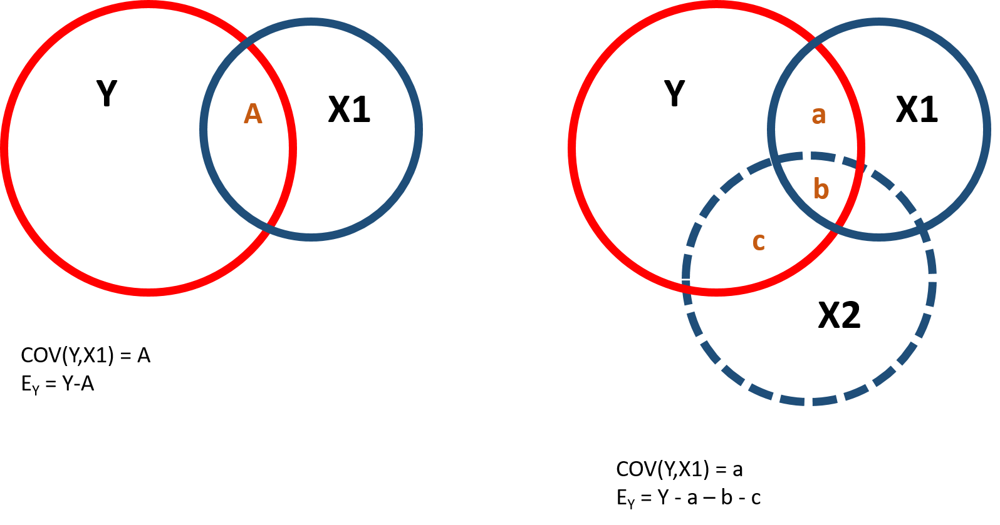

```{r setup, include=FALSE}
knitr::opts_chunk$set(echo = TRUE, message=F, warning=F, fig.width = 10)
```
**Packages**

Here are the packages we will use in this lecture. If you don't remember how to install them, you can have a look at the code. 

* **AER** for the ivreg function.
* **stargazer** for nice tables

```{r, eval=F}
# install.packages( AER )
# install.packages( stargazer )

library( "AER" ) # To use the ivreg function. Make sure to install it beforehand (install.packages)
library( "stargazer" )

```

**What you should know after this lecture**

* Under what circumstances do you need to use an instrumental variable? Why?
* What are the main characteristics of a valid instrumental variable? 
* Understanding key mechanisms behind an instrumental variable model

```{r, echo=FALSE, eval=F, results="hide", cache=F}
install.packages("AER", repos="https://cran.cnr.berkeley.edu")
install.packages("stargazer", repos="https://cran.cnr.berkeley.edu")
install.packages("scales", repos="https://cran.cnr.berkeley.edu")
install.packages( "wooldridge", repos="https://cran.cnr.berkeley.edu" )
```

```{r, echo=FALSE, results="hide"}
library("scales")
library(AER) # To use the ivreg function. Make sure to install it beforehand (install.packages)
library(stargazer)
library( "wooldridge" )
```

# The key concept

We use instrumental variables to address **omitted variable bias**. As you might remember, omitted variables are variables significantly correlated with an outcome variable (Y) but that cannot be observed or measured. Omitted variables are problematic when they are significantly correlated with both the outcome variable and a policy variable (X1) of interest because they can cause bias in the estimation of the coefficient. 

Figure \@ref(fig:figure1) illustrates the covariance structure of a model with an omitted variable correlated with both Y and X1:

```{r figure1, fig.cap="Covariance structure of an omitted variable model", out.width='40%', echo=F }
knitr::include_graphics( "FIGURE/InstVar/Picture2.png" )
```

In the illustrated case, the "full model" would include all variables, such as:

\begin{equation} 
Y=\beta_0 + \beta_1X_1 + \beta_2X_2
  (\#eq:fullmodel)
\end{equation} 

In reality, the omitted variable cannot be observed nor measured, so we end up with a "naive model" where the omitted variable is excluded:

\begin{equation} 
Y=\text{b}_0 + \text{b}_1X_1
  (\#eq:naivemodel)
\end{equation} 
<br>
<br>

When we omit a variable that is correlated with the policy and the outcome variable, it affects both the slope and the standard error of the model - you can observe this in figure \@ref(fig:figure2). Including or excluding Ability significantly changes the covariance between Y and X1 (the intersection between Y and X1) and the residual of Y (the part of Y which does not intersect with X1 or X2).   

```{r figure2, fig.cap="Covariance structure and residuals", out.width='80%', echo=F }

```

Instrumental variables are helpful to reduce the omitted variable bias and get a more precise estimate of the effect of X1 on Y. An instrumental variable is a variable correlated with the policy variable, so that it can be a good "substitute" for it, but not correlated with the omitted variable, so as to reduce its interference in estimating the effect of Y. Figure \@ref(fig:figure3) represents the covariance structure:

```{r figure3, fig.cap="Instrumental variable modeal, covariance structure", out.width='40%', echo=F }
knitr::include_graphics( "FIGURE/InstVar/Picture3.png" )
```

Note that because the instrumental variable is correlated to the policy variable, it is also correlated with the outcome variable (figure \@ref(fig:figure3)). However, this correlation only occurs through X1 as illustrated in the path diagram.

```{r figure4, fig.cap="Path diagram of the instrumental variable model", out.width='40%', echo=F }

```

We use the instrumental variable to partition the variance of the policy variable into 2 parts. One part (A) that is highly correlated with the instrumental variable and will be used to predict the outcome variable and one part (B+C) that is uncorrelated with the instrumental variable but it is correlated with the omitted variable and will be excluded from the model:

```{r figure5, fig.cap="Partitioning the variance of X1", out.width='40%', echo=F }

```

## The statistical model

We can express this in formula, where we first predict X1 using Z:

\begin{equation} 
\text{X}_1 = \text{b}_0 + \text{b}_1 \text{Z}_1 + \text{e}_x
  (\#eq:step1)
\end{equation}

And then use the predicted value of X1 (the A section in figure \@ref(fig:figure5)) to predict Y. In this way we remove from the model the correlation between X1 and X2 (which is part of error term $\text{e}_x$)

\begin{equation} 
\text{Y}_1 = \text{b}_0 + \text{b}_1 \text{X}_1 + \text{e}_y
  (\#eq:step2)
\end{equation}


```{r, echo=F}
# Variable definitions for model  y ~ x1 + x2 + x3
set.seed(103)
experience <- rnorm(1000, 50000, 10000)    #Control variable (Experience)

ability <- rnorm(1000, 35000, 10000)    #Ability

fathereduc  <- rnorm(1000, 15000, 20000)    #Father's education (IV)

ex1 = rnorm(1000, 26000, 10000)

ey = 0.43*rnorm(1000, 50000, 10000)

educ <- 3.7 + 0.52*fathereduc + 0.40*ability + 0.33*experience + ex1 #Education

wage  <- 5 + 0.23*educ + 0.5*ability + 0.2*experience - ey #Wage

wage  <- rescale(wage,  to = c(7.75, 300)) #Rescale from minimum wage to Director wage (hourly)

experience <- rescale(experience, to = c(0, 15))     #Rescale as experience

educ <- rescale(educ, to = c(10, 23))    #Rescale as years of school. Min 10 to max 23 (PhD)

ability <- rescale(ability, to = c(0, 600))    #Hypothetical test scores for ability

fathereduc  <- rescale(fathereduc,  to = c(10, 23))  #Father's education

dat <- data.frame(wage, educ, ability, experience, fathereduc)

```

# An instrumental variable model

```{r graduation, out.width='60%', echo=F }
knitr::include_graphics( "FIGURE/InstVar/Graduation.jpg" )
```

In the following working example, we will look at the correlation between hourly wage and education. The discussion regarding ["more education, more income"](https://www.nytimes.com/2014/09/11/business/economy/a-simple-equation-more-education-more-income.html) gets continuous attention in the media and in the policy world (see for instance the [New York Times](https://www.nytimes.com/2014/05/27/upshot/is-college-worth-it-clearly-new-data-say.html)). We ask: **how much does your salary (Y) increase for any additional year of education?** In other words, we are interested in estimating $\beta_1$.

\begin{equation} 
Y=\beta_0 + \beta_1Education
  (\#eq:example)
\end{equation}

## Data

Data contain the following variables:

**Variable nameb  ** | **Description    **                                               | 
-------------------- | ------------------------------------------------------------------|
wage                 |Wage
educ                 |Education
ability              |Ability (omitted variable)
experience           |Experience                                       
fathereduc           |Father's education         

Our **dependent variable** represents an individual's hourly wage in a given year in the United States. Our **policy variable** is the number of years that individuals have spent in school. We can look at some key summary statistics.

```{r, echo=T, results='asis'}
stargazer( dat,  
           type = "html", 
           omit = c("ability", "experience", "fathereduc"),
           omit.summary.stat = c("p25", "p75"), 
           covariate.labels = c("Wage", "Education"),
           digits = 2 )
```

When estimating the relationship between wage and education, scholars have encountered issues in dealing with the so-called "ability bias": individuals who have higher ability are more likely both to stay longer in school and get a more highly paid job. We can represent these relationships in this diagram:

```{r figure6, fig.cap="Ability bias", out.width='70%', echo=F }

```

Ability, however, is difficult to measure and cannot be included in the model. It is an omitted variable, which is correlated with both our outcome variable and our policy variable. Excluding "ability" from the analysis creates a bias in the estimation of $\beta_1$.

We can observe this bias with our simulated data. Let's assume we can create a variable measuring ability and include it in our model (**full model**) based on equation \@ref(eq:fullmodel) such that:

<center>$Y=\beta_0 + \beta_1\text{Education} + \beta_2\text{Ability} + \beta_3\text{Experience}$</center>

Let's then run a more realistic model (**naive model**) based on equation \@ref(eq:naivemodel) where the ability variable is excluded:

<center>$Y=\text{b}_0 + \text{b}_1\text{Education} + \text{b}_3\text{Experience}$</center>
<br>
<br>
We can now compare the different estimates: 

```{r, echo=T, results='asis'}
full.model  <- lm( wage ~ educ + ability + experience ) # Full Model if we were able to measure ability
naive.model <- lm( wage ~ educ + experience )      # Naive Model where ability is excluded (omitted variable bias)

stargazer( full.model, naive.model, 
           type = "html", 
           dep.var.labels = ("Wage"),
           column.labels = c("Full Model", "Naive Model"),
           covariate.labels = c("Education", "Ability", "Experience"),
           omit.stat = "all", 
           digits = 2 )
```

We note that the coefficient of the education variable is significantly different in the naive and the full model, where the naive model overestimate the effect of education on wage. 

## Analysis

In order to avoid the omitted variable bias we can introduce an instrumental variable. As mentioned above, the instrumental variable has these key characterististics:

>1. It is correlated with the policy variable.
>2. It is correlated to the dependent variable only through the policy variable.
>3. It is not correlated with the omitted variable.

While point #1 and #2 can be empirically tested, point #3 needs to be argued by theory. 

We based our example on previous studies which utilize an individual's father's education as an instrumental variable ( [Blackburn & Newmark, 1993](https://www.nber.org/papers/w3693); [Hoogerheide et al. 2012](https://personal.eur.nl/thurik/Research/Articles/Family%20background%20variables%20as%20instruments%20in%20EER.pdf) ). Individuals who come from [more educated families are more likely to stay in school longer](https://www.nytimes.com/2015/09/23/business/economy/education-gap-between-rich-and-poor-is-growing-wider.html), especially [when fathers are more educated](https://www.theguardian.com/society/2014/sep/23/fathers-education-child-success-school)but one's father's education has little to no direct effect on hourly wage. 

We can empirically test these hypotheses by looking at correlations across the variables in our dataset. In the first graph, we can see that father's education is positively correlated with education. In the second graph, there is a slight correlation between a father's education and hourly wage. We would expect this, because education and hourly wage are correlated. However, we theoretically argue that there is no direct correlation: a father's education increases the hourly wage *only because it increases one's education*, which in turn leads to a higher salary. Finally, in the third graph, we can see that there is no correlation between father's education and ability.

```{r}
par( mfrow=c(1,3) )

plot(fathereduc, educ, xlab = "Father's education", ylab = "Education" )   # Plot

abline( lm( educ ~ fathereduc ), col = "red")                              # regression line 

plot( fathereduc, wage, xlab = "Father's education", ylab = "Hourly wage" )

abline(lm( wage ~ fathereduc ), col = "green") 

plot( fathereduc, ability, xlab = "Father's education", ylab = "Ability")

abline(lm( ability ~ fathereduc ), col = "blue")
```

We now run the model using our instrumental variable. The model is defined in two stages: first, we estimate our policy variable based on our instrumental variable (equation \@ref(eq:step1)):

**First stage:**

<center>$Education=\beta_0 + \beta_1\text{Father's education} + \beta_2\text{Experience}$</center>

```{r, results='asis'}
first.stage  <- lm( educ ~ fathereduc + experience)        #Run the first stage predict the education variable

stargazer( first.stage,
           type = "html", 
           dep.var.labels = ("Education"),
           column.labels = c("First stage"),
           omit.stat = c("adj.rsq", "ser"), 
           covariate.labels = c("Father's education", "Experience"),
           digits = 2 )
```

Then, we estimate our dependent variable (Wage) using the predicted values of education estimated in the first model (equation \@ref(eq:step2)):

**Second stage:**

<center>$Wage=\beta_0 + \beta_1\text{Education} + \beta_2\text{Experience}$</center>

```{r, results='asis'}

x1_hat       <- fitted( first.stage )   
#Saved the predicted values of education from the first stage

second.stage <- lm( wage ~ x1_hat + experience )   
#Run the 2nd stage using the predicted values of education to look at the effect on income.


stargazer( full.model, naive.model, second.stage,
           type = "html", 
           dep.var.labels = ("Wage"),
           column.labels = c("Full Model", "Naive Model", "IV model"),
           omit.stat = c("adj.rsq", "ser"), 
           covariate.labels = c("Education", "Ability", "Predicted Education", "Experience"),
           digits = 2 )
```

Note that the table report the "true"" model (full model) where we include all variables, the naive model where we omit the ability variable, and the instrumental variable model where we use the predicted values of the first stage. The IV model has almost completely recovered the true slope.

## Additional explanation: plotting the results

Using our simulated data, we can have a look at what is happening when we estimate the model with an instrument variable. 

We know that omitted variable bias results from the correlation of our policy variable (Education) and the omitted variable (Ability).

```{r plot1, fig.cap="Relationship between Y and the omitted variable"}

plot(ability, educ, xlab = "Ability", ylab = "Education")

abline(lm( educ ~ ability ), col = "green")
```

The instrumental variable, however, is correlated only with the policy variable, not the omitted variable. 
Therefore, we can use the instrumental variable to partition the variance of education into a component that is highly correlated with ability (the residual), and a component that is uncorrelated with ability (X1-hat).  Remember the figure \@ref(fig:figure5) we discussed at the beginning of the lecture:

```{r figure7, fig.cap="Instrumental variable model", out.width='40%', echo=F }


```

To see this in practice, we can plot the predicted values (x1_hat) and the residual (e_x1) of the first stage in two graphs and look at the correlation with the omitted variable ability. You can see that there is almost no correlation between h1_hat and ability, but ability is highly correlated with the residual (e_x1).

```{r plot2, fig.cap="Partitioning the variance of Education"}

first.stage <- lm( educ ~ fathereduc + experience )          #Run again the first stage to predict education (x1)

x1_hat      <- fitted( first.stage )      #Save the predicted values of education (x1_hat)

e_x1        <- residuals( first.stage )   #Save residuals of education (e_x1)

par( mfrow=c(1,2) )

#Plot the predicted values against ability
plot( ability, x1_hat, xlab = "Ability (omitted variable)", ylab = "Predicted values of Education (x1_hat)")

abline( lm( x1_hat ~ ability), col = "blue")

#Plot the residual against ability
plot( ability, e_x1, xlab = "Ability (omitted variable)", ylab = "Education - Residual (e_X1)" )

abline( lm( e_x1 ~ ability), col = "green")
```

One interesting thing about the instrumental variable model is that Education will be more correlated with Wage than X1-hat, but X1-hat does a better job of recovering the true slope B1 from the full model.

```{r plot3, fig.cap="Relationship between the 'parts' of education and Y"}

par( mfrow=c(1,2) )

plot( educ, wage, xlab = "Education", ylab = "Wage" )

abline( lm( wage ~ educ), col = "red")

plot( x1_hat, wage, xlab = "Predicted values of Education (x1_hat)", ylab = "Wage" )

abline( lm( wage ~ x1_hat), col = "blue")
```

## Summary: How to select a valid instrumental variable 

Some things you should keep in mind about instrumental variables and how to select a valid one.

1. An instrumental variable should be strongly correlated with your policy variable; the higher the correlation, the better. You can empirically test how 'good' the correlation is, when running the first stage. The rule of thumb is that the first stage should have an **F Statistic of at least 10** in the first stage model to avoid the **weak instrument problem**.`

```{r, results='asis'}
first.stage <- lm( educ ~ fathereduc + ability )

stargazer( first.stage,
           column.labels = c("First Stage"),
           type="html",
           covariate.labels = c("Father's education", "Experience"),
           omit.stat = c("rsq","ser"), 
           digits = 2 )
```

If your instrumental variable is weak, it means that it is little correlated with the policy variable, so it does a "bad" job in approximating its effect on the policy outcome. You might find no policy effect even if there is one! You need to have strong evidence that the instrumental variable does a good job in approximating the policy variable (e.g., the F test) before concluding that the policy has no effect. 

2. Because the instrumental variable is correlated with the policy variable and the policy variable is correlated with the outcome variable, the instrumental variable is also correlated with the outcome. See for instance the correlation between father's education and wage. 

```{r plot4, fig.cap="Correlation between Y and the omitted variable"}

plot( fathereduc, wage, xlab = "Father's education", ylab = "Hourly wage")
abline(lm( wage ~ fathereduc ), col = "green") 

```

However, it is important to be able to argue that such correlation occurs only through the policy variable and there is no direct correlation between the instrumental and the outcome variable. 

```{r figure8, fig.cap="Instrumental variable model, path diagram", out.width='40%', echo=F }

knitr::include_graphics( "FIGURE/InstVar/PathDiagram_2.png" )

```

In our previous example, a father's education increases the hourly wage only if it makes an individual stays longer in school. If not, it has no effect on the wage. 

The lack of direct correlation between the instrumental and the oucome variable is argued through theory and previous studies. 

3. To recap, the covariance structure among the variables in an omitted variable model can be summarized in the following table, where:

* Wage is the outcome variable
* Education is the policy variable
* Ability is the omitted variable
* Experience is a control variable
* Father's education is the instrumental variable

```{r matrixstructure, fig.cap="Correlation matrix structure", echo=F}

panel.cor <- function(x, y, digits=2, prefix="", cex.cor)
{
    usr <- par("usr"); on.exit(par(usr))
    par(usr = c(0, 1, 0, 1))
    r <- abs(cor(x, y))
    txt <- format(c(r, 0.123456789), digits=digits)[1]
    txt <- paste(prefix, txt, sep="")
    if(missing(cex.cor)) cex <- 0.8/strwidth(txt)
    
    test <- cor.test(x,y)
    # borrowed from printCoefmat
    Signif <- symnum(test$p.value, corr = FALSE, na = FALSE,
                  cutpoints = c(0, 0.001, 0.01, 0.05, 0.1, 1),
                  symbols = c("***", "**", "*", ".", " "))
    
    text(0.5, 0.5, txt, cex = 1.5 )
    text(.7, .8, Signif, cex=cex, col=2)
}

panel.smooth <- function (x, y, col = par("col"), bg = NA, pch = par("pch"), 
	cex = 1, col.smooth = "red", span = 2/3, iter = 3, ...) 
{
	points(x, y, pch = 19, col = gray(0.7,0.3), bg = bg, cex = cex)
	ok <- is.finite(x) & is.finite(y)
	if (any(ok)) 
		lines(stats::lowess(x[ok], y[ok], f = span, iter = iter), 
			col = col.smooth, lwd=2, ...)
}

pairs( dat, upper.panel=panel.cor, lower.panel=panel.smooth )


```

4. Finding a valid instrumental variable is challenging, requires creativity and some review of previous studies to get ideas and preliminary assess the correlation between the model variables.

# Replication of a study

We now look at data that have been used by [Card in 1995](https://www.nber.org/papers/w4483.pdf) for estimating a similar model. The dataset is contained in the Wooldrige package and you can download it to replicate this exercise. 

```{r, eval=F}
install.packages( "wooldridge", repos="https://cran.cnr.berkeley.edu" )
library( "wooldridge" )
```

## Data

The dataset contains 3,010 observations collected in 1966/1976. 

```{r}
data( "card" ) ## we attach the data to our R working space
nrow( card ) ## To check if data were properly load, we can look if the number of obs is equal to 3010
```

For this exercise we are going to use the following variables. You can find a description of all variables [here](http://fmwww.bc.edu/ec-p/data/wooldridge/card.des).

**Variable name   ** | **Description    **                                  | 
-------------------- | -----------------------------------------------------|
lwage                |Annual wage (log form)                                |
educ                 |Years of education                                    |
nearc4               |Living close to college (=1) or far from college (=0) |
smsa                 |Living in metropolitan area (=1) or not (=0)          |
exper                |Years of experience                                   | 
expersq              |Years of experience (squared term)                    | 
black                |Black (=1), not black (=0)                            |
south                |Living in the south (=1) or not (=0)                  |

## Analysis

As we did before, Card wants to estimate the impact of education on wage. But to solve the ability bias, he utilizes a different instrumental variable: **proximity to college**. He provides arguments to support each of three main characteristics of a good instrumental variable:

1. **It is correlated with the policy variable:** Individuals who live close to a 4-year college have easier access to education at a lower costs (no communiting costs and time nor accomodation costs), so they have greater incentives to pursue education.
2. **It is not correlated with the omitted variable:** Individual ability does not depend on proximity to a college.
3. **It is correlated to the dependent variable only through the policy variable:** Proximity to a college has no effect on your annual income, unless you decide to pursue further education because of the nearby college. 

Therefore, he estimates a model where:

**First stage** (equation \@ref(eq:step1))

<center>$Educ = \beta_0 + \beta_1\text{nearc4} + \beta_{2-6}\text{Control variables}$</center>

**Second stage** (equation \@ref(eq:step2))

<center>$lwage = \beta_0 + \beta_1\text{Educ} + \beta_{2-6}\text{Control variables}$</center>

We replicate the study starting by having a look at the summary statistics and distribution of the 3 key variables:

```{r, echo=T, results='asis'}
stargazer( card,  
           type = "html", 
           keep = c("lwage", "^educ$", "nearc4"), 
           omit.summary.stat = c("p25", "p75"),
           digits = 2 )

#Note: the symbols ^ & $ around educ prevents the function from grabbing other variables containing educ, such as fatheduc or mothedut
```


```{r plot5, fig.cap="Distribution of Y, X, and Z"}
par( mfrow=c(1,2) )

plot( density(card$lwage), xlab = "Wage", main = "Dependent variable", ylab = "Frequency")

plot( density(card$educ), xlab = "Education", main = "Policy variable", ylab = "Frequency")

barplot( table(card$nearc4), xlab = "Living near a four-year college", ylab = "Frequency", main = "Instrumental variable")
```

We then estimate the model using two stages. As before, in the first stage we estimate education using our instrumental variable; you can see that the F statistic is greater than 10, suggesting that $\text{nearc4}$ is a valid instrumental variable. Then, we estimate the impact of education on wage using the predicted values of education. 

```{r, results='asis'}
first.stage = lm(educ ~ 
nearc4 +  
smsa66 +          
exper +          
expersq +        
black +         
south66, data = card)

x1_hat <- fitted( first.stage ) #Save predicted values for education

second.stage <- lm(lwage ~
x1_hat +
smsa66 +          
exper +          
expersq +        
black +         
south66, data = card)


stargazer( first.stage, second.stage,
           column.labels = c("First Stage", "Second Stage"),
           type = "html",
           omit.stat = c("rsq","ser"), 
           digits = 2 )
```

As you can see, our policy variable has a different estimate in the two models.

```{r, results='asis'}

naive.model <- lm(lwage ~
educ +
smsa66 +          
exper +          
expersq +        
black +         
south66, data = card)

stargazer( naive.model, second.stage,
           model.numbers = F,
           type = "html", 
           omit.stat = "all", 
           digits = 2,  keep = c("educ", "x1_hat") )
```

# Additional notes

## *ivreg* function 

If you like to explore new R functions, you can use the *ivreg* function from the package *AER* to calculate your instrumental variable model. See the example below using the same data as in the Card's example.

Note the syntax for using the ivreg function. 

```{r, results='asis'}
simple.model <- lm(
lwage ~              
educ +
smsa66 +
exper +    
expersq + 
black +
south66, data = card)

ivreg.model <- 
ivreg(            ## Call the ivreg function
lwage ~           ## Dependent variable of the second stage 
educ +            ## Education, as estimated in the first stage below 
smsa66 +          ## Control variable - Living in a metropolitan area
exper +           ## Control variable - Expertise
expersq +         ## Control variable - Squared term of the expertise variable
black +           ## Control variable - If race is black = 1, otherwise = 0
south66           ## Control variable - If living in the south = 1, otherwise = 0 
|                 ## Separate first and second stage   
.-educ +          ## we include all variable of the first stage, minus the education variable that is estimated     
nearc4,           ## The instrumental variable is included only here, in the first stage
data = card )     ## Set the dataset


stargazer( simple.model, ivreg.model,
           column.labels = c("No IV model", "IV model"),
           type="html", 
           omit.stat = c("rsq","ser"), 
           digits=2 )
```

## Additional examples 

Several studies have used instrumental variables to solve omitted variable issues. Here are some examples:

**Outcome variable** | **Policy variable**          | **Omitted variable**            | **Instrumental variable** |
-------------------- | -----------------------------|---------------------------------|---------------------------|
Health               |Smoking cigarettes            |Other negative health behaviors  |Tobacco taxes              | 
Crime rate           |Patrol hours                  |# of criminals                   |Election cycles            |
Income               |Education                     |Ability                          |Father's education         |
                     |                              |                                 |Distance to college        |
                     |                              |                                 |Military draft             |
Crime                |Incarceration rate            |Simultaneous causality           |Overcrowding litigations   |
Election outcomes    |Federal spending in a district|Political  vulnerability         |Federal spending in the rest of the state    |
Conflicts            |Economic growth               |Simultaneous causality           |Rainfall                   |


```{css, echo=F}
p {
color: black;
margin: 0 0 20px 0;
}

p.caption {
    text-align: center;
    font-style: italic;
}

td {
    padding: 3px 10px 3px 10px;
    }

table
{ 
    margin-left: auto;
    margin-right: auto;
    margin-top:80px;
    margin-bottom:100px;
}

h1, h2{
  margin-top:100px;
  margin-bottom:20px;
}

H5{
    text-align: center;
    color: gray;
    font-size:0.8em;
}

img {
    max-width: 90%;
    display: block;
    margin-right: auto;
    margin-left: auto;
    margin-top:30px;
    margin-bottom:20px;
}

pre {
  overflow-x: auto;
}

pre code {
   display: block; 
   padding: 0.5em;
   margin-bottom:20px;
}

code {
  font-size: 92%;
  border: 10px solid #F8F8F8;
  margin-bottom: 2px;
}

code[class] {
  background-color: #F8F8F8;
}

```