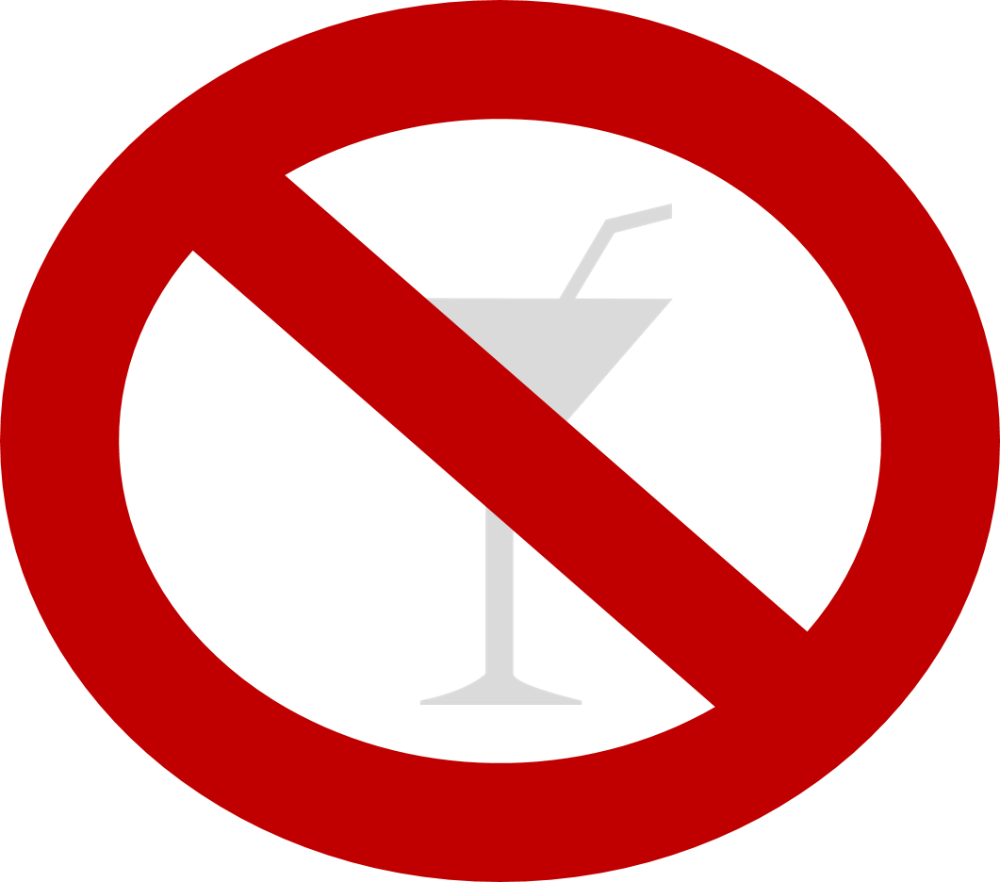

```{r setup, include=FALSE}
knitr::opts_chunk$set(echo = TRUE, message=F, warning=F, fig.width = 10)
```
**Packages**

Here are the packages we will use in this lecture. If you don't remember how to install them, you can have a look at the code. 

* **stargazer** for nice tables

```{r, eval=F}
install.packages( stargazer )
library( "stargazer" )
```

**Learning objectives** 

* When is it appropriate to use a regression discontinuity design?
* How should you organize your data before using a regression discontinuity design?
* How do you interpret the coefficients of a regression discontinuity model?
* What are the main assumptions of a regression discontinuity model?
* Applying a discontinuity regression design to data in R

```{r, echo=FALSE, results="hide", eval=F}
install.packages("stargazer", repos="https://cran.cnr.berkeley.edu")
install.packages("scales", repos="https://cran.cnr.berkeley.edu")
```

```{r, echo=FALSE, results="hide"}
library("stargazer")
library("scales")
```

# The key concept

The regression discontinuity design is used when the treatment (or intervention) is based on some continuous criteria (age, a test results, income...). Only individuals who are below or above a given cutoff point are assigned to the treatment. Examples include:

* A program designed to enhance skills of students who poorly perfom on class tests. Students with an average score of 50/100 participate in the program (treatment group), while students with an higher average are excluded (control group);
<br>
<br>
* A government program (such as Medicare) where individuals can enroll only after a certain age. Individuals who are older are enrolled (treatment group) while individuals who are yourger are not enrolled (control group);
<br>
<br>
* A house subsidy program to support low-income populations paying rent. Only individuals with a income below a certain level will receive the subside (treatment group) while others will not (control group);
<br>
<br>
* A law that faciliates admission to college for the top 10% students from low-ranked high schools; students in the top 10% will be part of the program (treatment group), while students below the top 10% will not (control group)

The key problem is the **endogeneity between the outcome and the assignment of the treatment**. Scholarships are a classical example. For instance,  let's imagine a scholarship which is offered to low income students to attend college. You can see a representation of the model in figure \@ref(fig:rdfigure). The x axis is the family income based on which we assign students to the treatment or control group. We call it the *rating variable*. The y axis is the likelihood to enroll into college. It is our *outcome variable*. There is a positive relationship between the two: students from higher income families are more likely to enroll to college. 

```{r rdfigure, fig.cap="Students' family income and college enrollment", out.width='60%', echo=F }
knitr::include_graphics( "FIGURE/RegDisc/Picture1.png" )
```

We establish to give a scholarship to students below a given level of income (the *cutoff*). We have two groups: one group receive the scholarship (treatment group) while the other does not (control group).

```{r rdfigure2, fig.cap="Control and treatment group based on the cutoff", out.width='60%', echo=F }

```

Comparing these two groups, however, is problematic. Students who did not receive the scholarship (the control group) are more likely to go to college even without the scholarship because of their income. Their enrollment is likely to remain higher than the enrollment of low-income students. This does not imply that the scholarship has no effect: it might be that in the absence of the treatment (i.e., without the scholarship), low-income students would have been even less likely to enroll to college. 

Regression discontinuity is used to solve this problem and assess whether or not we observe a treatment effect. It does so by accounting for the relationship between the outcome and the rating variable and then calculating the difference between the two groups. 

```{r rdfigure3, fig.cap="Treatment effect", out.width='60%', echo=F }
knitr::include_graphics( "FIGURE/RegDisc/Picture3.png" )
```

> The intuition behind the regression discontinuity design is the endogeneity of the outcome to the assignment of treatment, which might bias the estimation of the effect of the treatment. Low-income students might continue to enroll to college at a lower rate even with a scholarship, leading to a downward bias of the estimates. Similarly, low-income populations receiving a subsidy to pay rent might continue to have more housing issues than higher income individuals. Individuals who receive Medicare might have greater health problems because of age, and without controlling for the relationship between age and health outcomes, we might have a downward estimates of the effect of the program. The regression discontinuity model allows us to estimate the local treatment effect, comparing individuals close by the cut off points. 

## The statistical model

In mathematical terms, we are interested in estimating the following equation: 

\begin{equation} 
\text{Y} = \beta_0 + \beta_1*Treatment + \beta_2*Rating variable_c + \text{e}
  (\#eq:RD)
\end{equation}

Where:
<br>
<br>
$\text{Y}$ is our outcome variable;
<br>
<br>
$\text{Treatment}$ is a dummy variable indicating the treatment (=1) and the control (=0) group; 
<br>
<br>
$\text{Rating variable_c}$ is the rating variable centered at the cutoff point. To center the variable, we just need to subtract the cutoff score from each individual score. The cut-off point will become the new intercept (since cut-off - cut-off = 0), which it will help to interpret the results. 
<br>
<br>

Our dataset will look like this. In the figure, I reported the procedure to center the rating variable on the side for clarification purposes.

```{r dataset, fig.cap="Regression discontinuity dataset", out.width='60%', echo=F }
knitr::include_graphics( "FIGURE/RegDisc/Picture4.png" )
```

We can consider each coefficient of our equation \@ref(eq:RD) separately. 

1. $\beta_1$ represents the difference between the treatment and the control group and assesses whether the intervention had an effect.
<br>
2. $\beta_2$ represents the relationship between the outcome variable and the rating variable. It allows us to control for endogeneity in this relationship. 

## The counterfactual 

The counterfactual is *what it would have occured to Y, had the policy intervention not happened*. It is very important in regression discontinuity . For instance, in our previous regression discontinuity model, the counterfactual is the students' likelihood to enroll, if they had not received the scholarship.

```{r counterfactual, fig.cap="Counterfactual", out.width='60%', echo=F }
knitr::include_graphics( "FIGURE/RegDisc/Picture5.png" )
```

If we take our equation \@ref(eq:RD), the counterfactual is obtained by assuming that the intervetion has not occured (Treatment = 0), so that Y is only predicted by its relationship with rating variable: 

\begin{equation} 
\text{Y} = \beta_0 + \beta_1*0 + \beta_2*Score + \text{e}
  (\#eq:RDCounterfactual)
\end{equation}

# A regression-discontinuity model

```{r housing, fig.cap="Source: https://www.pinterest.com/youthchange/classroom-posters-121-130/", out.width='40%', echo=F }
knitr::include_graphics( "FIGURE/RegDisc/Attendance.jpg" )
```

We are going to look at the relationship between class attendance and students' performance. There is a lots of research and evidence that [class attendance has a positive and significant effect on student performance](http://graphics8.nytimes.com/packages/pdf/nyregion/20110617attendancereport.pdf). Because of this, government agencies and schools aim to design policies that incentivize students not to miss school days. Examples include tangible prizes such as [colorful pendants and free tickets to event](https://www.nytimes.com/2011/06/17/nyregion/city-reduces-chronic-absenteeism-in-public-schools.html), [automated calls from celebrities](https://cityroom.blogs.nytimes.com/2011/02/10/schools-use-celebrity-robo-calls-to-battle-truancy/?scp=2&sq=magic+johnson+and+fernanda&st=nyt), or [class policies that mandate attendance to students](https://people.ucsc.edu/~cdobkin/Papers/2010%20Skipping%20class%20in%20college%20and%20exam%20performance%20Evidence%20from%20a%20regression%20discontinuity%20classroom%20experiment.pdf).

Research has used several methods to test this relationship, from [simple regression analysis](https://www.sciencedirect.com/science/article/pii/S1877042816309776) to [randomized experiments](https://www.tandfonline.com/doi/abs/10.3200/JECE.39.3.213-227?journalCode=vece20). In this example, we imagine to look at three classes of college students and assign students who have an attendance rate lower than the median to the treatment group, as they would be subject to a mandatory attendance policy. Students who have an attendance rate greater than the median will be the control group.

> **Research question**: 
> Does a mandatory attendance policy increase student final performance? 
>
> **Hypothesis**: 
> A mandatory attendance policy will increase the final performance of students enrolled in the treatment.

## Data

```{r, echo=F}
set.seed(650)
Attendance1 = rbeta(1000, shape1 = 7, shape2 = 2,  ncp = 0)
Attendance = rescale(Attendance1, to = c(20,100))

Treatment = Attendance
Treatment = ifelse(Treatment>median(Treatment), 0, 1)

Attendance_c = Attendance - median(Attendance)

err = rnorm(1000, 600, 100)

Y = 40 + 120*Treatment + 20*Attendance_c + err

Performance = rescale(Y, to = c(0,100))

data = as.data.frame(cbind(Performance, Treatment, Attendance, Attendance_c))

```

We can have a look at the dataset below:

```{r}
head(data, 10)
```

The dataset contains four variables. 

 **Variable name   **   | **Description    **                                                                                          | 
----------------------- | ------------------------------------------------------------------------------------------------------------ |
$\text{Performance}$    |Final exam grade, from 0 to 100                                                                               |
$\text{Treatment}$      |Dummy variable if Treatment group (=1) or Control group (=0)                                                  |
$\text{Attendance}$     |Percentage of classes attended from 0% (attended no class) to 100% (attended all classes) - Rating variable   |
$\text{Attendance_c}$   |Attendance variable centered around the cutoff. The cutoff was fixed at the median of Attendance              |

The problem with comparing the treatment and the control group is that students with lower attendance (treatment group) are more likely to have lower grades than students with higher attendance. Because of this, if we compare the means of the two groups we might observe no different between them. 

We can empirically see this:

```{r}

mean(data$Performance[data$Treatment==1])
mean(data$Performance[data$Treatment==0])

```

Students who did not receive the treatment have a higher mean than students who did receive the treatment. If we were just to look at these results, we would conclude that the treatment had no effect. 

## Analysis

Our model is based on the equation \@ref(eq:RD):

<center>$\text{Y} = \beta_0 + \beta_1*Treatment + \beta_2*Score + \text{e}$</center>

```{r, echo=T, results='asis'}

reg = lm(Performance ~
Treatment+
Attendance_c, data = data)

stargazer( reg, 
           type = "html", 
           dep.var.labels = ("Final exam grade"),
           column.labels = c(""),
           covariate.labels = c("Treatment", "Attendance"),
           omit.stat = "all", 
           digits = 2 )
```

We interpret each coefficients:

$\beta_0$ represents the Performance of a student exactly at the cut-off point
$\beta_1$ is positive and significantly different from zero. This indicates that the Treatment had an effect and students in the treatment group saw their grade increased of 7 points. 
<br>
<br>
$\beta_2$ is positive and significantly different from zero. This indicates a positive relationship between attendance and the final exam grade. 

> It's common practice to center the score (rating) variable. Because our rating variable is centered, the intercept is located at the cutoff point and represents the average final score of a student with a median attendance. It's possible to run the same model without centering the score variable. However, the interpretation of our intercept would change. It would be the final score of a student with 0 attendance. Centering the score variable simplying our interpretation of the results and more precisely estimate the average treatment effect right after and right before the cutoff point.

We can see this by running the model with an uncentered rating variable. The coefficient of Treatment and Attendance do not change but the intercept significantly change. 

```{r, echo=T, results='asis'}

reg = lm(Performance ~ Treatment + Attendance, data = data)

stargazer( reg, 
           type = "html", 
           dep.var.labels = ("Final exam grade"),
           column.labels = c(""),
           covariate.labels = c("Treatment", "Attendance"),
           omit.stat = "all", 
           digits = 2 )
```

## Plotting the results 

We can visually observe the discontinuity in the following plot. The black line indicating the predicted value changes at the cutoff line. The control group (blue) is in a higher position than the treatment group, suggesting that students who had mandatory attendance performed better than we would have expected without the policy.

```{r}
# We first predict the final exam grades based on our regression discontinuity model. 
predfit = predict(reg, data) 

# We set colors for the graph
palette( c( adjustcolor( "steelblue", alpha.f=0.3), adjustcolor( "darkred", alpha.f=0.3)  ) )

# To differently color the treatment and control group we need to create a new Treatment variable that where the Control group = 2. 
data$Treatment2 = ifelse(data$Treatment==0,2,1)

# Plot our observed value
plot(Attendance_c, Performance, col=data$Treatment2, pch=19, bty="n",
      xlab="Attendance Rate (centered)", ylab="Final exam grade",  cex=2)

# Plot a line at the cutoff point
abline(v=0, col = "red", lwd = 2, lty = 2)

# Plot our predicted values
points( Attendance_c, predfit, col="black", lwd=5, pch = 20 )

## Add a legend
points( 10, 26, col="steelblue", pch=19, cex=2 )
text( 10, 26, "Treatment group", col="steelblue", pos=4 )
points( 10, 20, col="darkred", pch=19, cex=2 )
text( 10, 20, "Control group", col="darkred", pos=4 )
```

## The counterfactual

The discontinuity is easier to understand if we plot the counterfactual using the formula \@ref(eq:RDCounterfactual):

<center>$\text{Y} = \beta_0 + \beta_1*0 + \beta_2*Score + \text{e}$</center>
<br>
<br>
The counterfactual represents the final exame grades, had the policy of mandatory attendance not been implemented. It's the yellow group in the graph. Students in the treatment group would have performed worse without the policy. The yellow dots are - on average - in a lower position than the blue ones (which represent the score after the treatment).

```{r}
## We create a new dataset where the variable Treatment is only equal to 0 as no student has been part of the intervention
data2 = as.data.frame(cbind(data$Performance, Treatment = rep(0), data$Attendance_c))

## Based on our previous model we predict the final grades, had the intervention not occured
predfit2 = predict(reg, data2)

data2$predfit2 = predfit2

## We set a new color for representing the counterfactual
counterfactual = adjustcolor("goldenrod1", alpha.f=0.2)

## Plot the observed valies
plot(Attendance_c, Performance, col=data$Treatment2, pch=19, bty="n",
      xlab="Attendance Rate (centered)", ylab="Final exam grade",  cex=2)

# Plot a line at the cutoff
abline(v=0, col = "red", lwd = 2, lty = 2)

# Plot the counterfactual
# Note that we add a bit of noise in the data to facilitate visualization
points( Attendance_c[Attendance_c<0], predfit2[Attendance_c<0]+rnorm(500,0,5), 
        col=counterfactual, lwd=2, pch = 19, cex = 2 )

# Add a legend
## Add a legend
points( 10, 26, col="steelblue", pch=19, cex=2 )
text( 10, 26, "Treatment group", col="steelblue", pos=4 )
points( 10, 20, col="darkred", pch=19, cex=2 )
text( 10, 20, "Control group", col="darkred", pos=4 )
points( 10, 14, col="goldenrod1", pch=19, cex=2 )
text( 10, 14, "Counterfactual", col="goldenrod1", pos=4 )
```

# Replication of a study

```{r repstudy, out.width='40%', echo=F }

```

We are going to replicate a study conducted by [Carpenter and Dobkin (2009)](http://masteringmetrics.com/wp-content/uploads/2015/01/Carpenter-and-Dobkin-2009.pdf) on the effect of alcohol consumption on mortality rates. Statistics related to the effect of alcohol consumption are worrisome, from [high mortality rates due to car accidents](https://www.nhtsa.gov/risky-driving/drunk-driving) to [health realted problems](https://www.cdc.gov/alcohol/fact-sheets/alcohol-use.htm), especially among young adults.

Regression discontinuity is an appropriate design to study this issues as young adults are "naturally" selected in two groups based on their age: young adults who are below the age of 21 are not legally allowed to drink while young adults above the age of 21 are allowed to drink. We can compare the mortality rate between these two group. 

Data are made available by Josh Angrist and Steve Pischke here: http://masteringmetrics.com/resources/. 

> **Research question:** 
> Does alcohol consumption increase mortality rate?
>
> **Hypothesis:** 
> Young adults who consume alcohol have a higher mortality rate.

```{r, echo = F}
data = read.csv("DATA/RegDisc2.csv")
```

## Data

We can have a look at the first 10 rows of the data and summary statistics for the variables included.

```{r}
head( data )
```

```{r, echo=T, results='asis'}

stargazer( data,  
           type = "html", 
           omit.summary.stat = c("p25", "p75"),
           digits = 2 )
```

Variables include:

**Variable name   ** | **Description    **                                               | 
-------------------- | ------------------------------------------------------------------|
agecell              |Age of individual (the study focuses on adults between 19-22 year) |
all                  |Overall mortality rate                                             |
alcohol              |Mortality rate for alcohol-related causes                          |
homicide             |Mortality rate for homicides                                       |
suicide              |Mortality rate for suicide                                         | 
mva                  |Mortality rate for car accidents                                   | 
drugs                |Mortality rate for drug-related causes (alcohol excluded)          |
externalother        |Mortality rate for other external causes                           |

Before running our model we need to create two variables. One variable indicating young adults over than 21 (=1) and younger than 21 (=0). A second variable indicating the centered rating score, which in this case is age. 

```{r, echo=T, results='asis'}
# First we create a dummy Treatment variable, where individuals older than 21 are = 1 and younger than 21 = 0
data$Treatment = data$agecell
data$Treatment = ifelse(data$Treatment>21, 1, 0 )

# Second we create a centered age variable, which will be the rating variable in our model. 
data$age_c = data$agecell - 21

stargazer( data,  
           type = "html", 
           omit.summary.stat = c("p25", "p75"),
           keep = c("Treatment", "age_c"),
           digits = 2 )
```

## Analysis

We specify the model based on the equation \@ref(eq:RD). We estimate the effect of alcohol consumption on four outcomes: mortality rate for all causes, car accidents, alcohol-related causes, and drug-related causes.

```{r, echo=T, results='asis'}
reg1 = lm(all ~ Treatment + age_c, data = data)
reg2 = lm(mva ~ Treatment + age_c, data = data)
reg3 = lm(alcohol ~ Treatment + age_c, data = data)
reg4 = lm(drugs ~ Treatment + age_c, data = data)


stargazer( reg1, reg2, reg3, reg4,
           type = "html", 
           dep.var.labels = c("All causes", "Car accidents", "Alcohol", "Drugs"),
           column.labels = "",
           covariate.labels = c("Treatment", "Age"),
           omit.stat = "all", 
           digits = 3 )

```

We interpret the results based on our question and hypothesis: does alcohol consumption increase mortality rate?

1. In three models we observe a significant and positive difference between the control and treatment group.
<br>
<br>
2. The Treatment coefficient is significant in the first model, showing that young adults who consume alcohol have a higher mortality rate compared to young adults below the drinking age.
<br>
<br>
3. The Treatment coefficient is significant in the second model, showing that young adults who consume alcohol have a higher mortality rate for car accidents compared to young adults below the drinking age.
<br>
<br>
4. The Treatment coefficient is significant in the third model, showing that young adults who consume alcohol have a higher mortality rate for alcohol-related causes compared to young adults below the drinking age.
<br>
<br>
5. The Treatment coefficient is not significant in the fourth model, showing that young adults who consume alcohol *do not* have a higher mortality rate for drug-related causes compared to young adults below the drinking age.

## Plotting results

As before we can plot the results on a graph, so that we can visualize the discontinuity. We plot results car accidents model.

```{r}
# We first predict the final exam grades based on our regression discontinuity model. 
predfit = predict(reg2, data) 

# We set colors for the graph
palette( c( adjustcolor( "steelblue", alpha.f=1), adjustcolor( "darkred", alpha.f=1)  ) )

# To differently color the treatment and control group we need to create a new Treatment variable that where the Control group = 2. 
data$Treatment2 = ifelse(data$Treatment==0,2,1)

# Plot our observed value
plot(data$age_c, data$mva, col=data$Treatment2, pch=19, bty="n",
      xlab="Age (centered)", ylab="Car accidents",  cex=2)

# Plot a line at the cutoff point
abline(v=0, col = "red", lwd = 2, lty = 2)

# Plot our predicted values
points( data$age_c, predfit, col="black", lwd=5, pch = 20 )

## Add a legend
points( 1.5, 36, col="steelblue", pch=19, cex=2 )
text( 1.5, 36, "Treatment group", col="steelblue", pos=4 )
points( 1.5, 30, col="darkred", pch=19, cex=2 )
text( 1.5, 30, "Control group", col="darkred", pos=4 )
```

# Additional notes

There are two main threats to validity in a regression discontinuity design.

First, we assumed that the the **relationship between the rating variable and the outcome variable is linear**. 

```{r Linear1, fig.cap = "Source: http://econ.lse.ac.uk/staff/spischke/mhe/ex_ch6.pdf",  out.width='80%', echo=F }
knitr::include_graphics( "FIGURE/RegDisc/Linear1.png" )
```

Yet this assumption might not be met. It might happen that the relationship between the rating and the outcome variable is non linear. If this is case you need to properly model it in your formula. For instance, you might need to include quadratic term or more complex polymers if the relationship is curvilinear. 

```{r Linear2, fig.cap = "Source: http://econ.lse.ac.uk/staff/spischke/mhe/ex_ch6.pdf",out.width='80%', echo=F }
knitr::include_graphics( "FIGURE/RegDisc/Linear2.png" )
```

It could also happen that once a nonlinear relationship is modelled correctly, the "discontinuity" disappears as it was caused by a misspecification in the model. You can see this case in figure \@ref(fig:Linear3). The correct relationship is specified by the curve. But if we model it as a linear relationship, we might observe a discontinity that is not in the data.

```{r Linear3, fig.cap = "Source: http://econ.lse.ac.uk/staff/spischke/mhe/ex_ch6.pdf", out.width='80%', echo=F }
knitr::include_graphics( "FIGURE/RegDisc/Linear3.png" )
```

The second threat is the **diffusion of the treatment**. 

Regression discontinuity assumes that all individuals below (or above) the cutoff point received the treatment and none of the individuals above (or below) the cutoff received it. This might occur in some cases where the rating variable deterministically defines who receives the treatment and who does not (e.g., programs based on income). 

However, in some circumstances the treatment and the control group might be contaminated. For instance, despite the mandatory attendance policy some students might have decided not to regularly attend classes. When enforcing a law at the international level, some countries might not implement it right away, despite being eligible. In some other cases, individuals below (or above) the cutoff might be allowed to attend special classes or programs. 

Contamination of the control group or crossovers of the treatment group might affect the estimation of the main effect. In this case, the regression discontinuity is defined as "fuzzy" as the cut off is not deterministic but probabilistic (we assume that individuals who should receive the treatment are actually receiving it and viceversa). To solve the problem, you can:

* acknowledge possible issues related to contamination and crossover but still run your regression discontinuity comparing eligible vs ineligible individuals
* use eligibility as an instrumental variable. First you estimate you receive the treatment and then use regression discontinuity to estimate the treatment on the treated. 

# Additional resources

Additional resources are made available to help you to explore more advanced topics. In some cases, additional resources might also help you to better understand the topic by reading additional explanations and examples. 

Additional slides on regression discontinuity can be found [here](https://www.ipr.northwestern.edu/workshops/past-workshops/quasi-experimental-design-and-analysis-in-education/quasi-experiments/docs/QE-Day2.pdf), [here](http://erikgahner.dk/slides/2015-aas/12-rdd.pdf) or [here](http://faculty.smu.edu/kyler/courses/7312/presentations/baumer/Baumer_RD.pdf).

Little explanation, but nice graphs: [here](https://vizdatar.wordpress.com/author/vizdatar/). 

More on [nonlinear relationships](http://econ.lse.ac.uk/staff/spischke/mhe/ex_ch6.pdf) and [fuzzy regression discontinuity](http://cega.berkeley.edu/assets/cega_events/39/Regression_Discontinuity.pdf). 

[A complete guide to regression discontinuity for practitioners](http://dev.mdrc.org/sites/default/files/RDD%20Guide_Full%20rev%202016_0.pdf)  


```{css, echo=F}
p {
color: black;
margin: 0 0 20px 0;
}

td {
    padding: 3px 10px 3px 10px;
    }

table
{ 
    margin-left: auto;
    margin-right: auto;
    margin-top:80px;
    margin-bottom:100px;
}

h1, h2{
  margin-top:100px;
  margin-bottom:20px;
}

H5{
    text-align: center;
    color: gray;
    font-size:0.8em;
}

img {
    max-width: 90%;
    display: block;
    margin-right: auto;
    margin-left: auto;
    margin-top:30px;
    margin-bottom:20px;
}

pre {
  overflow-x: auto;
}

pre code {
   display: block; 
   padding: 0.5em;
   margin-bottom:20px;
}

code {
  font-size: 92%;
  border: 10px solid #F8F8F8;
  margin-bottom: 2px;
}

code[class] {
  background-color: #F8F8F8;
}


caption {
  font-style: bold;
}

```

