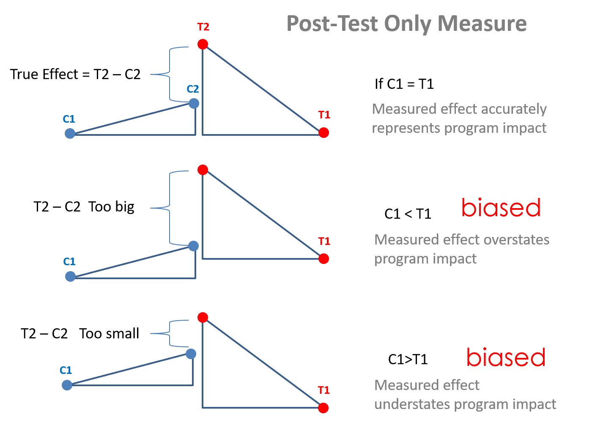
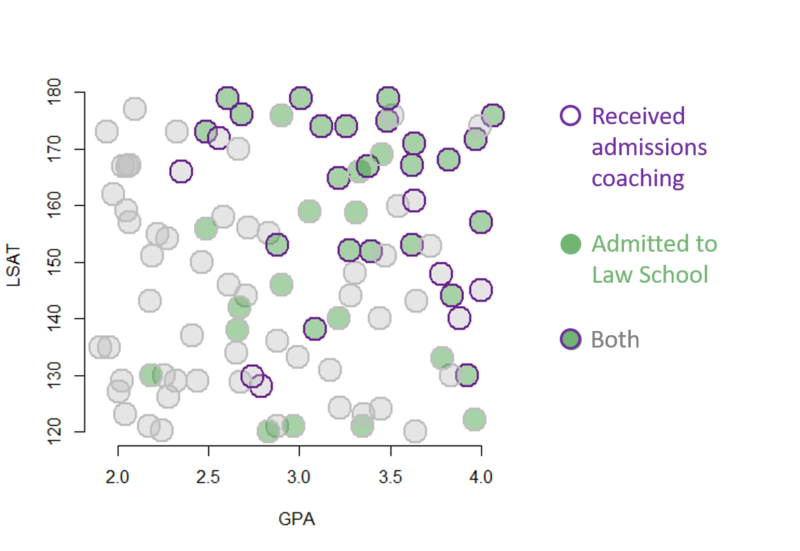

```{r setup, include=FALSE}
knitr::opts_chunk$set(echo = TRUE, message=F, warning=F, fig.width = 10)
```
**Packages**

We will use the following packages in this lecture. 

* **kableExtra** for nice tables
* **dplyr** to support formatting options in your table
* **MatchIt** to perform matching algorithms in R
* **ggplot2** for nice visualizations of covariates

```{r, eval=T}

# install.packages( "dplyr" )
# install.packages( "kableExtra" )
# install.packages( "MatchIt" )
# install.packages( "ggplot2" )

library( dplyr )
library( kableExtra )
library( MatchIt )
library( ggplot2 )
library( stargazer )

```


```{r, echo=F}
library( scales )
```


**Learning Objectives:**

* What problem does matching solve and when is it appropriate? 
* What are different methods used to match observations? What are pros and cons of each?
* What is a propensity scores?
* How can you estimate propensity scores and use them for matching?
* What is the primary weakness of matching?


# Key Insights


We have learned that the selection problem is the primary challenge to causal estimation of policy or program impact. When people can decide whether or not to participate in a voluntary program, almost universally the types of people that enroll are different than the types that do not. Or conversely, the types of people that are selected during an a competitive process are different from other applicants. The types of organizations that are required to do remedial training because they failed an inspection or safety checks are different than organizations that pass. These differences typically lead to unobservable omitted variables that will bias any estimates of program effectiveness. 


Randomized controlled trials are the gold standard approach to mitigating selection problems. Randomization ensures that observable characteristics like gender and age will be equally distributed between the treatment and control groups. It also ensures that latent or unobservable characteristics like motivation, ability, experience, and support are also balanced. As a result, it breaks any correlations that exist between the choice to enroll in a program and all other traits of study participants. If randomization is successful, it makes the treatment (or level of treatment) completely exogenous. Thus, differences between treated and untreated subjects (or levels of treatment), can be interpretted as **caused** by the treatment, and not other factors. *This assumes 'happy' randomization and no non-random attrition, but these are testable assumptions.*

Note that randomization ensures that there are no pre-treatment differences between study groups, thus the post-test only estimator is appropriate. 



Unfortunately in many cases, a randomized control trial is not a feasible option and we need to consider other methods, such as some of the quasi-experimental methodologies that we have seen so far. 

Propensity score matching is a methodology that tries to achieve the favorable conditions of a randomized controlled trail while using observational data thas has potential selection bias. In several circumstances, individuals self-select into the treatment or the control group because of "certain characteristics" that make them more likely to select into one group or the other. 

For instance, we might be interested in understanding whether government funding provided to small businesses to hire individuals from disadvantaged populations promotes higher employment rates for this segment of the labor force. If we only consider the businesses that applied and received the funding we would likely find a positive correlation between program dollars and employment of disadvantaged populations. But to what extent were these businesses already planning to hire individuals from disadvantaged populations before the program started? In order words, what would have these businesses done had they not receive funding? How many business apply for the funds because they already employ a large number of people that meet the eligibility criteria versus businesses changing their hiring practices to qualify? In non-randomized studies the selection problem undermine the ability to use non-treated individuals as the counterfactual to treated individuals in the sample. 

The **propensity score** model came about when scholars asked, if the choice to participate in the program is introducing omitted variable bias into the study, can we control for the decision? Can we model the **propensity** or likelihood that a person participates in the program? The goal of **propensity scores** is to find individuals that are almost idenentical on a given set of measured characteristics so that they are both equally likely to participate in a program, i.e. self-select into the treatment group. However, we are matching those that participated in the treatment to those that are not. In order words, in the example above we are looking for businesses with identical work forces, one of which received funding for hiring disadvantaged populations (the treatment), another which did not apply but would have received it if they had since they are almost identical to the organizaton that was treated (control or counterfactual). We can then compare their outcomes.

In very simple terms, we are looking for [**doppelgangers**](https://en.wikipedia.org/wiki/Doppelg%C3%A4nger), individuals that **look identical** even if they are not genetically related. 

```{r doppel, fig.cap="Doppelg?nger", out.width='80%', echo=F }

```


## Example

Let's consider a case with a top dollar admissions coaching service for college students interested in law school. The services helps coach students on application materials and selection of programs. You pay a premium for the services, though. 

The question, however, is whether the program really works? They boast high success rates on their website, but what types of students would sign up for their services in the first place? Those that really want to attend law school. We almost certainly have a selection problem, where merely signing up for the program is a signal of commitment to law school. Those students are likely different than other students. Is the program actually improving chances of getting admitted to a good program? Or is the organization merely capturing the top students that are already strong candidates? 


The challenge is going to be that students signing up for an expensive admissions coaching program are likely doing a lot of other things to improve their chances of success. Those that sign up for admissions coaching are not "typical" students in the pool of applicants. They tend to have high GPAs and good LSAT scores, making their likelihood of success high even without the coaching. 




Looking at the figure, the challenges is the high correlation between participating in the admissions coaching program and admissions to law school. If admissions success was entirely driven by the program the the high correlation would be fine. But we see that admissions is also correlated with GPA and LSAT scores. The strong relationships between these four variables suggests there may be another factor driving the correlations we observe. Admissions does not have to be impacted at all by the coaching program for there to be a strong correlation if there is a common variable like level of motivation shaping all of the covariates in the model. 


Note that including LSAT and GPA in the model will improve estimates beyond a naive model that only includes program participation. But they are not sufficient to control for missing variables. The underlying variable of motivation is still missing, so the estimate of the impact of admissions coaching on the final outcome will still be biased. 

The trick is to recognize that the treatment and control groups are apples and oranges so a raw comparison of success rates between the two groups will be problematic. Since there is no way to measure admissions rates before students sign up for coaching program and apply, we cannot use some of the common models that can help correct for bias such as a difference-in-difference framework or panel methods. We only have outcomes that occur after the treatment. We know that post-test only estimates will only be unbiased if we have groups that are identical prior to the treatment. 

The fix is to use a matching process to identify twins in the data such that two cases are "identical" on measured characteristics but one received the treatment and one did not. In this case we have two control variables only, so we will use a very simplistic method of looking at instances where treated and untreated cases overlap on the scatterplot, dropping the rest of the data:


Note that the covariates are all measures from prior to when the treatment occurred, so they are describing the pre-treatment state of the study group. As a result, by discarding a large proportion of the data and focusing on the subset of matched cases we have re-created the conditions of an RCT, primarily that two groups should be balanced. We can now consider the data in more detail and the evidence for program success. In this case both the treatment and the outcome are binary, so we can use visual inspection and reason through the scenarios:  


Conceptually, each pair represents a counter-factual if we believe the assumption that your untreated doppelganger is a reasonable representation of what you would look like if you had not received the treatment. We can now estimate the impact of admissions coaching by comparion treated and untreated cases. For simplicity, we will use a linear probability model:  


```{r, eval=T}
# > dput(gpa)
gpa <- 
c(2.6159787901946, 3.21736812236511, 3.5405463872337, 3.91970108539356, 
2.03511472781177, 2.68532174464602, 2.28188577528272, 3.08720640268527, 
3.48284146544279, 3.22380189104055, 3.30665435896137, 3.32780850423293, 
3.63068142350387, 3.83636515392655, 3.05930145996071, 3.84185246439118, 
2.5851924685327, 2.00855552381307, 2.79299048387649, 2.70916293710547, 
3.81917149760915, 3.6228595647663, 2.02911531212327, 4.06257304112354, 
3.31000053524501, 2.24801764007312, 3.21803571258973, 2.88121994382121, 
3.28149707848388, 3.37537264518966, 2.06694528290228, 2.8341656291009, 
2.67077874220602, 2.99320790449838, 3.62199372770993, 2.41017136636896, 
2.48878104071005, 1.94074545589611, 2.06551642414302, 3.00895809303604, 
3.17268682678355, 3.63900386751848, 1.95564219272312, 2.90445155197373, 
2.96985021333923, 2.04184280729974, 3.51497964386235, 3.44927166080488, 
2.32360299429693, 3.62939363940064, 2.67644331229011, 3.9625794083367, 
3.78254297208907, 2.65219077868443, 2.04978651754732, 4.14464452793737, 
2.48963425316853, 3.87916927405778, 2.27686723428854, 3.2758285853739, 
2.25702120670263, 2.22312919313002, 1.90659155192284, 2.7412970195498, 
2.05778186661082, 2.32975939146246, 3.97168731681461, 2.19218613139104, 
3.64476468242825, 2.44186660097907, 2.18107385074341, 2.56219410820381, 
3.7841979264117, 3.71822022692478, 4.11113336088402, 3.12366098811401, 
2.60484367948823, 3.44220105531685, 2.87896437353783, 3.25610482267806, 
2.88243076763779, 2.9046920441307, 2.35062220472042, 2.18646903048459, 
3.34780158776369, 1.98127124131876, 3.35514639143928, 3.45353594577433, 
3.49068473784773, 2.0978658668199, 2.8337986455381, 3.3948034778424, 
3.9917474339063, 2.17246398713074, 2.46460939967413, 2.66652609693591, 
3.47013062349409, 2.65792960385949, 2.71760079662088, 2.05328463950335
)
# > dput(lsat)
lsat <- 
c(145.952300905935, 164.888289647179, 159.910726683132, 129.970164649436, 
166.887384502726, 176.082647938974, 126.107126639122, 138.122725198303, 
175.01429450674, 124.198774814702, 148.157905651809, 165.902042918279, 
170.86210876751, 129.99790831433, 158.942759642743, 144.08190941799, 
157.928700436461, 127.061252394214, 127.976715835044, 143.977311018364, 
168.106455706551, 153.055960309505, 129.064444014144, 175.849294786817, 
158.727197609528, 120.151646259827, 140.020994141552, 120.91269127151, 
144.065689775316, 166.973298192915, 156.958358920427, 155.027941726026, 
141.951051458246, 133.161455824508, 167.033654426077, 136.925631393548, 
155.958900412229, 173.109818741141, 167.154034182213, 179.02157657656, 
131.002511364673, 120.050625056506, 134.837196550179, 145.944899668184, 
120.95292452038, 123.038299671817, 175.857511479449, 124.055513940446, 
129.064654266376, 160.908015210708, 128.862085689755, 122.076773077479, 
147.898610773285, 134.045987415308, 159.03168608195, 157.004128686876, 
173.101477346685, 140.034635459666, 154.128716946311, 152.00978239957, 
129.985348798586, 154.973056993292, 134.992192179686, 129.855955393512, 
167.006113927053, 173.073118368711, 171.768836785606, 151.123510536061, 
143.107434454865, 129.001508432487, 143.018432642471, 171.956900333934, 
132.955417572184, 152.919779850605, 145.042058294691, 174.016230162574, 
178.881300588744, 140.008999177798, 153.04453474676, 174.0134253414, 
136.101729739799, 175.950286787161, 165.917359624194, 129.991254750415, 
121.055826911114, 161.95634242456, 123.067521423418, 169.012586453432, 
178.970514980657, 177.055312739649, 120.009700877406, 151.926746758908, 
173.993404666208, 120.944944607453, 150.032393136119, 170.036478709669, 
151.184419758293, 137.937387497094, 156.080379871703, 166.978991885011
)
# > dput( coaching )
coaching <- 
c(0L, 1L, 0L, 1L, 0L, 1L, 0L, 1L, 1L, 0L, 0L, 0L, 1L, 0L, 0L, 
1L, 0L, 0L, 1L, 0L, 1L, 1L, 0L, 1L, 0L, 0L, 0L, 0L, 0L, 1L, 0L, 
0L, 0L, 0L, 1L, 0L, 0L, 0L, 0L, 1L, 0L, 0L, 0L, 0L, 0L, 0L, 0L, 
0L, 0L, 1L, 0L, 0L, 1L, 0L, 0L, 1L, 1L, 1L, 0L, 1L, 0L, 0L, 0L, 
1L, 0L, 0L, 1L, 0L, 0L, 0L, 0L, 1L, 0L, 0L, 1L, 1L, 1L, 0L, 1L, 
1L, 0L, 0L, 1L, 0L, 0L, 0L, 0L, 0L, 1L, 0L, 0L, 1L, 0L, 0L, 0L, 
0L, 0L, 0L, 0L, 0L)
# > dput( admit )
admit <- 
c(0L, 1L, 0L, 1L, 0L, 1L, 0L, 1L, 1L, 0L, 0L, 1L, 1L, 0L, 1L, 
1L, 0L, 0L, 0L, 0L, 1L, 1L, 0L, 1L, 1L, 0L, 1L, 0L, 0L, 1L, 0L, 
0L, 1L, 0L, 1L, 0L, 1L, 0L, 0L, 1L, 0L, 0L, 0L, 1L, 1L, 0L, 0L, 
0L, 0L, 0L, 0L, 1L, 0L, 0L, 0L, 1L, 1L, 0L, 0L, 1L, 0L, 0L, 0L, 
0L, 0L, 0L, 1L, 0L, 0L, 0L, 0L, 0L, 1L, 0L, 0L, 1L, 1L, 0L, 1L, 
1L, 0L, 1L, 0L, 1L, 1L, 0L, 0L, 1L, 1L, 0L, 1L, 1L, 0L, 0L, 0L, 
0L, 0L, 1L, 0L, 0L)


data <- data.frame( admit, coaching, gpa, lsat ) 
```


Code for graphs: 

```{r, eval=F}
border <- ifelse( coaching==1, "darkorchid4", "gray" )
background <- ifelse( admit==1, "forestgreen", "gray" )

plot( gpa, lsat, 
      pch=21, cex=3, bty="n", 
      col=border, bg=adjustcolor( background, alph=0.4),
      xlab="GPA", ylab="LSAT", lwd=2  )


twins <- c(3,4,8,9,14,22,27,30,32,40,47,50,51,
           64,67,72,74,79,82,88,92,93,96,97)

plot( gpa[twins], lsat[twins], pch=21, cex=3.5, bty="n", 
      col=border[twins], 
      bg=adjustcolor( background[twins], alph=0.4 ),
      xlab="GPA", ylab="LSAT", lwd=2,
      xlim=c(2,4), ylim=c(120,180) )
```


```{r, echo=F}
# > dput(gpa)
gpa <- 
c(2.6159787901946, 3.21736812236511, 3.5405463872337, 3.91970108539356, 
2.03511472781177, 2.68532174464602, 2.28188577528272, 3.08720640268527, 
3.48284146544279, 3.22380189104055, 3.30665435896137, 3.32780850423293, 
3.63068142350387, 3.83636515392655, 3.05930145996071, 3.84185246439118, 
2.5851924685327, 2.00855552381307, 2.79299048387649, 2.70916293710547, 
3.81917149760915, 3.6228595647663, 2.02911531212327, 4.06257304112354, 
3.31000053524501, 2.24801764007312, 3.21803571258973, 2.88121994382121, 
3.28149707848388, 3.37537264518966, 2.06694528290228, 2.8341656291009, 
2.67077874220602, 2.99320790449838, 3.62199372770993, 2.41017136636896, 
2.48878104071005, 1.94074545589611, 2.06551642414302, 3.00895809303604, 
3.17268682678355, 3.63900386751848, 1.95564219272312, 2.90445155197373, 
2.96985021333923, 2.04184280729974, 3.51497964386235, 3.44927166080488, 
2.32360299429693, 3.62939363940064, 2.67644331229011, 3.9625794083367, 
3.78254297208907, 2.65219077868443, 2.04978651754732, 4.14464452793737, 
2.48963425316853, 3.87916927405778, 2.27686723428854, 3.2758285853739, 
2.25702120670263, 2.22312919313002, 1.90659155192284, 2.7412970195498, 
2.05778186661082, 2.32975939146246, 3.97168731681461, 2.19218613139104, 
3.64476468242825, 2.44186660097907, 2.18107385074341, 2.56219410820381, 
3.7841979264117, 3.71822022692478, 4.11113336088402, 3.12366098811401, 
2.60484367948823, 3.44220105531685, 2.87896437353783, 3.25610482267806, 
2.88243076763779, 2.9046920441307, 2.35062220472042, 2.18646903048459, 
3.34780158776369, 1.98127124131876, 3.35514639143928, 3.45353594577433, 
3.49068473784773, 2.0978658668199, 2.8337986455381, 3.3948034778424, 
3.9917474339063, 2.17246398713074, 2.46460939967413, 2.66652609693591, 
3.47013062349409, 2.65792960385949, 2.71760079662088, 2.05328463950335
)
# > dput(lsat)
lsat <- 
c(145.952300905935, 164.888289647179, 159.910726683132, 129.970164649436, 
166.887384502726, 176.082647938974, 126.107126639122, 138.122725198303, 
175.01429450674, 124.198774814702, 148.157905651809, 165.902042918279, 
170.86210876751, 129.99790831433, 158.942759642743, 144.08190941799, 
157.928700436461, 127.061252394214, 127.976715835044, 143.977311018364, 
168.106455706551, 153.055960309505, 129.064444014144, 175.849294786817, 
158.727197609528, 120.151646259827, 140.020994141552, 120.91269127151, 
144.065689775316, 166.973298192915, 156.958358920427, 155.027941726026, 
141.951051458246, 133.161455824508, 167.033654426077, 136.925631393548, 
155.958900412229, 173.109818741141, 167.154034182213, 179.02157657656, 
131.002511364673, 120.050625056506, 134.837196550179, 145.944899668184, 
120.95292452038, 123.038299671817, 175.857511479449, 124.055513940446, 
129.064654266376, 160.908015210708, 128.862085689755, 122.076773077479, 
147.898610773285, 134.045987415308, 159.03168608195, 157.004128686876, 
173.101477346685, 140.034635459666, 154.128716946311, 152.00978239957, 
129.985348798586, 154.973056993292, 134.992192179686, 129.855955393512, 
167.006113927053, 173.073118368711, 171.768836785606, 151.123510536061, 
143.107434454865, 129.001508432487, 143.018432642471, 171.956900333934, 
132.955417572184, 152.919779850605, 145.042058294691, 174.016230162574, 
178.881300588744, 140.008999177798, 153.04453474676, 174.0134253414, 
136.101729739799, 175.950286787161, 165.917359624194, 129.991254750415, 
121.055826911114, 161.95634242456, 123.067521423418, 169.012586453432, 
178.970514980657, 177.055312739649, 120.009700877406, 151.926746758908, 
173.993404666208, 120.944944607453, 150.032393136119, 170.036478709669, 
151.184419758293, 137.937387497094, 156.080379871703, 166.978991885011
)
# > dput( coaching )
coaching <- 
c(0L, 1L, 0L, 1L, 0L, 1L, 0L, 1L, 1L, 0L, 0L, 0L, 1L, 0L, 0L, 
1L, 0L, 0L, 1L, 0L, 1L, 1L, 0L, 1L, 0L, 0L, 0L, 0L, 0L, 1L, 0L, 
0L, 0L, 0L, 1L, 0L, 0L, 0L, 0L, 1L, 0L, 0L, 0L, 0L, 0L, 0L, 0L, 
0L, 0L, 1L, 0L, 0L, 1L, 0L, 0L, 1L, 1L, 1L, 0L, 1L, 0L, 0L, 0L, 
1L, 0L, 0L, 1L, 0L, 0L, 0L, 0L, 1L, 0L, 0L, 1L, 1L, 1L, 0L, 1L, 
1L, 0L, 0L, 1L, 0L, 0L, 0L, 0L, 0L, 1L, 0L, 0L, 1L, 0L, 0L, 0L, 
0L, 0L, 0L, 0L, 0L)
# > dput( admit )
admit <- 
c(0L, 1L, 0L, 1L, 0L, 1L, 0L, 1L, 1L, 0L, 0L, 1L, 1L, 0L, 1L, 
1L, 0L, 0L, 0L, 0L, 1L, 1L, 0L, 1L, 1L, 0L, 1L, 0L, 0L, 1L, 0L, 
0L, 1L, 0L, 1L, 0L, 1L, 0L, 0L, 1L, 0L, 0L, 0L, 1L, 1L, 0L, 0L, 
0L, 0L, 0L, 0L, 1L, 0L, 0L, 0L, 1L, 1L, 0L, 0L, 1L, 0L, 0L, 0L, 
0L, 0L, 0L, 1L, 0L, 0L, 0L, 0L, 0L, 1L, 0L, 0L, 1L, 1L, 0L, 1L, 
1L, 0L, 1L, 0L, 1L, 1L, 0L, 0L, 1L, 1L, 0L, 1L, 1L, 0L, 0L, 0L, 
0L, 0L, 1L, 0L, 0L)

# > dput( p.coach )
p.coach <- 
c(0.193923781681413, 0.47287683402821, 0.580478841925711, 0.413573803803523, 
0.205863521749613, 0.33620535123994, 0.142167388899611, 0.275947743690683, 
0.729335627644695, 0.231615242003094, 0.384288947726956, 0.516397819885138, 
0.734503955800836, 0.445348122867454, 0.397796892728336, 0.449568532253992, 
0.264307623286641, 0.0895984671123723, 0.210941655993544, 0.221503081065662, 
0.801763427100846, 0.449937031031123, 0.0846919384681651, 0.899870172386177, 
0.495945430765638, 0.0762781307879699, 0.30977838541748, 0.168657656768907, 
0.358988800107053, 0.524681886185771, 0.154763835706046, 0.271489477091039, 
0.179343048977632, 0.213061554138318, 0.646570697736474, 0.162364557010663, 
0.215607428515951, 0.211949016414052, 0.205863521749613, 0.550607101745605, 
0.263585866144653, 0.322987558879105, 0.0969765195678889, 0.293976742403956, 
0.168657656768907, 0.0736850764950737, 0.64706351074539, 0.251671040958826, 
0.114109734036, 0.631683516595536, 0.16548717687838, 0.420162554416107, 
0.553428940948012, 0.199341375483122, 0.161144999013057, 0.728251275134177, 
0.319048390235219, 0.523432545012868, 0.190377970505028, 0.381212060912859, 
0.116591096734163, 0.162691016253755, 0.0969765195678889, 0.184433131744098, 
0.205863521749613, 0.271981974879125, 0.849684562337091, 0.15003538549689, 
0.475760689724168, 0.114109734036, 0.152967182354891, 0.313487770300792, 
0.374162267925612, 0.558011726542901, 0.607169458522428, 0.508625198954204, 
0.412025484313965, 0.390502324059283, 0.332571518640745, 0.627583881763466, 
0.190007765521348, 0.454563689105695, 0.259763075741113, 0.105813402280968, 
0.25857759453476, 0.186884216928093, 0.247073173801597, 0.622549043215077, 
0.677187080078125, 0.248445417988065, 0.137750350183543, 0.410995850132668, 
0.87448939300524, 0.0865491471428936, 0.20943780051436, 0.35378836858, 
0.435384265262225, 0.197522230053406, 0.276446699791544, 0.188808574796188
)
# > dput( p.admit )
p.admit <- 
c(0.193923781681413, 0.47287683402821, 0.580478841925711, 0.413573803803523, 
0.205863521749613, 0.33620535123994, 0.142167388899611, 0.275947743690683, 
0.729335627644695, 0.231615242003094, 0.384288947726956, 0.516397819885138, 
0.734503955800836, 0.445348122867454, 0.397796892728336, 0.449568532253992, 
0.264307623286641, 0.0895984671123723, 0.210941655993544, 0.221503081065662, 
0.801763427100846, 0.449937031031123, 0.0846919384681651, 0.899870172386177, 
0.495945430765638, 0.0762781307879699, 0.30977838541748, 0.168657656768907, 
0.358988800107053, 0.524681886185771, 0.154763835706046, 0.271489477091039, 
0.179343048977632, 0.213061554138318, 0.646570697736474, 0.162364557010663, 
0.215607428515951, 0.211949016414052, 0.205863521749613, 0.550607101745605, 
0.263585866144653, 0.322987558879105, 0.0969765195678889, 0.293976742403956, 
0.168657656768907, 0.0736850764950737, 0.64706351074539, 0.251671040958826, 
0.114109734036, 0.631683516595536, 0.16548717687838, 0.420162554416107, 
0.553428940948012, 0.199341375483122, 0.161144999013057, 0.728251275134177, 
0.319048390235219, 0.523432545012868, 0.190377970505028, 0.381212060912859, 
0.116591096734163, 0.162691016253755, 0.0969765195678889, 0.184433131744098, 
0.205863521749613, 0.271981974879125, 0.849684562337091, 0.15003538549689, 
0.475760689724168, 0.114109734036, 0.152967182354891, 0.313487770300792, 
0.374162267925612, 0.558011726542901, 0.607169458522428, 0.508625198954204, 
0.412025484313965, 0.390502324059283, 0.332571518640745, 0.627583881763466, 
0.190007765521348, 0.454563689105695, 0.259763075741113, 0.105813402280968, 
0.25857759453476, 0.186884216928093, 0.247073173801597, 0.622549043215077, 
0.677187080078125, 0.248445417988065, 0.137750350183543, 0.410995850132668, 
0.87448939300524, 0.0865491471428936, 0.20943780051436, 0.35378836858, 
0.435384265262225, 0.197522230053406, 0.276446699791544, 0.188808574796188
)

# p.coach <- p.coach + rnorm(100,0,0.03)
# p.admit <- p.admit + rnorm(100,0,0.03)

# d <- data.frame( p.admit, gpa, lsat, p.coach )
                 
panel.cor <- function(x, y, digits=2, prefix="", cex.cor)
{
    usr <- par("usr"); on.exit(par(usr))
    par(usr = c(0, 1, 0, 1))
    r <- abs(cor(x, y))
    txt <- format(c(r, 0.123456789), digits=digits)[1]
    txt <- paste(prefix, txt, sep="")
    if(missing(cex.cor)) cex <- 0.8/strwidth(txt)
    
    test <- cor.test(x,y)
    # borrowed from printCoefmat
    Signif <- symnum(test$p.value, corr = FALSE, na = FALSE,
                  cutpoints = c(0, 0.001, 0.01, 0.05, 0.1, 1),
                  symbols = c("***", "**", "*", ".", " "))
    
    text(0.5, 0.5, txt, cex = 1.5 )
    text(.7, .8, Signif, cex=cex, col=2)
}

panel.smooth <- function (x, y, col = par("col"), bg = NA, pch = par("pch"), 
    cex = 1.2, col.smooth = "red", span = 2/3, iter = 3, ...) 
{
    points(x, y, pch = 19, col = gray(0.7,0.4), bg = bg, cex = cex)
    ok <- is.finite(x) & is.finite(y)
    if (any(ok)) 
        lines(stats::lowess(x[ok], y[ok], f = span, iter = iter), 
            col = col.smooth, lwd=2, ...)
}

# custom plot
jplot <- function( x1, x2, lab1="", lab2="", draw.line=T, ... )
{

    plot( x1, x2,
          pch=19, 
          col=gray(0.6, alpha = 0.2), 
          cex=0.5,  
          bty = "n",
          xlab=lab1, 
          ylab=lab2, cex.lab=1.5,
        ... )

    if( draw.line==T ){ 
        ok <- is.finite(x1) & is.finite(x2)
        lines( lowess(x2[ok]~x1[ok]), col="red", lwd=3 ) }

}

# correlation plots
# pairs( d, upper.panel=panel.cor, lower.panel=panel.smooth )
```


```{r, results="asis"}

# row positions of matched pairs in dataset
twins <- c(3,4,8,9,14,22,27,30,32,40,47,50,51,
           64,67,72,74,79,82,88,92,93,96,97)

data.twins <- data[ twins , ]


m1 <- lm( admit ~ coaching + gpa + lsat, data=data )
m2 <- lm( admit ~ coaching + gpa + lsat, data=data.twins )
  
stargazer( m1, m2, 
           type="html", digits=2,
           omit.stat = c("ser","f") )
```


> A propensity score represents the probability of being assigned to the treatment group based on a given set of characteristics. 

In this example it would be the likelihood that an applicant had participated in an expensive admissions coaching service. 

By matching observations in the treatment and in the control based on their propensity score, we can create artificial treatment and control groups that are more balanced than a blind comparison of the raw data. In some circumstances matching can reduce or eliminate the effects of confounding variables.


# Matching Scores


```{r exampleCover, fig.cap="Source: https://pixabay.com/images/search/classroom/", out.width='60%', echo=F }
knitr::include_graphics( "FIGURE/Matching/Picture1.jpg" )
```

```{r, echo = F}

set.seed(503)
income = rnorm(25)          
occ_score = rnorm(25)
y_educ = rnorm(25)
z = 1 + 0.2*income + 0.8*occ_score + 1.1*y_educ            
pr = 1/(1+exp(-z))        
school = rbinom(25, 1, pr)    

income = rescale(income, to = c(16000, 300000))
income = log(income)

occ_score = rescale(occ_score, to = c(0,100))

y_educ = rescale(y_educ, to = c(12,25))

df = data.frame(y = school, x1 = income, x2 = occ_score, x3 = y_educ)

colnames(df) <- c("school", "income", "occ_score", "y_educ")

df$student = as.numeric(rownames(df))
```

An area of research where propensity score matching has attracted a lot of attention is [education policy](https://www.coe.unt.edu/sites/default/files/1846/Forrest%20Lane%20-%20Propensity%20Score%20Matching.pdf). In education policy research is often difficult to use randomized trails as we cannot force families to randomly send their kids to private or public schools or to some programs rather than others. Nor can we observe the same individual under one condition or the other - a child can either attend a Catholic elementary school or a public one! [Propensity score matching is therefore a good technique](https://www.researchgate.net/publication/273061804_An_Illustrative_Example_of_Propensity_Score_Matching_with_Education_Research) to control for differences across groups of childrend and evaluate the impact of different types of school, programs, and policies.

[Reardon, Cheadle, and Robinson (2008)](https://cepa.stanford.edu/sites/default/files/reardon_cheadle_robinson_catholic_schools_effects_SREE_march_7_2008.pdf), for instance, utilized propensity score matching to estimate the effect of attending a Catholic vs. a public elementary school on math and reading skills. The key idea is that characteristics (income or parents' occupation and education) that lead students to self-select into Catholic schools might also explain their better performance. As the authors say: "given that Catholic and public school students differ in many ways likely to affect their cognitive skills, a simple comparison of their mean test scores at subsequent waves is likely to yield substantially biased estimates of the effect of Catholic schooling."

[Morgan, Frisco, Farkas, and Hibel (2010)](https://www.ncbi.nlm.nih.gov/pmc/articles/PMC3630079/) look at special education programs and compare students who were legally entitled to be enrolled vs students who did not attend these programs to establish their effectiveness on math and reading skills. Students who are legally entitled to these programs have generally higher scores even before being involved and attend better schools. Directly compare the two groups will lead to biased estimates.

In this example, we use simulated data to evaluate the effect of attending a private vs a public high school on math skills. For convenience, we will work on a small sample of 25 students. We will walk through all the steps of a matching score approach.

> **Research question**: 
> Do students who attend private high schools have higher math skills than students who attend a public high school?
>
> **Hypothesis**: 
> Students who attend a private high schools will not have higher math skills than students in public school.

## Identify the covariates

First of all, we need to determine the variables that might explain self-selection into private vs public school. It is important to match the two groups based on all possible covariates. Covariates can be identified by looking at previous literature or empirical diffrences across the two groups.

We identify 3 covariates:

 **Variable name   **   | **Description    **                                                                         | 
----------------------- | ------------------------------------------------------------------------------------------- |
$\text{income}$    |Family income                                                                                |
$\text{occ_score}$          |Father's occupational score based on education, salary and prestige, from 0 to 100|
$\text{y_educ}$ |Father's year of education          |

We will use this three covariates to predict whether a student enrolls in a private school (=1) or in a public school (=0). 

## Creating matching score

A matching score describes an individual's probability to belong in the treatment or control group based on a set of covariates. In our case, the propensity scores are built based on the 3 covariates that we have just identified and will predict the likelihood that the child will attend a private or public school. Note that since we consider "going to a private school" to be our treatment, students in a private school are the "treament group" while students in a public school are the "control group".

To estimate probability we can use a logit or a linear probability model that we discussed in the previous lecture. We chose to utilize a logit model in this example.

```{r}

## Estimate the logit model
log = glm( school ~ income + occ_score + y_educ, data = df, family = "binomial")

## Calculate the propensity score by estimating the probability for each child to attend a private or a public school.
df$prop_score <- predict(log, newdata = df, type = "response")

```

We can have a look at the summary statistics of the propensity scores

```{r}

summary(df$prop_score)

```

We can also plot the propensity score for each student.

```{r}

palette(c("darkred", "dodgerblue1"))

plot(df$student, df$prop_score, col = df$school+1, lwd = 3, ylab = "Predicted probabilities", xlab = "Observations", xaxt = "n")

axis(1, at=1:25)

#points(19, 0.3, col = "darkred", lwd = 3)
#text(22.5, 0.3, "Treatment (Private School)", col = "darkred")

#points(19, 0.25, col = "dodgerblue1", lwd = 3)
#text(22.5, 0.25, "Control (Public School)", col = "dodgerblue1")

for (i in 1:nrow(df)){
  segments(df$student[i], 0, df$student[i], df$prop_score[i], lty = 2, col = "gray70")}

```

## Chose a matching strategy

Now that we have our propensity scores we need to decide *how* to match individuals with one another. There are several choices to be made and each choice influences the final dataset. 

### One-to-one vs one-to-many

First, we need to decide whether we want a *one-to-one match or a one-to-many match*. In the first case, we match one student in a private school with only one student in a public school. In the second case, we want to match a single case in the treatment group (private school) with several students in public schools (control group). This second method allows us to get less precise matches but, potentially, to retain a large sample of observations. By contrast, a one-to-one match is more precise but potentially throws away several observations. 

For example, let's take five random students from our dataset. We have only one student in the treatment group (#5, in bold). We could decide to match the student with multiple students from the control group or only one, throwing away the remaining 4 observations. 

```{r}

## We order our observations by propensity score, so that we can observations that are close to each other.
df = as.data.frame(df[order(df$prop_score), ])

## We just look at the top 5 observations
df2 = round(df[5:9,], 2)
```

```{r kableExtra.html.bsTable = T}

rownames(df2)<-NULL

df2 = df2[,c(5,1,6)]

df2 %>%
  
  kable(caption = "Top 5 observations with lowest propensity scores", format = "html", escape = F) %>%
  
  kable_styling(full_width = F, fixed_thead = T) %>%  
  
  row_spec(which(df2$school == 1), bold = T, col = "black")

```

### Nearest neighbor matching and caliper distance

But how do we match? There are two common strategies. The first one is called *nearest neighbor matching*. It means that we will select the student(s) with the closest propensity score to our "treated" student #20. The second one is called *nearest neighbor matching within a specified caliper distance* - don't get scared by the name. It just means that you specify a maximum distance between two scores for them to be a match.

Let's see this in practice. For each possible control observation, we calculate the distance from their propensity score to the propensity score of the treated student #20.

```{r}

## Note that we take the absolute value of the difference

df2$distance = abs(df2$prop_score[df2$school==1] - df2$prop_score)

```

Now, if we use a nearest neighbor matching strategy, we would match student #5 with student #20 or student #4 (highlighted in yellow) because they are the ones at the closest distance. 

If we decide for a one-to-one strategy, we would need to decide whether to match the student with #12 or #2 (we will discuss how to make this choice in a moment). With a many-to-many strategy we would match student #5 with both #12 and #2 and retain all three observations. 

```{r}

options(kableExtra.html.bsTable = T)

df2 %>%
  mutate(distance = cell_spec(distance, "html", background = ifelse(distance ==  min(distance[distance != 0]), "#FFCC00", "#FFFFFF"))) %>%
  
  kable(format = "html", escape = F, caption = "Distances from student #5") %>%
  
  kable_styling(full_width = F, fixed_thead = T) %>%
  
  row_spec(which(df2$school == 1), bold = T, col = "black")

```

If we use a nearest neighbor matching within a specified caliper distance strategy, then we first need to pick the maximum distance that we would allow between two observations. 

Let's say we decide 0.1. If we take a look at the table below, we can see that up to three students match the required rule and are at less than 0.1 distance from the propensity score of the students admitted to law school.

```{r}

df2$Caliper_Distance = ifelse(df2$school == 1, " ", ifelse(df2$distance <0.1, "MATCH", "NO MATCH"))

options(kableExtra.html.bsTable = T)

df2 %>%
  mutate(distance = cell_spec(
        distance, "html", background = ifelse(distance ==  min(distance[distance != 0]), "#FFCC00", "#FFFFFF"))) %>%
  
  mutate(Caliper_Distance = cell_spec(
        Caliper_Distance, "html", background = ifelse(Caliper_Distance == " ", "#FFFFFF", ifelse(Caliper_Distance ==  "MATCH", "#00CC00", "#FF0000")), bold = T)) %>%
  
  kable(format = "html", escape = F, caption = "Caliper Distance from student #5") %>%
  
  kable_styling(full_width = F, fixed_thead = T) %>%
  
  row_spec(which(df2$school == 1), bold = T, col = "black")
```

Let's now say we decide 0.03. In this case,there would be no match for student #20 as all other propensity scores are at more than 0.03 points of distance.

```{r}

df2$Caliper_Distance = ifelse(df2$school == 1, " ", ifelse(df2$distance <0.03, "MATCH", "NO MATCH"))

options(kableExtra.html.bsTable = T)

df2 %>%
  mutate(distance = cell_spec(
        distance, "html", background = ifelse(distance ==  min(distance[distance != 0]), "#FFCC00", "#FFFFFF"))) %>%
  
  mutate(Caliper_Distance = cell_spec(
        Caliper_Distance, "html", background = ifelse(Caliper_Distance == " " , "#FFFFFF", ifelse(Caliper_Distance ==  "MATCH", "#00CC00", "#FF0000")), bold = T)) %>%
  
  kable(format = "html", escape = F, caption = "Caliper Distance from student #5") %>%
  
  kable_styling(full_width = F, fixed_thead = T) %>%
  
  row_spec(which(df2$school == 1), bold = T, col = "black")
```

### With or Without replacement

Right now we are working with only one case. The situation might get more complicated when with have multiple observations with similar scores.

Let's have a look some others observations in our dataset

```{r}
df3 = round(df[15:19,], 2)

df3 = df3[,c(5,1,6)]

df3 = as.data.frame(df3[order(df3$school, decreasing = T), ])

#df3$distance = df3[3,6] - df3$prop_score
```

```{r}

options(kableExtra.html.bsTable = T)

df3 %>%
 # mutate(distance = cell_spec(
        #distance, "html", background = ifelse(distance ==  min(distance[distance != 0]), "#FFCC00", "#FFFFFF"))) %>%
  
  #mutate(Caliper_Distance = cell_spec(
        #Caliper_Distance, "html", background = ifelse(Caliper_Distance ==  "MATCH", "#00CC00", "#FF0000"), bold = T)) %>%
  
  kable(format = "html", escape = F, caption = "Caliper Distance from student #5") %>%
  
  kable_styling(full_width = F, fixed_thead = T) %>%
  
  row_spec(which(df3$school == 1), bold = T, col = "black")
```

How do we match the different "treated" students (in bold)? First, we need to decide if we want to match **with or without replacement**. Matching without replacement means that once a student has been matched with another, it will be no longer available for another match. Vicecersa, in matching with replacement the same student is allowed to match with multiple other students. In the first case, observations will be independent from one another as they are matched with only one student at a time. In the second case, observations will be dependent from one another but we might have better matches, especially when there are only few individuals in the control group. 

You can see in table 2.6. We have 3 treated students and 2 untreated students. We calculate the distance from each treated student to each untreated students (#14 and #6). You can see results in column "distance_14" and "distance_6". Let's assume we are matching according to the nearest neighbor matching rule (see \@ref:nearest-neighbor-matching-and-caliper-distance). 

If we match with replacement, we can match the same untreated student to multiple treated students as in column "WithReplacement". In this way, we retain all 5 observations. But if we match withour replacement, then we will match each untreated student with only one treated student. As result, we lose one observation in our final dataset as shown in column "WithoutReplacement". 

```{r}

df3$distance_14 = ifelse(df3$school == 1, df3$prop_score - df3$prop_score[df3$student == "14"], NA)
df3$distance_14 = round(abs(df3$distance_14), 2)

df3$distance_6 = ifelse(df3$school == 1, df3$prop_score - df3$prop_score[df3$student == "6"], NA)
df3$distance_6 = round(abs(df3$distance_6), 2)

df3$WithReplacement = c(14, 6, 6, NA, NA)
df3$WithoutReplacement = c( "", 6, 14, NA, NA)

options(kableExtra.html.bsTable = T)


df3 %>%
 mutate(WithReplacement = cell_spec(
        WithReplacement, "html", background = c("#FFCC00", "#00CC00", "#00CC00", "#FFFFFF", "#FFFFFF"))) %>%
  
  mutate(WithoutReplacement = cell_spec(
        WithoutReplacement, "html", background = c("#FFFFFF", "#00CC00", "#FFCC00", "#FFFFFF", "#FFFFFF"))) %>%
  
  kable(format = "html", escape = F, caption = "Assignment with or without replacement") %>%
  
  kable_styling(full_width = F, fixed_thead = T) %>%
  
  row_spec(which(df3$school == 1), bold = T, col = "black")

```

### Greedy and optimal process

Note that the assignment of treated and untreated students also depends on the process that we choose for matching observation. 

In a **greedy process**, we select a random treated observation and we start the matching process from there. 

Let's say we start from student #11 (see column "Start_11"). We would match it with student #14 as it is the nearest neighbor. Then, we look at student #8 and we would matched with student #6. No untreated student would be available to be matched with #9 in a without replacement process.

While this seems trivial, the problem with a greedy process is that we might loose good matches. For instance, have a look at column "Start_9", where the greedy process selected student #9 as a starting point. In this case, the unmatched case is student #8, which has a perfect match with student #6!

The problem with a greedy process is that it doesn't consider all observations together and does not try to maximize the end result. 

```{r}

df3$WithoutReplacement <- NULL
df3$WithReplacement <- NULL

df3$Start_11 = c(14, 6, " ", NA, NA)
df3$Start_8 = c( " ", 6, 14, NA, NA)
df3$Start_9 = c(14, " ", 6, NA, NA)

options(kableExtra.html.bsTable = T)

df3 %>%

  kable(format = "html", escape = F, caption = "Greedy process, starting from student #9") %>%
  
  kable_styling(full_width = F, fixed_thead = T) %>%
  
  row_spec(which(df3$school == 1), bold = T, col = "black")
```

We can see this by looking at how the total distance change across the difference options. 

If we start from student #11 the total distance is 0.03 (0.03 + 0). If we start from student #8 the total distance is 0.02 (0 + 0.02).  If we start from student #9 the total distance is 0.04 (0.03 + 0.01).

Alternatively, we can use an optimal matching proceess in which we look at all observations at the same time and we try to minimize the difference between two scores based on previous rules.

```{r}

df3$OptimalProcess = c("", 14, 6, NA, NA)

options(kableExtra.html.bsTable = T)

df3 %>%

   kable(format = "html", escape = F, caption = "Optimal process, one-to-one") %>%
  
  kable_styling(full_width = F, fixed_thead = T) %>%
  
  row_spec(which(df3$school == 1), bold = T, col = "black")
```

In this case, the outcome is different from the greedy process as we are try to minimize the difference for each observation. 

### To summarize

While you won't have to 'manually' account for all these options understand differences across them is important as some choices have more restringent criteria than others.


 **Options   **   | **Description    **                                                                         | 
----------------------- | ------------------------------------------------------------------------------------------- |
One-to-one or One-to-Many    |One-to-one increases the precision of the match but a one-to-many approach allows to retain more observations |
Nearest neighbor or caliper distance neighbor          |With the Caliper distance neighbor approach we can control "how different" two observations are. While with the nearest neighbor approach we might include more observations, but some of them might be very far apart.|
With or Without Replacement |With replacement decreases the number of observations that we retain and might decrease precision, especially when combined with a greedy approach. Without replacement increases the precision and number of matches but create dependence across observation         |
Greedy vs Optimal Process | An optimal process is generally preferred, as a greedy process is contigent upon the starting observation.


## MatchIT function in R

Now that we understand the basics of matching, we can use the *MatchIt* function to match propensity scores across all observations.

We will use the same dataset as before, but we are going to enlarge into 10.000 observations. Propensity score matching generally works better with large dataset where few cases are "treated" and many of them are "untreated" - in this way, it it easy to find a doppelganger!

```{r, echo = F}

set.seed(503)
income = rnorm(10000)          
occ_score = rnorm(10000)
y_educ = rnorm(10000)
err = rnorm(10000)

z = - 3.2 + 1.4*income + 0.5*occ_score + 0.95*y_educ + err             
pr = 1/(1+exp(-z))        
school = rbinom(10000, 1, pr)    

income = rescale(income, to = c(16000, 300000))
income = log(income)

occ_score = rescale(occ_score, to = c(0,100))

y_educ = rescale(y_educ, to = c(12,25))

math_skills = 3.4 - 1.2 * school + err

math_skills = rescale(math_skills, to = c(0,100))

df = data.frame(y2 = math_skills, y = school, x1 = income, x2 = occ_score, x3 = y_educ)

colnames(df) <- c("math_skills", "school", "income", "occ_score", "y_educ")

df$student = as.numeric(rownames(df))


```

Before using the MatchIt function, let's have a look at the covariates between treated and untreated observations. We run a set of t-test for looking at differences across years of education, occupational scores, and income. As you can see, all three t-tests show a p-value < 0.001 suggesting that we cannot reject the null hypothesis that the two groups are equal. 

```{r}

t.test(df$y_educ[df$school==1], df$y_educ[df$school==0])
t.test(df$occ_score[df$school==1], df$occ_score[df$school==0])
t.test(df$income[df$school==1], df$income[df$school==0])

```

Graphically, we can represent the distribution density for each group and compare them. As you can see in the graphs below, the main difference is in the income level. 

```{r}

df$school2 = as.factor(df$school)

ggplot(df, aes(x = df$y_educ, fill = df$school2)) +
	geom_density(position="identity", alpha=0.6) +
	scale_fill_brewer(palette="Dark2") +
	ggtitle("Density plot of years of education, by group") +
	scale_x_continuous(name = "Years of education",
	breaks = seq(12, 25, 2),
        limits=c(12, 25)) +
	scale_y_continuous(name = "Density") +
        theme(plot.title = element_text(size = 14, face = "bold"),
              text = element_text(size = 12)) +
	guides(fill=guide_legend(title=NULL))+ 
	scale_fill_discrete(labels=c("Control - Public School", "Treatment - Private School"))

ggplot(df, aes(x = df$income, fill = df$school2)) +
	geom_density(position="identity", alpha=0.6) +
	scale_fill_brewer(palette="Dark2") +
	ggtitle("Density plot of income, by group") +
	scale_x_continuous(name = "Income",
	breaks = seq(9.5, 13, 0.5),
        limits=c(9, 13)) +
	scale_y_continuous(name = "Density") +
        theme(plot.title = element_text(size = 14, face = "bold"),
              text = element_text(size = 12)) +
	guides(fill=guide_legend(title=NULL))+ 
	scale_fill_discrete(labels=c("Control - Public School", "Treatment - Private School"))

ggplot(df, aes(x = df$occ_score, fill = df$school2)) +
	geom_density(position="identity", alpha=0.6) +
	scale_fill_brewer(palette="Dark2") +
	ggtitle("Density plot of occupational score, by group") +
	scale_x_continuous(name = "Occupational score",
	breaks = seq(0, 100, 20),
        limits=c(0, 100)) +
	scale_y_continuous(name = "Density") +
        theme(plot.title = element_text(size = 14, face = "bold"),
              text = element_text(size = 12)) +
	guides(fill=guide_legend(title=NULL))+ 
	scale_fill_discrete(labels=c("Control - Public School", "Treatment - Private School"))

```


From the package *MatchIt* we will use the function *matchit* to create the propensity scores and the new dataset with the matched observation.

Note the function code. First, we specificy the logit model to calculate the propensity scores as we did before in section \@ref:creating-matching-score. We then specify the method to match the scores. We will use the *nearest neighbor* method (see \@ref:nearest-neighbor-matching-and-caliper-distance). The default method is "withour replacement".

```{r}

m1 = matchit(df$school ~ df$income + df$occ_score + df$y_educ, method = "nearest", data = df)

```

We can see the outcome of the process by using *summary*.

Have a look at the column "Mean Diff" and compare results in the "Summary of balance for all data" vs "Summary of balance for matched data". You can see that the mean difference is drastically reduced in the matched data. 

We can also look at the "Sample sizes" summary at the very end of the output. We started with 8841 control cases and 1159 treated cases. The algorithm matched all treated cases with only one control case, discarding 7682 observations. 

```{r}

summary(m1)

```

Once the algotrithm has calculated and matched the propensity scores, we can create a new dataset that contains all matched observations using the function *match.data*.

```{r}

m1data = match.data(m1)

```

Now that we have the dataset with the matched observations, we can have another look at the covariates and compare the treated and untreated cases.

```{r}

t.test(m1data$y_educ[m1data$school==1], m1data$y_educ[m1data$school==0], paired = T)
t.test(m1data$occ_score[m1data$school==1], m1data$occ_score[m1data$school==0], paired = T)
t.test(m1data$income[m1data$school==1], m1data$income[m1data$school==0], paired = T)

```

The t-tests show that the differences between treated and untreated cases in terms of years of education, occupational score, and income are no longer significant. The matching process has crated a balanced data set. 

We can see this graphically by looking at the dentisy plots for each independent variables in the treated and untreated group.

```{r}

m1data$school = as.factor(m1data$school2)

ggplot(m1data, aes(x = m1data$y_educ, fill = m1data$school2)) +
	geom_density(position="identity", alpha=0.6) +
	scale_fill_brewer(palette="Dark2") +
	ggtitle("Density plot of years of education, by group") +
	scale_x_continuous(name = "Years of education",
	breaks = seq(14, 25, 2),
        limits=c(14, 25)) +
	scale_y_continuous(name = "Density") +
        theme(plot.title = element_text(size = 14, face = "bold"),
              text = element_text(size = 12)) +
	guides(fill=guide_legend(title=NULL))+ 
	scale_fill_discrete(labels=c("Control - Public School", "Treatment - Private School"))

ggplot(m1data, aes(x = m1data$income, fill = m1data$school2)) +
	geom_density(position="identity", alpha=0.6) +
	scale_fill_brewer(palette="Dark2") +
	ggtitle("Density plot of income, by group") +
	scale_x_continuous(name = "Income",
	breaks = seq(11, 13, 0.5),
        limits=c(11, 13)) +
	scale_y_continuous(name = "Density") +
        theme(plot.title = element_text(size = 14, face = "bold"),
              text = element_text(size = 12)) +
	guides(fill=guide_legend(title=NULL))+ 
	scale_fill_discrete(labels=c("Control - Public School", "Treatment - Private School"))

ggplot(m1data, aes(x = m1data$occ_score, fill = m1data$school2)) +
	geom_density(position="identity", alpha=0.6) +
	scale_fill_brewer(palette="Dark2") +
	ggtitle("Density plot of occupational score, by group") +
	scale_x_continuous(name = "Occupational score",
	breaks = seq(0, 100, 20),
        limits=c(0, 100)) +
	scale_y_continuous(name = "Density") +
        theme(plot.title = element_text(size = 14, face = "bold"),
              text = element_text(size = 12)) +
	guides(fill=guide_legend(title=NULL))+ 
	scale_fill_discrete(labels=c("Control - Public School", "Treatment - Private School"))
```

### Other options in matchit

The *matchit* function has several options that you can explore in [Gary King's User guide](https://r.iq.harvard.edu/docs/matchit/2.4-15/User_s_Guide_to.html). You are familiar with some of them as we discussed them above in section XX:

* replace - allows to implement with replacement and without replacement procedures. In other words, you can indicate if each control case can be matched with more than one treated case. The default is "without replacement". If you want to use "with replacement", you need to state replace = TRUE. 

* ratio: if the matching is done "with replacement", you can specify the number of control matched with each treated case (one-to-many strategy). For instance, ratio = 3. 

* caliper: you can indicate the caliper distance by specificy the number of standard deviations of the distance measure. You can also indicate if, when no matches are available within the caliper distance, the nearest neighbor should be considered using  calclosest = TRUE.

 SHINY APP

## Calculating the treatment effect

Now that we have a matched dataset we can calculate the effect of treatment ( = being in a private school). As before, we can do a simple t-test across the two groups and compare the math skill scores between students in a private school and students in a public school.

```{r}

t.test(m1data$math_skills[m1data$school==1], m1data$math_skills[m1data$school==0], paired = T)

summary(math_skills)

```

The t-test shows that there is a statistically significant difference across the two groups (p-value < 0.001). The difference is equal to -0.34, suggesting that students attending a private school report, on average, a math skills score that is 4.33 points lower that students in public schools.

As before, we can look at results in a graphical form below. The treatment density curve (blue) tend more towards lower scores, marked on the left side of the graph, compared to the control (pink) curve. 

```{r}

ggplot(m1data, aes(x = m1data$math_skills, fill = m1data$school2)) +
	geom_density(position="identity", alpha=0.6) +
	scale_fill_brewer(palette="Dark2") +
	ggtitle("Density plot of math skill score, by group") +
	scale_x_continuous(name = "Math skill score",
	breaks = seq(0, 100, 20),
        limits=c(0, 100)) +
	scale_y_continuous(name = "Density") +
        theme(plot.title = element_text(size = 14, face = "bold"),
              text = element_text(size = 12)) +
	guides(fill=guide_legend(title=NULL))+ 
	scale_fill_discrete(labels=c("Control - Public School", "Treatment - Private School"))

```


```{css, echo=F}
p {
color: black;
margin: 0 0 20px 0;
}

td {
    padding: 3px 10px 3px 10px;
}

p.caption {
    text-align: center;
    font-style: italic;
}

table
{ 
    margin-left: auto;
    margin-right: auto;
    margin-top:40px;
    margin-bottom:100px;
}

caption {
    caption-side: bottom;
    color: black;
    text-align: center;
    font-style: italic;
}

h1, h2{
  margin-top:100px;
  margin-bottom:20px;
}

H5{
    text-align: center;
    color: gray;
    font-size:0.8em;
}

img {
    max-width: 90%;
    display: block;
    margin-right: auto;
    margin-left: auto;
    margin-top:30px;
    margin-bottom:20px;
}

pre {
  overflow-x: auto;
}

pre code {
   display: block; 
   padding: 0.5em;
   margin-bottom:20px;
}

code {
  font-size: 92%;
  border: 10px solid #F8F8F8;
  margin-bottom: 2px;
}

code[class] {
  background-color: #F8F8F8;
}


caption {
  font-style: bold;
}

```


